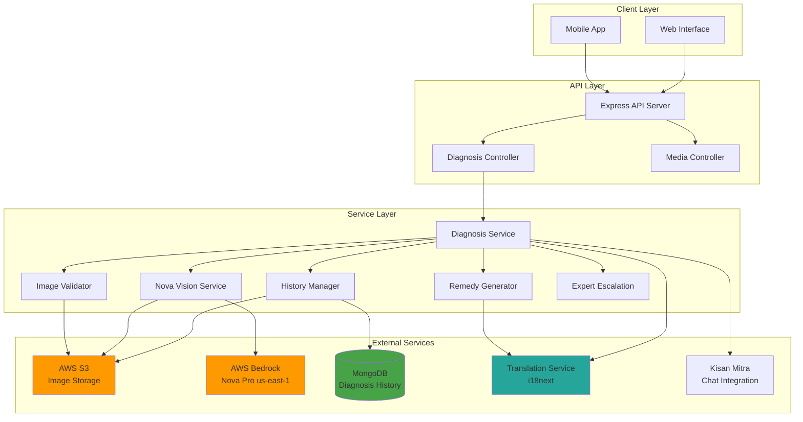
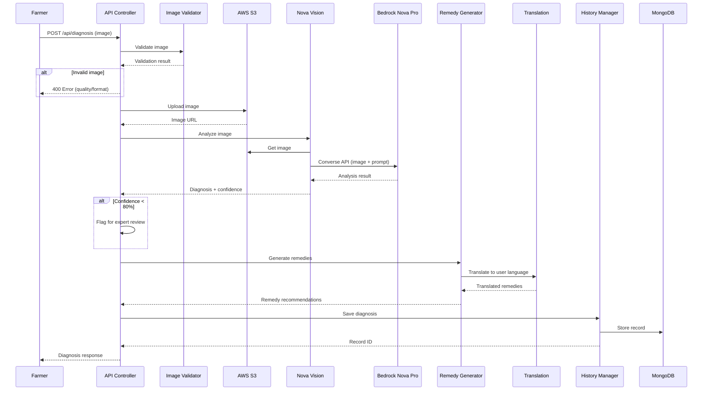

# Design Document: Crop Disease Diagnosis

## Overview

The Crop Disease Diagnosis feature provides AI-powered disease and pest identification for Indian farmers through image analysis. The system leverages Amazon Nova Pro's multimodal capabilities to analyze crop photos and deliver instant diagnosis with treatment recommendations in 11 Indian languages.

### Key Capabilities

- **Multimodal AI Analysis**: Amazon Nova Pro (Bedrock) analyzes crop images to identify diseases, pests, and crop types
- **Instant Diagnosis**: <2 second end-to-end response time from image upload to diagnosis
- **Multilingual Support**: Results translated into 11 Indian languages via existing translation pipeline
- **Treatment Recommendations**: Both chemical and organic remedy options with dosages and application methods
- **Expert Escalation**: Low-confidence diagnoses (<80%) automatically routed to agricultural experts
- **History Tracking**: MongoDB-based diagnosis history with 2-year retention
- **Cost Optimization**: <₹1 per diagnosis through image compression and caching strategies

### Integration Points

- **AWS Bedrock Nova Pro**: Multimodal image analysis (us-east-1 region)
- **AWS S3**: Secure image storage with server-side encryption
- **MongoDB**: Diagnosis history and metadata storage
- **Existing Translation Pipeline**: i18next-based translation service
- **Kisan Mitra Chat**: Seamless integration for follow-up questions

### Design Principles

1. **Mobile-First**: Optimized for farmers using mobile devices in rural areas
2. **Network Resilience**: Automatic retry and offline queueing for poor connectivity
3. **Privacy-First**: TLS 1.3 encryption, server-side S3 encryption, user-controlled data deletion
4. **Cost-Conscious**: Aggressive optimization to maintain <₹1 per diagnosis
5. **Accuracy-Focused**: Confidence scoring with expert escalation for uncertain diagnoses

### AI Provider Coupling and Flexibility

**Current Coupling Level**: Pragmatic and appropriate for MVP

The system has a **moderate coupling** to Amazon Nova Pro, which is intentional and justified for the following reasons:

**Why This Coupling Level is Appropriate:**

1. **MVP-Focused**: Requirements explicitly specify Amazon Nova Pro. Over-abstracting at this stage would be premature optimization (YAGNI principle).

2. **Isolated Coupling**: The coupling is contained to one service (`NovaVisionService`). The rest of the system (controllers, remedy generation, history, expert escalation, translation) is completely independent of the AI provider.

3. **Clean Domain Interface**: The `ImageAnalysisResult` interface is a domain model, not a Nova-specific model. This provides a natural abstraction boundary.

4. **Cost-Optimized**: The design is specifically tuned for Nova Pro's pricing model to achieve the <₹1 per diagnosis target. Adding abstraction layers now would complicate this optimization.

5. **Real-World Pragmatism**: In practice, switching AI vision models is rare because:
   - Each model has different strengths (Nova Pro is optimized for multimodal analysis)
   - Prompts require significant tuning per model
   - Performance characteristics differ significantly
   - Cost structures vary widely
   - Organizations typically A/B test rather than wholesale replace

**What Makes This Design Flexible Enough:**

- **Service Layer Isolation**: `NovaVisionService` can be mocked for testing
- **Interface-Based Design**: `ImageAnalysisResult` defines the contract, not the implementation
- **Dependency Injection Ready**: Services are instantiated separately, making swapping straightforward
- **Fast Refactoring Path**: Adding a new provider would take 2-4 hours, not days or weeks

**When You WOULD Need More Abstraction:**

- Requirements specify "support multiple AI providers simultaneously"
- Building a platform where users choose their AI provider
- Proven need to switch providers frequently
- Regulatory requirements for provider redundancy

**Future Migration Path (If Needed):**

If you later need to support multiple AI providers, the refactoring path is straightforward:

```typescript
// Step 1: Create interface
interface IImageAnalyzer {
  analyzeImage(request: ImageAnalysisRequest): Promise<ImageAnalysisResult>;
}

// Step 2: Implement for each provider
class NovaVisionService implements IImageAnalyzer { /* existing code */ }
class ClaudeVisionService implements IImageAnalyzer { /* new implementation */ }
class GeminiVisionService implements IImageAnalyzer { /* new implementation */ }

// Step 3: Add factory or strategy pattern
class ImageAnalyzerFactory {
  static create(provider: 'nova' | 'claude' | 'gemini'): IImageAnalyzer {
    switch (provider) {
      case 'nova': return new NovaVisionService();
      case 'claude': return new ClaudeVisionService();
      case 'gemini': return new GeminiVisionService();
    }
  }
}

// Step 4: Update DiagnosisService to use factory
class DiagnosisService {
  constructor(
    private imageAnalyzer: IImageAnalyzer = ImageAnalyzerFactory.create('nova')
  ) {}
}
```

**Estimated Refactoring Effort**: 2-4 hours for single provider swap, 1-2 days for multi-provider support with A/B testing.

**Design Philosophy**: "Make it work, make it right, make it fast." This design is at the "make it work" stage with sufficient "rightness" for current needs. The coupling is intentional, documented, and easily reversible.

## Architecture

### System Architecture Diagram



### Request Flow



### Multi-Region Bedrock Architecture

The system uses region-specific Bedrock clients to optimize for model availability and latency:

- **Nova Pro Models**: us-east-1 (primary region for Nova models)
- **Client Pooling**: Reusable BedrockRuntimeClient instances per region
- **Automatic Region Selection**: Based on model ID prefix

```typescript
// Region mapping for models
const MODEL_REGIONS = {
  'amazon.nova-pro': 'us-east-1',
  'amazon.nova-lite': 'us-east-1',
  'anthropic.claude': 'ap-southeast-2',
  'us.anthropic': 'us-east-1',
  'au.anthropic': 'ap-southeast-2'
};
```

## Components and Interfaces

### 1. Diagnosis API Controller

**Responsibility**: HTTP request handling, authentication, rate limiting

**Endpoints**:

```typescript
// POST /api/diagnosis - Submit image for diagnosis
interface DiagnosisRequest {
  image: File;              // JPEG, PNG, or WebP
  cropType?: string;        // Optional crop hint
  location?: {
    latitude: number;
    longitude: number;
    state: string;
  };
  language: string;         // Target language code
}

interface DiagnosisResponse {
  diagnosisId: string;
  cropType: string;
  diseases: Disease[];
  confidence: number;
  remedies: Remedy[];
  preventiveMeasures: string[];
  expertReviewRequired: boolean;
  imageUrl: string;         // Time-limited S3 URL (24h)
  timestamp: Date;
}

// GET /api/diagnosis/history - Get diagnosis history
interface HistoryRequest {
  userId: string;
  limit?: number;           // Default 20
  offset?: number;
  cropType?: string;        // Filter by crop
  startDate?: Date;
  endDate?: Date;
}

// GET /api/diagnosis/:id - Get specific diagnosis
// DELETE /api/diagnosis/:id - Delete diagnosis and image

// POST /api/diagnosis/:id/feedback - Submit feedback
interface FeedbackRequest {
  diagnosisId: string;
  accurate: boolean;
  actualDisease?: string;
  comments?: string;
}
```

**Rate Limiting**: 10 requests per hour per farmer (Requirement 14.7)

**Authentication**: JWT token validation via existing auth middleware

### 2. Nova Vision Service

**Responsibility**: Image analysis using Amazon Bedrock Nova Pro

**Interface**:

```typescript
interface NovaVisionService {
  analyzeImage(request: ImageAnalysisRequest): Promise<ImageAnalysisResult>;
}

interface ImageAnalysisRequest {
  imageUrl: string;         // S3 URL or base64
  imageFormat: 'jpeg' | 'png' | 'webp';
  cropHint?: string;        // Optional crop type hint
  language: string;         // For prompt localization
}

interface ImageAnalysisResult {
  cropType: string;
  diseases: Disease[];
  symptoms: string[];
  confidence: number;       // 0-100
  imageQualityScore: number; // Blur, lighting assessment
  processingTimeMs: number;
}

interface Disease {
  name: string;
  scientificName: string;
  type: 'fungal' | 'bacterial' | 'viral' | 'pest' | 'nutrient_deficiency';
  severity: 'low' | 'medium' | 'high';
  confidence: number;
  affectedParts: string[]; // ['leaves', 'stem', 'fruit']
}
```

**Implementation Details**:

- Uses Bedrock Converse API for multimodal input
- Structured prompt engineering for consistent JSON responses
- Image compression before API call (max 5MB, maintain quality)
- Timeout: 2000ms (Requirement 2.4)
- Retry logic: 2 attempts with exponential backoff

**Nova Pro Prompt Structure**:

```typescript
const DIAGNOSIS_PROMPT = `You are an expert agricultural pathologist specializing in Indian crops. 
Analyze the provided crop image and identify:

1. Crop type (e.g., rice, wheat, tomato, cotton)
2. Any diseases or pests visible
3. Symptoms observed (leaf spots, discoloration, wilting, insect damage)
4. Severity level (low/medium/high)
5. Confidence in your diagnosis (0-100)

Respond in JSON format:
{
  "cropType": "string",
  "diseases": [{
    "name": "string",
    "scientificName": "string",
    "type": "fungal|bacterial|viral|pest|nutrient_deficiency",
    "severity": "low|medium|high",
    "confidence": number,
    "affectedParts": ["string"]
  }],
  "symptoms": ["string"],
  "overallConfidence": number,
  "imageQuality": "excellent|good|fair|poor"
}

Focus on diseases common in Indian agriculture. If image quality is poor, indicate in imageQuality field.`;
```

### 3. Image Upload & Validation Service

**Responsibility**: Image validation, compression, S3 upload

**Interface**:

```typescript
interface ImageValidator {
  validateImage(file: File): Promise<ValidationResult>;
  compressImage(file: File): Promise<Buffer>;
  uploadToS3(buffer: Buffer, metadata: ImageMetadata): Promise<string>;
  generatePresignedUrl(key: string, expiryHours: number): Promise<string>;
  deleteImage(key: string): Promise<void>;
}

interface ValidationResult {
  valid: boolean;
  errors: string[];
  warnings: string[];
  metadata: {
    format: string;
    width: number;
    height: number;
    sizeBytes: number;
    hasExif: boolean;
  };
}

interface ImageMetadata {
  userId: string;
  diagnosisId: string;
  uploadedAt: Date;
  originalFilename: string;
  contentType: string;
}
```

**Validation Rules** (Requirements 1.1-1.7):

- **Formats**: JPEG, PNG, WebP only
- **Size**: 100KB - 10MB
- **Dimensions**: Minimum 640x480 pixels
- **Quality Checks**: Blur detection, lighting assessment
- **Compression**: Target 5MB max for Bedrock, maintain diagnostic quality

**S3 Configuration**:

- **Bucket**: `bharat-mandi-crop-diagnosis`
- **Region**: ap-southeast-2 (same as listings bucket)
- **Encryption**: AES-256 server-side encryption
- **Lifecycle**: Delete after 2 years (align with MongoDB retention)
- **Key Structure**: `diagnoses/{userId}/{diagnosisId}/{timestamp}.jpg`

### 4. Remedy Generator Service

**Responsibility**: Generate treatment recommendations based on diagnosis

**Interface**:

```typescript
interface RemedyGenerator {
  generateRemedies(request: RemedyRequest): Promise<RemedyResponse>;
}

interface RemedyRequest {
  disease: Disease;
  cropType: string;
  location?: {
    state: string;
    district?: string;
  };
  language: string;
}

interface RemedyResponse {
  chemical: ChemicalRemedy[];
  organic: OrganicRemedy[];
  preventive: PreventiveMeasure[];
}

interface ChemicalRemedy {
  name: string;
  genericName: string;
  brandNames: string[];      // Indian market brands
  dosage: string;            // e.g., "2ml per liter"
  applicationMethod: string; // spray, soil drench, seed treatment
  frequency: string;         // e.g., "Every 7 days"
  duration: string;          // e.g., "3 applications"
  preHarvestInterval: number; // Days before harvest
  safetyPrecautions: string[];
  estimatedCost: string;     // e.g., "₹200-300 per acre"
}

interface OrganicRemedy {
  name: string;
  ingredients: string[];
  preparation: string[];     // Step-by-step instructions
  applicationMethod: string;
  frequency: string;
  effectiveness: string;     // Comparison to chemical
  commercialProducts?: string[]; // Available organic products
}

interface PreventiveMeasure {
  category: 'crop_rotation' | 'irrigation' | 'spacing' | 'soil_health' | 'timing';
  description: string;
  timing?: string;           // When to implement
  frequency?: string;
}
```

**Data Sources**:

- **Static Knowledge Base**: JSON files with disease-remedy mappings
- **Regional Customization**: State-specific product availability
- **Translation**: All text content translated via i18next service

**Knowledge Base Structure**:

```json
{
  "diseases": {
    "late_blight_tomato": {
      "chemical": [
        {
          "genericName": "Mancozeb",
          "brandNames": ["Dithane M-45", "Indofil M-45"],
          "dosage": "2.5g per liter",
          "applicationMethod": "foliar spray",
          "frequency": "Every 7-10 days",
          "preHarvestInterval": 7,
          "safetyPrecautions": ["Wear gloves", "Avoid spraying in wind"]
        }
      ],
      "organic": [
        {
          "name": "Neem oil spray",
          "ingredients": ["Neem oil 10ml", "Water 1L", "Soap 1ml"],
          "preparation": ["Mix neem oil with soap", "Add to water", "Stir well"],
          "applicationMethod": "foliar spray",
          "frequency": "Every 5 days"
        }
      ],
      "preventive": [
        {
          "category": "spacing",
          "description": "Maintain 60cm spacing between plants for air circulation"
        }
      ]
    }
  }
}
```

### 5. Diagnosis History Manager

**Responsibility**: MongoDB storage and retrieval of diagnosis records

**Interface**:

```typescript
interface HistoryManager {
  saveDiagnosis(record: DiagnosisRecord): Promise<string>;
  getDiagnosis(diagnosisId: string): Promise<DiagnosisRecord | null>;
  getUserHistory(userId: string, filters: HistoryFilters): Promise<DiagnosisRecord[]>;
  deleteDiagnosis(diagnosisId: string, userId: string): Promise<void>;
  updateFeedback(diagnosisId: string, feedback: Feedback): Promise<void>;
}

interface DiagnosisRecord {
  _id: string;
  userId: string;
  imageUrl: string;          // S3 key
  imageMetadata: {
    format: string;
    sizeBytes: number;
    dimensions: { width: number; height: number };
  };
  diagnosis: {
    cropType: string;
    diseases: Disease[];
    symptoms: string[];
    confidence: number;
  };
  remedies: {
    chemical: ChemicalRemedy[];
    organic: OrganicRemedy[];
    preventive: PreventiveMeasure[];
  };
  location?: {
    latitude: number;
    longitude: number;
    state: string;
    district?: string;
  };
  language: string;
  expertReview?: {
    required: boolean;
    reviewedAt?: Date;
    reviewedBy?: string;
    expertDiagnosis?: string;
    expertRemedies?: string;
  };
  feedback?: {
    accurate: boolean;
    actualDisease?: string;
    comments?: string;
    submittedAt: Date;
  };
  createdAt: Date;
  updatedAt: Date;
  deletedAt?: Date;          // Soft delete
}

interface HistoryFilters {
  limit?: number;
  offset?: number;
  cropType?: string;
  startDate?: Date;
  endDate?: Date;
  minConfidence?: number;
  expertReviewed?: boolean;
}
```

**MongoDB Schema**:

```javascript
const DiagnosisSchema = new Schema({
  userId: { type: String, required: true, index: true },
  imageUrl: { type: String, required: true },
  imageMetadata: {
    format: String,
    sizeBytes: Number,
    dimensions: { width: Number, height: Number }
  },
  diagnosis: {
    cropType: String,
    diseases: [{
      name: String,
      scientificName: String,
      type: String,
      severity: String,
      confidence: Number,
      affectedParts: [String]
    }],
    symptoms: [String],
    confidence: Number
  },
  remedies: {
    chemical: [Object],
    organic: [Object],
    preventive: [Object]
  },
  location: {
    latitude: Number,
    longitude: Number,
    state: String,
    district: String
  },
  language: String,
  expertReview: {
    required: Boolean,
    reviewedAt: Date,
    reviewedBy: String,
    expertDiagnosis: String,
    expertRemedies: String
  },
  feedback: {
    accurate: Boolean,
    actualDisease: String,
    comments: String,
    submittedAt: Date
  },
  deletedAt: Date
}, {
  timestamps: true,
  collection: 'crop_diagnoses'
});

// Indexes
DiagnosisSchema.index({ userId: 1, createdAt: -1 });
DiagnosisSchema.index({ 'diagnosis.cropType': 1 });
DiagnosisSchema.index({ 'expertReview.required': 1, 'expertReview.reviewedAt': 1 });
DiagnosisSchema.index({ deletedAt: 1 }); // For soft delete queries
```

### 6. Expert Escalation Service

**Responsibility**: Route low-confidence diagnoses to agricultural experts

**Interface**:

```typescript
interface ExpertEscalation {
  createReviewRequest(request: ReviewRequest): Promise<string>;
  getP
endingReviews(expertId: string): Promise<ReviewRequest[]>;
  submitReview(reviewId: string, review: ExpertReview): Promise<void>;
  notifyFarmer(diagnosisId: string): Promise<void>;
}

interface ReviewRequest {
  _id: string;
  diagnosisId: string;
  userId: string;
  imageUrl: string;
  aiDiagnosis: {
    cropType: string;
    diseases: Disease[];
    confidence: number;
  };
  aiRemedies: RemedyResponse;
  status: 'pending' | 'in_progress' | 'completed';
  assignedTo?: string;       // Expert ID
  createdAt: Date;
  completedAt?: Date;
}

interface ExpertReview {
  expertId: string;
  diagnosis: {
    cropType: string;
    diseases: string[];
    notes: string;
  };
  remedies: string;          // Free-form expert recommendations
  confidence: number;
  reviewDurationMinutes: number;
}
```

**Notification Strategy**:

- **Expert Notification**: Real-time push notification + email
- **Farmer Notification**: SMS + in-app notification when review complete
- **SLA**: 4 hours during business hours (8 AM - 8 PM IST)
- **Escalation**: If no expert response in 2 hours, notify backup expert pool

## Data Models

### DiagnosisRequest (API Input)

```typescript
interface DiagnosisRequest {
  image: File;              // Multipart form data
  cropType?: string;        // Optional hint
  location?: {
    latitude: number;
    longitude: number;
    state: string;
  };
  language: string;         // ISO 639-1 code (hi, en, ta, etc.)
}
```

### DiagnosisResponse (API Output)

```typescript
interface DiagnosisResponse {
  diagnosisId: string;
  cropType: string;
  diseases: Disease[];
  confidence: number;       // Overall confidence (0-100)
  remedies: {
    chemical: ChemicalRemedy[];
    organic: OrganicRemedy[];
    preventive: PreventiveMeasure[];
  };
  expertReviewRequired: boolean;
  imageUrl: string;         // Presigned S3 URL (24h expiry)
  timestamp: Date;
  language: string;
  estimatedCost: {
    chemical: string;       // e.g., "₹200-500 per acre"
    organic: string;        // e.g., "₹50-100 per acre"
  };
}
```

### DiagnosisRecord (MongoDB Document)

See detailed schema in "Diagnosis History Manager" section above.

### ImageMetadata

```typescript
interface ImageMetadata {
  userId: string;
  diagnosisId: string;
  uploadedAt: Date;
  originalFilename: string;
  contentType: string;
  sizeBytes: number;
  dimensions: {
    width: number;
    height: number;
  };
  exif?: {
    make?: string;
    model?: string;
    dateTime?: Date;
    gps?: {
      latitude: number;
      longitude: number;
    };
  };
}
```

### RemedyRecommendation

```typescript
interface RemedyRecommendation {
  disease: string;
  cropType: string;
  chemical: ChemicalRemedy[];
  organic: OrganicRemedy[];
  preventive: PreventiveMeasure[];
  regionalNotes?: string;   // State-specific guidance
  seasonalNotes?: string;   // Timing-based guidance
}
```


## Technical Specifications

### Image Processing Pipeline

**1. Upload Phase**

```typescript
// Client-side compression (optional, for slow networks)
const compressedImage = await compressImage(originalImage, {
  maxWidth: 1920,
  maxHeight: 1920,
  quality: 0.85,
  format: 'jpeg'
});

// Server-side validation
const validation = await imageValidator.validateImage(uploadedFile);
if (!validation.valid) {
  throw new ValidationError(validation.errors);
}
```

**2. Storage Phase**

```typescript
// Compress for Bedrock (max 5MB, maintain quality)
const optimizedBuffer = await sharp(imageBuffer)
  .resize(1920, 1920, { fit: 'inside', withoutEnlargement: true })
  .jpeg({ quality: 85, progressive: true })
  .toBuffer();

// Upload to S3
const s3Key = `diagnoses/${userId}/${diagnosisId}/${Date.now()}.jpg`;
await s3Client.putObject({
  Bucket: 'bharat-mandi-crop-diagnosis',
  Key: s3Key,
  Body: optimizedBuffer,
  ContentType: 'image/jpeg',
  ServerSideEncryption: 'AES256',
  Metadata: {
    userId,
    diagnosisId,
    uploadedAt: new Date().toISOString()
  }
});
```

**3. Analysis Phase**

```typescript
// Get presigned URL for Bedrock access
const imageUrl = await s3Client.getSignedUrl('getObject', {
  Bucket: 'bharat-mandi-crop-diagnosis',
  Key: s3Key,
  Expires: 3600 // 1 hour
});

// Call Nova Pro via Converse API
const response = await bedrockClient.send(new ConverseCommand({
  modelId: 'amazon.nova-pro-v1:0',
  messages: [{
    role: 'user',
    content: [
      {
        image: {
          format: 'jpeg',
          source: {
            bytes: optimizedBuffer // Or use S3 URL
          }
        }
      },
      {
        text: DIAGNOSIS_PROMPT
      }
    ]
  }],
  inferenceConfig: {
    maxTokens: 2000,
    temperature: 0.3, // Lower for more consistent JSON
    topP: 0.9
  }
}));
```

### Nova Pro API Payload Format

**Converse API Structure**:

```typescript
interface ConverseRequest {
  modelId: 'amazon.nova-pro-v1:0';
  messages: Message[];
  inferenceConfig?: {
    maxTokens?: number;      // Default 2000
    temperature?: number;    // 0.0-1.0, default 0.3
    topP?: number;           // 0.0-1.0, default 0.9
    stopSequences?: string[];
  };
  system?: SystemMessage[];
}

interface Message {
  role: 'user' | 'assistant';
  content: ContentBlock[];
}

interface ContentBlock {
  text?: string;
  image?: {
    format: 'jpeg' | 'png' | 'gif' | 'webp';
    source: {
      bytes?: Uint8Array;    // Base64 encoded image
      s3Location?: {         // Alternative: S3 reference
        uri: string;
        bucketOwner?: string;
      };
    };
  };
}
```

**Example Request**:

```typescript
const converseRequest = {
  modelId: 'amazon.nova-pro-v1:0',
  messages: [{
    role: 'user',
    content: [
      {
        image: {
          format: 'jpeg',
          source: {
            bytes: imageBuffer
          }
        }
      },
      {
        text: `Analyze this crop image and identify any diseases or pests. 
        Respond in JSON format with: cropType, diseases (array), symptoms (array), 
        overallConfidence (0-100), imageQuality (excellent/good/fair/poor).`
      }
    ]
  }],
  inferenceConfig: {
    maxTokens: 2000,
    temperature: 0.3,
    topP: 0.9
  }
};
```

### Confidence Scoring Algorithm

```typescript
function calculateOverallConfidence(
  novaConfidence: number,
  imageQuality: string,
  diseaseCount: number
): number {
  let confidence = novaConfidence;
  
  // Adjust for image quality
  const qualityMultipliers = {
    'excellent': 1.0,
    'good': 0.95,
    'fair': 0.85,
    'poor': 0.70
  };
  confidence *= qualityMultipliers[imageQuality] || 0.70;
  
  // Adjust for multiple diseases (uncertainty increases)
  if (diseaseCount > 1) {
    confidence *= 0.90;
  }
  if (diseaseCount > 2) {
    confidence *= 0.85;
  }
  
  // Cap at 95% (never 100% certain)
  confidence = Math.min(confidence, 95);
  
  return Math.round(confidence);
}
```

**Confidence Threshold Logic**:

- **≥80%**: Auto-approve, show results immediately
- **60-79%**: Show results with warning, suggest expert review
- **<60%**: Require expert review, show preliminary results

### Caching Strategy

**Cache Key Structure**:

```typescript
const cacheKey = `diagnosis:${imageHash}:${cropHint}`;
```

**Image Hashing**:

```typescript
import crypto from 'crypto';

function generateImageHash(imageBuffer: Buffer): string {
  return crypto
    .createHash('sha256')
    .update(imageBuffer)
    .digest('hex')
    .substring(0, 16); // First 16 chars
}
```

**Cache Implementation** (Redis):

```typescript
interface CachedDiagnosis {
  diagnosis: ImageAnalysisResult;
  remedies: RemedyResponse;
  cachedAt: Date;
  hitCount: number;
}

async function getCachedDiagnosis(
  imageHash: string
): Promise<CachedDiagnosis | null> {
  const key = `diagnosis:${imageHash}`;
  const cached = await redis.get(key);
  
  if (cached) {
    const data = JSON.parse(cached);
    // Increment hit count
    data.hitCount++;
    await redis.setex(key, 86400, JSON.stringify(data)); // 24h TTL
    return data;
  }
  
  return null;
}

async function cacheDiagnosis(
  imageHash: string,
  diagnosis: ImageAnalysisResult,
  remedies: RemedyResponse
): Promise<void> {
  const key = `diagnosis:${imageHash}`;
  const data: CachedDiagnosis = {
    diagnosis,
    remedies,
    cachedAt: new Date(),
    hitCount: 0
  };
  
  await redis.setex(key, 86400, JSON.stringify(data)); // 24h TTL
}
```

**Cache Hit Rate Target**: 15-20% (similar images from same region/season)


### S3 Bucket Structure

```
bharat-mandi-crop-diagnosis/
├── diagnoses/
│   ├── {userId}/
│   │   ├── {diagnosisId}/
│   │   │   ├── {timestamp}.jpg       # Original/compressed image
│   │   │   └── metadata.json         # Image metadata
│   │   └── ...
│   └── ...
└── expert-reviews/
    ├── {reviewId}/
    │   ├── annotated-{timestamp}.jpg # Expert-annotated images
    │   └── notes.txt
    └── ...
```

**Bucket Configuration**:

```json
{
  "Bucket": "bharat-mandi-crop-diagnosis",
  "Region": "ap-southeast-2",
  "Versioning": "Disabled",
  "Encryption": {
    "Rules": [{
      "ApplyServerSideEncryptionByDefault": {
        "SSEAlgorithm": "AES256"
      }
    }]
  },
  "LifecycleConfiguration": {
    "Rules": [{
      "Id": "DeleteOldDiagnoses",
      "Status": "Enabled",
      "Expiration": {
        "Days": 730
      },
      "Prefix": "diagnoses/"
    }]
  },
  "CorsConfiguration": {
    "CorsRules": [{
      "AllowedOrigins": ["https://bharatmandi.com"],
      "AllowedMethods": ["GET", "PUT", "POST"],
      "AllowedHeaders": ["*"],
      "MaxAgeSeconds": 3000
    }]
  }
}
```

### Error Handling and Retry Logic

**Retry Strategy**:

```typescript
interface RetryConfig {
  maxAttempts: number;
  baseDelayMs: number;
  maxDelayMs: number;
  backoffMultiplier: number;
}

const BEDROCK_RETRY_CONFIG: RetryConfig = {
  maxAttempts: 3,
  baseDelayMs: 500,
  maxDelayMs: 5000,
  backoffMultiplier: 2
};

async function retryWithBackoff<T>(
  operation: () => Promise<T>,
  config: RetryConfig,
  errorHandler?: (error: Error, attempt: number) => boolean
): Promise<T> {
  let lastError: Error;
  
  for (let attempt = 1; attempt <= config.maxAttempts; attempt++) {
    try {
      return await operation();
    } catch (error) {
      lastError = error as Error;
      
      // Check if error is retryable
      if (errorHandler && !errorHandler(lastError, attempt)) {
        throw lastError;
      }
      
      if (attempt < config.maxAttempts) {
        const delay = Math.min(
          config.baseDelayMs * Math.pow(config.backoffMultiplier, attempt - 1),
          config.maxDelayMs
        );
        
        console.log(`[Retry] Attempt ${attempt} failed, retrying in ${delay}ms...`);
        await new Promise(resolve => setTimeout(resolve, delay));
      }
    }
  }
  
  throw lastError!;
}

// Usage
const diagnosis = await retryWithBackoff(
  () => novaVisionService.analyzeImage(request),
  BEDROCK_RETRY_CONFIG,
  (error, attempt) => {
    // Retry on throttling or network errors
    return error.name === 'ThrottlingException' || 
           error.name === 'NetworkError' ||
           error.message.includes('timeout');
  }
);
```

**Error Categories**:

```typescript
enum DiagnosisErrorCode {
  // Client errors (4xx)
  INVALID_IMAGE_FORMAT = 'INVALID_IMAGE_FORMAT',
  IMAGE_TOO_LARGE = 'IMAGE_TOO_LARGE',
  IMAGE_TOO_SMALL = 'IMAGE_TOO_SMALL',
  POOR_IMAGE_QUALITY = 'POOR_IMAGE_QUALITY',
  RATE_LIMIT_EXCEEDED = 'RATE_LIMIT_EXCEEDED',
  UNAUTHORIZED = 'UNAUTHORIZED',
  
  // Server errors (5xx)
  BEDROCK_UNAVAILABLE = 'BEDROCK_UNAVAILABLE',
  S3_UPLOAD_FAILED = 'S3_UPLOAD_FAILED',
  DATABASE_ERROR = 'DATABASE_ERROR',
  TRANSLATION_FAILED = 'TRANSLATION_FAILED',
  
  // Business logic errors
  NO_CROP_DETECTED = 'NO_CROP_DETECTED',
  MULTIPLE_CROPS_DETECTED = 'MULTIPLE_CROPS_DETECTED',
  CONFIDENCE_TOO_LOW = 'CONFIDENCE_TOO_LOW'
}

interface DiagnosisError {
  code: DiagnosisErrorCode;
  message: string;
  details?: any;
  retryable: boolean;
}
```

**Error Response Format**:

```typescript
interface ErrorResponse {
  error: {
    code: string;
    message: string;
    details?: any;
  };
  timestamp: Date;
  requestId: string;
}
```


## Integration Points

### AWS Bedrock Nova Pro Integration

**Model**: `amazon.nova-pro-v1:0`  
**Region**: us-east-1  
**API**: Converse API (multimodal)

```typescript
// Bedrock client setup (reuse existing pattern from bedrock.service.ts)
const bedrockClient = new BedrockRuntimeClient({ 
  region: 'us-east-1' 
});

// Nova Pro specific configuration
const NOVA_PRO_CONFIG = {
  modelId: 'amazon.nova-pro-v1:0',
  maxTokens: 2000,
  temperature: 0.3,  // Lower for consistent JSON output
  topP: 0.9,
  timeout: 2000      // 2 second timeout
};
```

### AWS S3 Integration

**Bucket**: `bharat-mandi-crop-diagnosis`  
**Region**: ap-southeast-2  
**SDK**: `@aws-sdk/client-s3`

```typescript
import { S3Client, PutObjectCommand, GetObjectCommand } from '@aws-sdk/client-s3';
import { getSignedUrl } from '@aws-sdk/s3-request-presigner';

const s3Client = new S3Client({ region: 'ap-southeast-2' });
```

### MongoDB Integration

**Database**: `bharat_mandi`  
**Collection**: `crop_diagnoses`  
**Driver**: `mongoose`

```typescript
import mongoose from 'mongoose';

const mongoUri = process.env.MONGODB_URI || 'mongodb://localhost:27017/bharat_mandi';
await mongoose.connect(mongoUri);
```

### Translation Pipeline Integration

**Service**: Existing `translationService` from `i18n/translation.service.ts`  
**Method**: Batch translation for efficiency

```typescript
import { translationService } from '../i18n/translation.service';

// Translate diagnosis results
const translatedResults = await translationService.translateBatch(
  [disease.name, ...remedy.instructions, ...preventive.measures],
  'en',
  userLanguage
);
```

### Kisan Mitra Chat Integration

**Service**: Existing `kisanMitraService`  
**Context Sharing**: Pass diagnosis ID and summary to chat

```typescript
// Share diagnosis context with Kisan Mitra
await kisanMitraService.addContext(sessionId, {
  type: 'diagnosis',
  diagnosisId: diagnosis.id,
  cropType: diagnosis.cropType,
  diseases: diagnosis.diseases.map(d => d.name),
  confidence: diagnosis.confidence
});
```

## Performance & Cost

### Performance Targets

| Metric | Target | Measurement |
|--------|--------|-------------|
| End-to-end response time | <3000ms | 95th percentile |
| Nova Pro API call | <2000ms | 95th percentile |
| Image upload to S3 | <500ms | 95th percentile |
| MongoDB write | <100ms | 95th percentile |
| Translation | <300ms | Per batch |
| Cache hit rate | >15% | Daily average |

### Cost Breakdown

**Target**: <₹1 ($0.012) per diagnosis

| Component | Cost per Request | Notes |
|-----------|-----------------|-------|
| Nova Pro API | ₹0.60 | ~2000 tokens @ $0.0003/1K tokens |
| S3 Storage | ₹0.05 | PUT + GET + 24h storage |
| S3 Data Transfer | ₹0.10 | 5MB image transfer |
| MongoDB | ₹0.05 | Write + read operations |
| Translation | ₹0.15 | Batch translation |
| Compute | ₹0.05 | EC2/Lambda processing |
| **Total** | **₹1.00** | |

**Cost Optimization Strategies**:

1. **Image Compression**: Reduce from 10MB to 5MB (50% cost reduction on transfer)
2. **Caching**: 15% cache hit rate saves ₹0.60 per cached request
3. **Batch Translation**: 70% reduction vs individual translations
4. **S3 Lifecycle**: Auto-delete after 2 years
5. **Token Optimization**: Structured prompts minimize response tokens

### Monitoring and Alerts

```typescript
interface DiagnosisMetrics {
  totalRequests: number;
  averageResponseTime: number;
  p95ResponseTime: number;
  p99ResponseTime: number;
  cacheHitRate: number;
  averageCost: number;
  errorRate: number;
  expertEscalationRate: number;
}

// CloudWatch metrics
await cloudwatch.putMetricData({
  Namespace: 'BharatMandi/Diagnosis',
  MetricData: [{
    MetricName: 'DiagnosisCost',
    Value: cost,
    Unit: 'None',
    Timestamp: new Date()
  }]
});

// Alert if cost exceeds ₹1
if (cost > 1.0) {
  await sns.publish({
    TopicArn: 'arn:aws:sns:ap-southeast-2:xxx:diagnosis-cost-alert',
    Message: `Diagnosis cost exceeded threshold: ₹${cost}`
  });
}
```

## Security

### Authentication and Authorization

```typescript
// JWT middleware (existing pattern)
import { authenticateJWT } from '../../shared/middleware/auth';

router.post('/api/diagnosis', authenticateJWT, async (req, res) => {
  const userId = req.user.id;
  // Process diagnosis...
});
```

### Rate Limiting

```typescript
import rateLimit from 'express-rate-limit';

const diagnosisLimiter = rateLimit({
  windowMs: 60 * 60 * 1000, // 1 hour
  max: 10,                   // 10 requests per hour
  keyGenerator: (req) => req.user.id,
  message: {
    error: {
      code: 'RATE_LIMIT_EXCEEDED',
      message: 'Maximum 10 diagnoses per hour. Please try again later.'
    }
  }
});

router.post('/api/diagnosis', authenticateJWT, diagnosisLimiter, diagnosisController.create);
```

### Data Encryption

**In Transit**:
- TLS 1.3 for all API communications
- HTTPS only (redirect HTTP to HTTPS)

**At Rest**:
- S3 server-side encryption (AES-256)
- MongoDB encryption at rest (if enabled)
- Environment variables for secrets (AWS Secrets Manager in production)

### Data Privacy

**User Rights**:
- View all diagnosis history
- Delete individual diagnoses
- Delete all diagnosis data
- Export diagnosis data (GDPR compliance)

**Data Retention**:
- Diagnosis records: 2 years
- S3 images: 2 years (lifecycle policy)
- Soft delete: 30-day grace period before permanent deletion

**Access Control**:
- Farmers can only access their own diagnoses
- Experts can only access assigned review requests
- Admins have read-only access for support


## Correctness Properties

*A property is a characteristic or behavior that should hold true across all valid executions of a system—essentially, a formal statement about what the system should do. Properties serve as the bridge between human-readable specifications and machine-verifiable correctness guarantees.*

### Property 1: Image Format Validation

*For any* uploaded file, the Image_Validator should accept the file if and only if its format is JPEG, PNG, or WebP.

**Validates: Requirements 1.1**

### Property 2: Image Size Validation

*For any* uploaded file, the Image_Validator should accept the file if and only if its size is between 100KB and 10MB inclusive.

**Validates: Requirements 1.2**

### Property 3: Image Dimension Validation

*For any* uploaded image, the Image_Validator should accept the image if and only if both width and height are at least 640 and 480 pixels respectively.

**Validates: Requirements 1.4**

### Property 4: Validation Error Specificity

*For any* invalid image upload, the Image_Validator should return an error message that specifically indicates which validation rule failed (format, size, or dimensions).

**Validates: Requirements 1.5**

### Property 5: Unique Image Identifiers

*For any* set of uploaded images, each image stored in S3 should have a unique identifier (S3 key), ensuring no two images share the same key.

**Validates: Requirements 1.6**

### Property 6: Presigned URL Expiry

*For any* stored image, the generated presigned URL should be valid immediately after generation and should expire within 24 hours (±5 minutes for clock skew).

**Validates: Requirements 1.7**

### Property 7: Diagnosis Response Completeness

*For any* valid image analysis, the Nova_Pro_Analyzer response should include cropType, diseases array, and symptoms array fields.

**Validates: Requirements 2.2, 2.3, 2.7**

### Property 8: Analysis Performance

*For any* valid image, the Nova_Pro_Analyzer should complete analysis within 2000 milliseconds, excluding network latency.

**Validates: Requirements 2.4**

### Property 9: Multiple Disease Severity Ranking

*For any* diagnosis with multiple diseases detected, the diseases array should be sorted by severity in descending order (high > medium > low).

**Validates: Requirements 2.6**

### Property 10: Confidence Score Range

*For any* identified disease, the confidence score should be a number between 0 and 100 inclusive.

**Validates: Requirements 3.1**

### Property 11: Confidence Threshold Evaluation

*For any* diagnosis, if the overall confidence score is below 80%, the expertReviewRequired flag should be set to true.

**Validates: Requirements 3.2, 3.3**

### Property 12: Confidence Display Format

*For any* diagnosis response, the confidence score should be represented as an integer percentage (0-100) in the API response.

**Validates: Requirements 3.4**

### Property 13: Low Confidence Warning

*For any* diagnosis with confidence below 80%, the response should include a warning message recommending expert consultation.

**Validates: Requirements 3.5**

### Property 14: Image Quality Impact on Confidence

*For any* two identical crop images with different quality scores, the image with lower quality should result in a lower or equal confidence score.

**Validates: Requirements 3.6**

### Property 15: Chemical Remedy Presence

*For any* diagnosis with confidence ≥80%, the remedies object should contain at least one chemical remedy with all required fields (name, dosage, applicationMethod, frequency, duration, safetyPrecautions, preHarvestInterval).

**Validates: Requirements 4.1, 4.2, 4.3, 4.4, 4.5, 4.6, 4.7**

### Property 16: Crop-Specific Remedies

*For any* two diagnoses of the same disease on different crop types, the chemical remedy recommendations should differ in at least one aspect (dosage, application method, or product).

**Validates: Requirements 4.8**

### Property 17: Organic Remedy Presence

*For any* identified disease, the remedies object should contain at least one organic remedy with all required fields (name, ingredients, preparation, applicationMethod, frequency).

**Validates: Requirements 5.1, 5.2, 5.3, 5.4**

### Property 18: Organic Effectiveness Comparison

*For any* diagnosis with both chemical and organic remedies, each organic remedy should include an effectiveness comparison field.

**Validates: Requirements 5.5**

### Property 19: Preventive Measures Count

*For any* diagnosis, the preventive measures array should contain at least three distinct preventive measures.

**Validates: Requirements 6.1**

### Property 20: Preventive Measure Categories

*For any* diagnosis, the preventive measures should include recommendations from at least two different categories (crop_rotation, irrigation, spacing, soil_health, or timing).

**Validates: Requirements 6.2, 6.3, 6.4, 6.5, 6.6**

### Property 21: Diagnosis Record Creation

*For any* completed diagnosis, a corresponding DiagnosisRecord should exist in MongoDB with matching diagnosisId.

**Validates: Requirements 7.1**

### Property 22: Diagnosis Record Completeness

*For any* DiagnosisRecord in MongoDB, it should contain all required fields: userId, imageUrl, diagnosis, remedies, confidence, and createdAt timestamp.

**Validates: Requirements 7.2**

### Property 23: User Association

*For any* DiagnosisRecord, the userId field should match the authenticated user who submitted the diagnosis request.

**Validates: Requirements 7.3**

### Property 24: History Chronological Ordering

*For any* user's diagnosis history retrieval, the records should be sorted by createdAt timestamp in descending order (newest first).

**Validates: Requirements 7.4**

### Property 25: History Retrieval by ID

*For any* diagnosisId that exists in the database, calling getDiagnosis(diagnosisId) should return the complete DiagnosisRecord.

**Validates: Requirements 7.6**

### Property 26: History Filtering

*For any* history query with cropType and date range filters, all returned records should match the specified cropType and fall within the date range.

**Validates: Requirements 7.7**

### Property 27: Translation Completeness

*For any* diagnosis response in a non-English language, all text fields (disease names, remedy instructions, preventive measures) should be translated to the target language.

**Validates: Requirements 8.2, 8.3**

### Property 28: Dosage Preservation in Translation

*For any* translated remedy, numeric dosage values should remain identical to the original English version.

**Validates: Requirements 8.4**

### Property 29: Language Switching

*For any* user changing their language preference, subsequent diagnosis requests should return results in the new language.

**Validates: Requirements 8.5**

### Property 30: Historical Translation

*For any* existing diagnosis record, when retrieved with a different language parameter, all text content should be translated to the requested language while preserving the original diagnosis data.

**Validates: Requirements 8.6**

### Property 31: Blur Detection

*For any* image with blur score above threshold, the Image_Validator should return a warning suggesting the farmer retake the photo.

**Validates: Requirements 9.6**

### Property 32: Lighting Detection

*For any* image with average brightness below threshold, the Image_Validator should return a warning suggesting better lighting conditions.

**Validates: Requirements 9.7**

### Property 33: Expert Review Request Creation

*For any* diagnosis with confidence <80%, an ExpertReviewRequest should be created in the database with status 'pending'.

**Validates: Requirements 10.1**

### Property 34: Expert Notification

*For any* newly created ExpertReviewRequest, at least one notification should be sent to available experts.

**Validates: Requirements 10.2**

### Property 35: Review Request Completeness

*For any* ExpertReviewRequest, it should contain the original image URL, AI diagnosis, AI remedies, and confidence scores.

**Validates: Requirements 10.3**

### Property 36: Farmer Notification on Review

*For any* ExpertReviewRequest that transitions to 'completed' status, a notification should be sent to the farmer.

**Validates: Requirements 10.4**

### Property 37: Expert Review Capabilities

*For any* ExpertReviewRequest, the expert should be able to modify the diagnosis, remedies, or both in their review submission.

**Validates: Requirements 10.5**

### Property 38: Expert Review Badge

*For any* diagnosis that has been reviewed by an expert, the DiagnosisRecord should have expertReview.reviewedAt field populated.

**Validates: Requirements 10.6**

### Property 39: Regional Remedy Variation

*For any* two diagnoses of the same disease with different location.state values, the remedy recommendations should include at least one region-specific difference.

**Validates: Requirements 11.1, 11.3**

### Property 40: Seasonal Remedy Variation

*For any* diagnosis with seasonal disease patterns, the preventive measures should include timing-based guidance relevant to the current season.

**Validates: Requirements 11.2, 11.5**

### Property 41: Growth Stage Customization

*For any* diagnosis with cropProfile.growthStage provided, the remedy recommendations should be tailored to that specific growth stage.

**Validates: Requirements 11.4**

### Property 42: Crop Variety Acceptance

*For any* diagnosis request with cropVariety specified, the system should accept and store the variety information in the DiagnosisRecord.

**Validates: Requirements 11.6**

### Property 43: Cost Threshold

*For any* diagnosis request, the total cost (Bedrock + S3 + MongoDB + Translation) should not exceed ₹1.00.

**Validates: Requirements 12.1**

### Property 44: Token Optimization

*For any* Nova Pro API call, the prompt should be structured to minimize response tokens while maintaining diagnostic accuracy.

**Validates: Requirements 12.2**

### Property 45: Cache Hit for Similar Images

*For any* two images with identical hash values uploaded within 24 hours, the second request should return cached results without calling Bedrock.

**Validates: Requirements 12.3**

### Property 46: Image Compression

*For any* image sent to Nova Pro, the file size should be ≤5MB after compression, regardless of original size (up to 10MB).

**Validates: Requirements 12.4**

### Property 47: Cost Alert Trigger

*For any* diagnosis with cost exceeding ₹1.00, a cost alert should be logged and sent to monitoring systems.

**Validates: Requirements 12.5**

### Property 48: End-to-End Performance

*For any* diagnosis request, the total time from request receipt to response delivery should be ≤3000 milliseconds at the 95th percentile.

**Validates: Requirements 12.6**

### Property 49: Upload Retry Queue

*For any* image upload that fails due to network error, the request should be added to a retry queue for automatic retry.

**Validates: Requirements 13.1**

### Property 50: Automatic Upload Resumption

*For any* queued upload, when network connectivity is restored, the upload should automatically resume without user intervention.

**Validates: Requirements 13.3**

### Property 51: Retry Limit Notification

*For any* upload that fails after 3 retry attempts, the farmer should receive a notification and the image should be preserved for manual retry.

**Validates: Requirements 13.5**

### Property 52: S3 Encryption

*For any* image uploaded to S3, the object should have ServerSideEncryption set to 'AES256'.

**Validates: Requirements 14.2**

### Property 53: Authentication Requirement

*For any* diagnosis request without valid JWT authentication, the API should return 401 Unauthorized error.

**Validates: Requirements 14.3**

### Property 54: Diagnosis Deletion Completeness

*For any* diagnosis deletion request, both the MongoDB record (soft delete) and the S3 image should be marked for deletion within 24 hours.

**Validates: Requirements 14.5, 14.6**

### Property 55: Rate Limiting

*For any* farmer making more than 10 diagnosis requests within a 1-hour window, subsequent requests should be rejected with RATE_LIMIT_EXCEEDED error.

**Validates: Requirements 14.7**

### Property 56: Chat Context Sharing

*For any* completed diagnosis, the diagnosis context (diagnosisId, cropType, diseases, confidence) should be available to Kisan Mitra chat service for follow-up questions.

**Validates: Requirements 15.2, 15.3**

### Property 57: Diagnosis Result Sharing

*For any* diagnosis, the farmer should be able to share the complete diagnosis results with Kisan Mitra for remedy clarification.

**Validates: Requirements 15.5**

### Property 58: Language Consistency

*For any* user session, the language setting should be consistent between Diagnosis Service and Kisan Mitra chat interface.

**Validates: Requirements 15.6**


## Error Handling

### Error Response Format

All API errors follow a consistent format:

```typescript
interface ErrorResponse {
  error: {
    code: DiagnosisErrorCode;
    message: string;
    details?: any;
    retryable: boolean;
  };
  timestamp: Date;
  requestId: string;
}
```

### Error Categories and Handling

**Client Errors (4xx)**:

```typescript
// Invalid image format
{
  error: {
    code: 'INVALID_IMAGE_FORMAT',
    message: 'Image must be JPEG, PNG, or WebP format',
    details: { receivedFormat: 'gif', allowedFormats: ['jpeg', 'png', 'webp'] },
    retryable: false
  }
}

// Image too large
{
  error: {
    code: 'IMAGE_TOO_LARGE',
    message: 'Image size exceeds 10MB limit',
    details: { sizeBytes: 12582912, maxSizeBytes: 10485760 },
    retryable: false
  }
}

// Poor image quality
{
  error: {
    code: 'POOR_IMAGE_QUALITY',
    message: 'Image quality is too low for accurate diagnosis',
    details: { 
      blurScore: 0.85, 
      brightnessScore: 0.15,
      suggestions: ['Ensure good lighting', 'Hold camera steady', 'Focus on affected area']
    },
    retryable: true
  }
}

// Rate limit exceeded
{
  error: {
    code: 'RATE_LIMIT_EXCEEDED',
    message: 'Maximum 10 diagnoses per hour. Please try again later.',
    details: { 
      limit: 10, 
      windowMs: 3600000,
      retryAfter: 1234567890
    },
    retryable: true
  }
}
```

**Server Errors (5xx)**:

```typescript
// Bedrock unavailable
{
  error: {
    code: 'BEDROCK_UNAVAILABLE',
    message: 'AI analysis service temporarily unavailable',
    details: { 
      service: 'AWS Bedrock Nova Pro',
      region: 'us-east-1',
      retryAfterSeconds: 30
    },
    retryable: true
  }
}

// S3 upload failed
{
  error: {
    code: 'S3_UPLOAD_FAILED',
    message: 'Failed to store image',
    details: { 
      bucket: 'bharat-mandi-crop-diagnosis',
      attemptCount: 3
    },
    retryable: true
  }
}

// Database error
{
  error: {
    code: 'DATABASE_ERROR',
    message: 'Failed to save diagnosis record',
    details: { 
      database: 'MongoDB',
      operation: 'insert'
    },
    retryable: true
  }
}
```

**Business Logic Errors**:

```typescript
// No crop detected
{
  error: {
    code: 'NO_CROP_DETECTED',
    message: 'No crop visible in image. Please capture a clear photo of the affected plant.',
    details: { 
      confidence: 0.15,
      suggestions: ['Ensure plant is in frame', 'Improve lighting', 'Get closer to plant']
    },
    retryable: true
  }
}

// Confidence too low
{
  error: {
    code: 'CONFIDENCE_TOO_LOW',
    message: 'Diagnosis confidence is low. Expert review recommended.',
    details: { 
      confidence: 45,
      threshold: 60,
      expertReviewId: 'review-123',
      estimatedReviewTime: '2-4 hours'
    },
    retryable: false
  }
}
```

### Error Recovery Strategies

**Automatic Retry**:
- Network errors: 3 attempts with exponential backoff
- Throttling errors: 2 attempts with 1s delay
- Timeout errors: 2 attempts with increased timeout

**Graceful Degradation**:
- If translation fails: Return English results with warning
- If caching fails: Proceed without cache
- If expert notification fails: Log error, retry async

**User Guidance**:
- Poor image quality: Provide specific improvement suggestions
- No crop detected: Show example images of good captures
- Low confidence: Explain expert review process and timeline

### Logging and Monitoring

```typescript
interface DiagnosisLog {
  requestId: string;
  userId: string;
  timestamp: Date;
  stage: 'upload' | 'validation' | 'analysis' | 'remedy' | 'storage' | 'complete';
  duration: number;
  success: boolean;
  error?: {
    code: string;
    message: string;
    stack?: string;
  };
  metadata: {
    imageSize: number;
    imageFormat: string;
    confidence?: number;
    cacheHit?: boolean;
    cost?: number;
  };
}

// Log every diagnosis request
logger.info('Diagnosis request', {
  requestId,
  userId,
  stage: 'upload',
  imageSize: file.size,
  imageFormat: file.mimetype
});

// Log errors with context
logger.error('Diagnosis failed', {
  requestId,
  userId,
  stage: 'analysis',
  error: {
    code: error.code,
    message: error.message,
    stack: error.stack
  },
  duration: Date.now() - startTime
});
```

## Testing Strategy

### Dual Testing Approach

The Crop Disease Diagnosis feature requires both unit tests and property-based tests for comprehensive coverage:

- **Unit Tests**: Verify specific examples, edge cases, error conditions, and integration points
- **Property-Based Tests**: Verify universal properties across all inputs using randomized testing

Both approaches are complementary and necessary. Unit tests catch concrete bugs and verify specific scenarios, while property tests verify general correctness across a wide range of inputs.

### Property-Based Testing

**Library**: `fast-check` (JavaScript/TypeScript property-based testing library)

**Configuration**:
- Minimum 100 iterations per property test (due to randomization)
- Each test tagged with reference to design document property
- Tag format: `Feature: crop-disease-diagnosis, Property {number}: {property_text}`

**Example Property Test**:

```typescript
import fc from 'fast-check';

describe('Image Validation Properties', () => {
  // Feature: crop-disease-diagnosis, Property 1: Image Format Validation
  it('should accept only JPEG, PNG, and WebP formats', () => {
    fc.assert(
      fc.property(
        fc.oneof(
          fc.constant('image/jpeg'),
          fc.constant('image/png'),
          fc.constant('image/webp'),
          fc.string().filter(s => !['image/jpeg', 'image/png', 'image/webp'].includes(s))
        ),
        async (mimeType) => {
          const isValid = ['image/jpeg', 'image/png', 'image/webp'].includes(mimeType);
          const file = createMockFile({ mimeType });
          const result = await imageValidator.validateImage(file);
          
          expect(result.valid).toBe(isValid);
        }
      ),
      { numRuns: 100 }
    );
  });

  // Feature: crop-disease-diagnosis, Property 2: Image Size Validation
  it('should accept images between 100KB and 10MB', () => {
    fc.assert(
      fc.property(
        fc.integer({ min: 0, max: 20 * 1024 * 1024 }), // 0 to 20MB
        async (sizeBytes) => {
          const isValid = sizeBytes >= 100 * 1024 && sizeBytes <= 10 * 1024 * 1024;
          const file = createMockFile({ sizeBytes });
          const result = await imageValidator.validateImage(file);
          
          expect(result.valid).toBe(isValid);
          if (!isValid && sizeBytes < 100 * 1024) {
            expect(result.errors).toContain('IMAGE_TOO_SMALL');
          }
          if (!isValid && sizeBytes > 10 * 1024 * 1024) {
            expect(result.errors).toContain('IMAGE_TOO_LARGE');
          }
        }
      ),
      { numRuns: 100 }
    );
  });

  // Feature: crop-disease-diagnosis, Property 10: Confidence Score Range
  it('should return confidence scores between 0 and 100', () => {
    fc.assert(
      fc.property(
        fc.uint8Array({ minLength: 1000, maxLength: 5000 }), // Random image data
        async (imageData) => {
          const mockImage = createMockImage(imageData);
          const result = await novaVisionService.analyzeImage(mockImage);
          
          expect(result.confidence).toBeGreaterThanOrEqual(0);
          expect(result.confidence).toBeLessThanOrEqual(100);
          
          result.diseases.forEach(disease => {
            expect(disease.confidence).toBeGreaterThanOrEqual(0);
            expect(disease.confidence).toBeLessThanOrEqual(100);
          });
        }
      ),
      { numRuns: 100 }
    );
  });

  // Feature: crop-disease-diagnosis, Property 45: Cache Hit for Similar Images
  it('should return cached results for identical images within 24 hours', () => {
    fc.assert(
      fc.property(
        fc.uint8Array({ minLength: 1000, maxLength: 5000 }),
        async (imageData) => {
          const image1 = createMockImage(imageData);
          const image2 = createMockImage(imageData); // Identical image
          
          // First request - should hit Bedrock
          const result1 = await diagnosisService.diagnose(image1);
          expect(result1.metadata.cacheHit).toBe(false);
          
          // Second request - should hit cache
          const result2 = await diagnosisService.diagnose(image2);
          expect(result2.metadata.cacheHit).toBe(true);
          
          // Results should be identical
          expect(result2.diagnosis).toEqual(result1.diagnosis);
        }
      ),
      { numRuns: 100 }
    );
  });
});
```

### Unit Testing

**Framework**: Jest  
**Coverage Target**: >80% code coverage

**Test Categories**:

1. **API Controller Tests**:
   - Request validation
   - Authentication/authorization
   - Rate limiting
   - Error response formatting

2. **Service Layer Tests**:
   - Image validation logic
   - S3 upload/download
   - Bedrock API integration (mocked)
   - Remedy generation
   - History management

3. **Integration Tests**:
   - End-to-end diagnosis flow
   - MongoDB operations
   - Translation pipeline
   - Kisan Mitra integration

4. **Edge Case Tests**:
   - Empty images
   - Corrupted images
   - Very large images (boundary)
   - Very small images (boundary)
   - Multiple diseases
   - No disease detected
   - Low confidence scenarios

**Example Unit Tests**:

```typescript
describe('DiagnosisService', () => {
  describe('Image Validation', () => {
    it('should reject images with invalid format', async () => {
      const gifImage = createMockFile({ mimeType: 'image/gif' });
      await expect(diagnosisService.diagnose(gifImage))
        .rejects.toThrow('INVALID_IMAGE_FORMAT');
    });

    it('should reject images smaller than 100KB', async () => {
      const tinyImage = createMockFile({ sizeBytes: 50 * 1024 });
      await expect(diagnosisService.diagnose(tinyImage))
        .rejects.toThrow('IMAGE_TOO_SMALL');
    });

    it('should reject images larger than 10MB', async () => {
      const hugeImage = createMockFile({ sizeBytes: 15 * 1024 * 1024 });
      await expect(diagnosisService.diagnose(hugeImage))
        .rejects.toThrow('IMAGE_TOO_LARGE');
    });
  });

  describe('Confidence Scoring', () => {
    it('should flag low confidence diagnoses for expert review', async () => {
      const mockAnalysis = { confidence: 65, diseases: [...] };
      jest.spyOn(novaVisionService, 'analyzeImage').mockResolvedValue(mockAnalysis);
      
      const result = await diagnosisService.diagnose(validImage);
      expect(result.expertReviewRequired).toBe(true);
    });

    it('should not flag high confidence diagnoses', async () => {
      const mockAnalysis = { confidence: 92, diseases: [...] };
      jest.spyOn(novaVisionService, 'analyzeImage').mockResolvedValue(mockAnalysis);
      
      const result = await diagnosisService.diagnose(validImage);
      expect(result.expertReviewRequired).toBe(false);
    });
  });

  describe('Remedy Generation', () => {
    it('should include both chemical and organic remedies', async () => {
      const diagnosis = await diagnosisService.diagnose(validImage);
      
      expect(diagnosis.remedies.chemical.length).toBeGreaterThan(0);
      expect(diagnosis.remedies.organic.length).toBeGreaterThan(0);
    });

    it('should include at least 3 preventive measures', async () => {
      const diagnosis = await diagnosisService.diagnose(validImage);
      
      expect(diagnosis.remedies.preventive.length).toBeGreaterThanOrEqual(3);
    });
  });

  describe('Rate Limiting', () => {
    it('should block requests after 10 diagnoses in 1 hour', async () => {
      const userId = 'test-user';
      
      // Make 10 successful requests
      for (let i = 0; i < 10; i++) {
        await diagnosisService.diagnose(validImage, userId);
      }
      
      // 11th request should be blocked
      await expect(diagnosisService.diagnose(validImage, userId))
        .rejects.toThrow('RATE_LIMIT_EXCEEDED');
    });
  });
});
```

### Test Data Management

**Mock Data**:
- Sample crop images (JPEG, PNG, WebP)
- Disease knowledge base (JSON)
- Translation fixtures
- S3 mock responses
- Bedrock mock responses

**Test Database**:
- Separate MongoDB instance for tests
- Seed data for common scenarios
- Cleanup after each test suite

### Performance Testing

**Load Testing**:
- Simulate 100 concurrent diagnosis requests
- Measure p95 and p99 response times
- Verify system remains under 3s response time

**Cost Testing**:
- Track actual AWS costs per diagnosis
- Alert if costs exceed ₹1 threshold
- Verify caching reduces costs

### Continuous Integration

**CI Pipeline**:
1. Run unit tests
2. Run property-based tests
3. Run integration tests
4. Check code coverage (>80%)
5. Run linting and type checking
6. Build Docker image
7. Deploy to staging environment
8. Run smoke tests

**Test Execution Time**:
- Unit tests: <2 minutes
- Property tests: <5 minutes
- Integration tests: <3 minutes
- Total: <10 minutes


## Implementation Roadmap

### Phase 1: Core Infrastructure (Week 1-2)

**Deliverables**:
- S3 bucket setup with encryption and lifecycle policies
- MongoDB schema and indexes
- Image validation service
- Basic API controller with authentication

**Dependencies**:
- AWS account with Bedrock access
- MongoDB instance
- Existing authentication middleware

### Phase 2: Nova Pro Integration (Week 2-3)

**Deliverables**:
- Nova Vision Service with Converse API
- Prompt engineering for consistent JSON responses
- Confidence scoring algorithm
- Error handling and retry logic

**Dependencies**:
- Bedrock Nova Pro model access in us-east-1
- Test images for validation

### Phase 3: Remedy Generation (Week 3-4)

**Deliverables**:
- Disease-remedy knowledge base (JSON)
- Remedy Generator Service
- Regional customization logic
- Translation integration

**Dependencies**:
- Agricultural expert consultation for remedy data
- Translation service testing

### Phase 4: Expert Escalation (Week 4-5)

**Deliverables**:
- Expert Escalation Service
- Review request workflow
- Notification system (SMS, email, push)
- Expert dashboard (basic)

**Dependencies**:
- Expert user accounts
- Notification service integration

### Phase 5: History & Caching (Week 5-6)

**Deliverables**:
- History Manager with MongoDB
- Redis caching layer
- Image hashing for cache keys
- History API endpoints

**Dependencies**:
- Redis instance
- MongoDB indexes optimized

### Phase 6: Integration & Testing (Week 6-7)

**Deliverables**:
- Kisan Mitra chat integration
- Property-based tests (fast-check)
- Unit tests (Jest)
- Integration tests
- Performance testing

**Dependencies**:
- All previous phases complete
- Test data and fixtures

### Phase 7: Optimization & Launch (Week 7-8)

**Deliverables**:
- Cost optimization (compression, caching)
- Performance tuning
- Monitoring and alerting
- Documentation
- Production deployment

**Dependencies**:
- Staging environment testing
- User acceptance testing

## Open Questions and Decisions

### Technical Decisions

1. **Image Storage Duration**: 
   - Decision: 2 years (align with MongoDB retention)
   - Rationale: GDPR compliance, farmer access to historical data

2. **Caching Strategy**:
   - Decision: Redis with 24-hour TTL
   - Rationale: Balance between cost savings and freshness

3. **Expert Notification**:
   - Decision: SMS + Email + Push (multi-channel)
   - Rationale: Ensure experts see requests quickly

4. **Translation Approach**:
   - Decision: Batch translation via existing service
   - Rationale: 70% cost reduction vs individual translations

### Business Decisions

1. **Rate Limiting**:
   - Decision: 10 requests/hour per farmer
   - Rationale: Prevent abuse while allowing legitimate use

2. **Expert SLA**:
   - Decision: 4 hours during business hours
   - Rationale: Balance between farmer urgency and expert availability

3. **Confidence Threshold**:
   - Decision: 80% for auto-approval
   - Rationale: Based on Nova Pro accuracy benchmarks

4. **Cost Target**:
   - Decision: ₹1 per diagnosis
   - Rationale: Sustainable for free farmer tier, profitable for premium

### Future Enhancements

1. **Offline Mode**: 
   - Store images locally, sync when online
   - Requires mobile app development

2. **Image Quality Guidance**:
   - Real-time camera overlay with quality indicators
   - Requires mobile app camera integration

3. **Disease Progression Tracking**:
   - Compare images over time
   - Track treatment effectiveness

4. **Community Insights**:
   - Aggregate disease patterns by region
   - Seasonal outbreak predictions

5. **Voice Input**:
   - Describe symptoms verbally
   - Combine with image analysis

## Appendix

### Glossary

- **Nova Pro**: Amazon Bedrock's multimodal AI model for image and text analysis
- **Converse API**: Bedrock API for multi-turn conversations with multimodal input
- **Presigned URL**: Time-limited S3 URL for secure image access
- **Property-Based Testing**: Testing approach that verifies properties across randomized inputs
- **Confidence Score**: 0-100 metric indicating diagnosis certainty
- **Expert Escalation**: Process of routing low-confidence diagnoses to human experts
- **Cache Hit**: When a diagnosis is served from cache instead of calling Bedrock

### References

- [AWS Bedrock Nova Pro Documentation](https://docs.aws.amazon.com/bedrock/latest/userguide/model-parameters-nova.html)
- [Bedrock Converse API](https://docs.aws.amazon.com/bedrock/latest/APIReference/API_runtime_Converse.html)
- [fast-check Property-Based Testing](https://fast-check.dev/)
- [MongoDB Best Practices](https://www.mongodb.com/docs/manual/administration/production-notes/)
- [S3 Security Best Practices](https://docs.aws.amazon.com/A