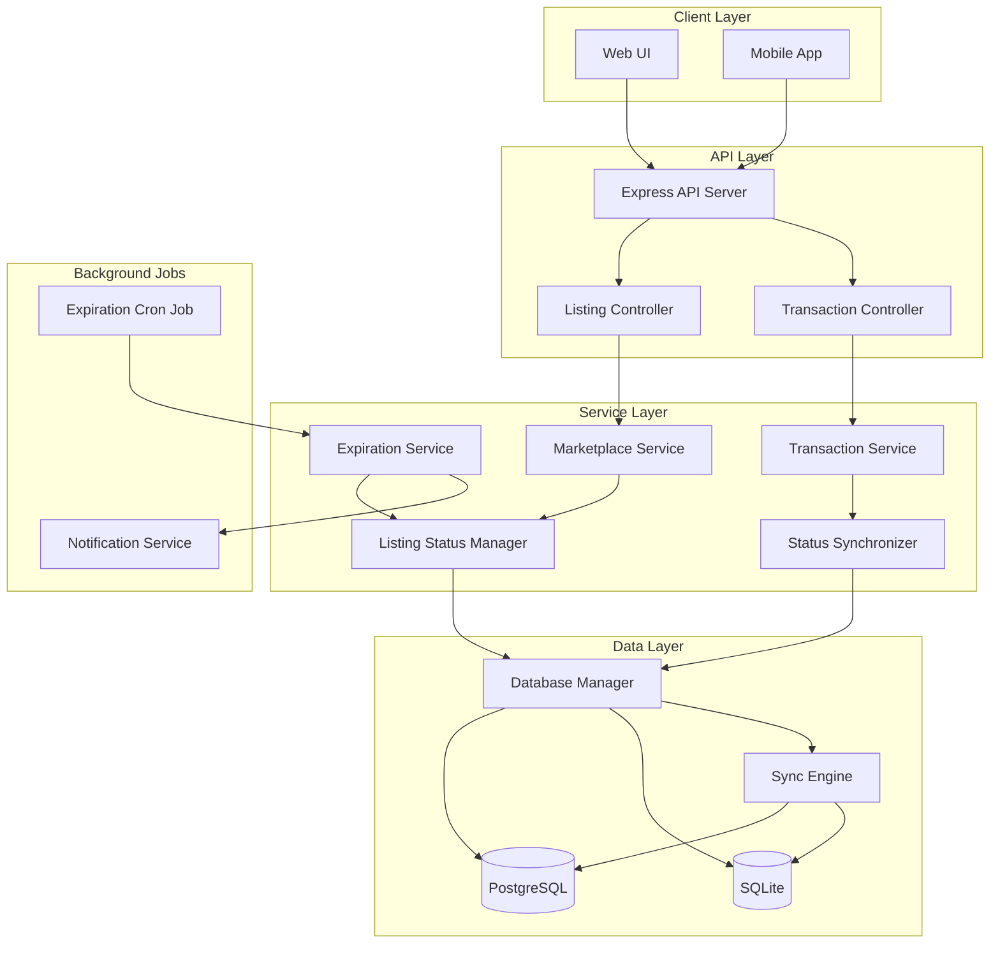
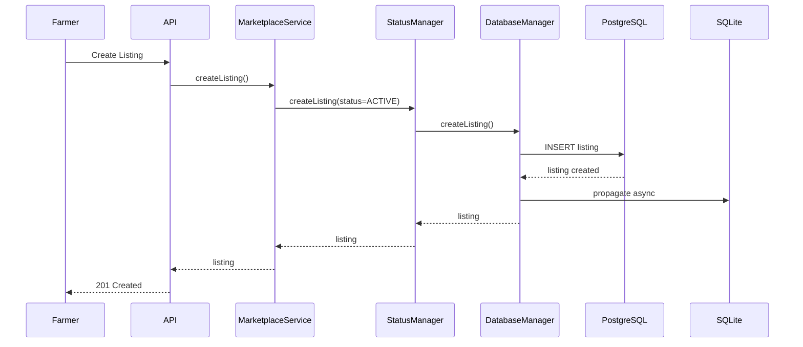
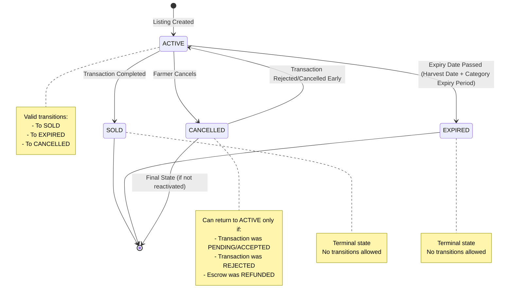
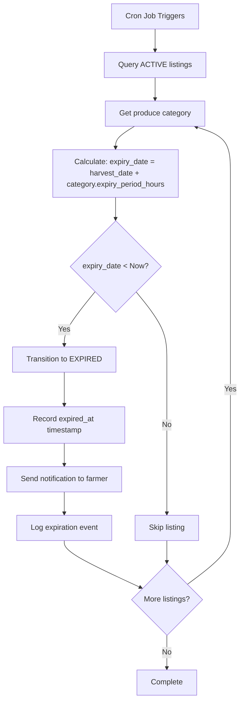
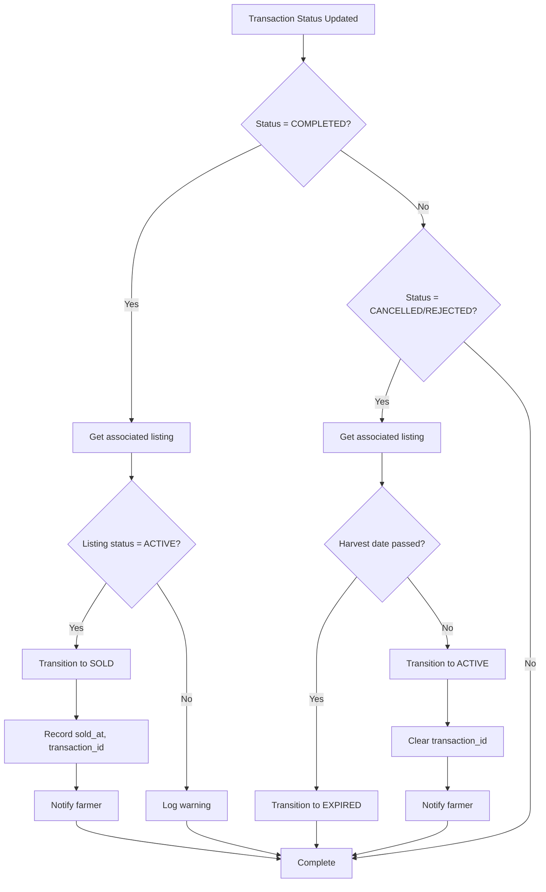
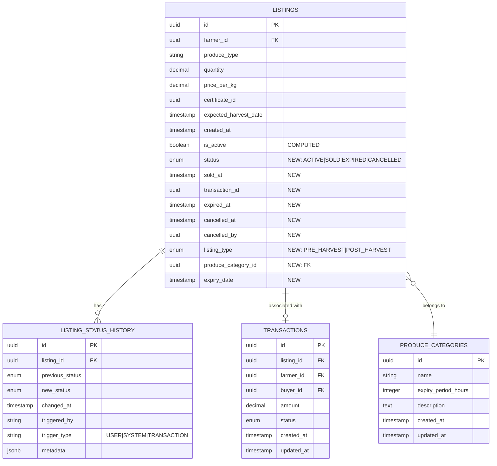
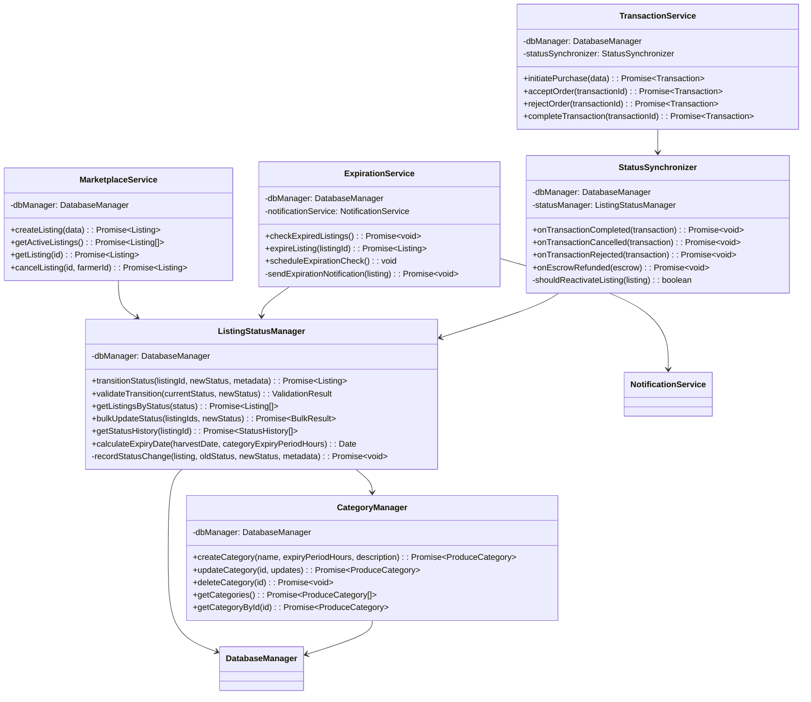
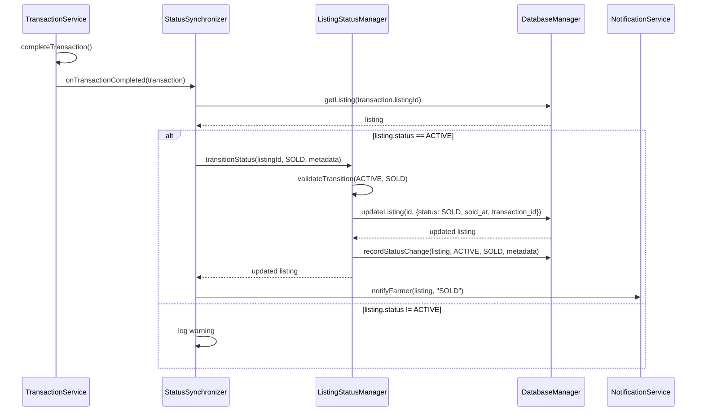

# Design Document: Enhanced Listing Status Management

## Overview

### Purpose

This design document specifies the technical implementation for enhanced listing status management in the Bharat Mandi marketplace. The feature replaces the simple boolean `isActive` flag with an explicit status enumeration (ACTIVE, SOLD, EXPIRED, CANCELLED) to accurately track listing lifecycle, improve analytics, and provide better user experience.

### Scope

The design covers:
- Database schema changes for PostgreSQL and SQLite
- Status enumeration and validation logic
- Automatic expiration service based on harvest dates
- Transaction-listing status synchronization
- Backward compatibility layer for existing code
- Offline sync compatibility
- API response format changes
- Audit trail for status changes
- Bulk operations support

### Goals

1. Enable accurate tracking of listing lifecycle states
2. Maintain backward compatibility with existing `isActive` field
3. Automate listing expiration based on harvest dates
4. Synchronize listing status with transaction completion
5. Support offline operations with proper conflict resolution
6. Provide comprehensive audit trail for compliance
7. Enable analytics and reporting on listing outcomes

### Non-Goals

1. Changing the transaction state machine
2. Modifying escrow flow logic
3. Altering the notification system architecture
4. Implementing new UI components (frontend implementation)


## High-Level Design (HLD)

> **Related Documentation**: See [State Diagrams](../../shared/state-diagrams.md) for complete visual state machine diagrams and marketplace flow.

### System Architecture

The enhanced listing status management feature integrates into the existing Bharat Mandi architecture as follows:



### Component Interaction Diagram



### State Transition Diagram




### Data Flow Diagram

#### Automatic Expiration Flow



#### Transaction Completion Synchronization Flow



### Database Schema Overview

The feature adds a `status` column to the `listings` table and creates a new `listing_status_history` table for audit trail:




### Service Layer Architecture



### Event-Driven Synchronization Design

The system uses an event-driven approach to synchronize listing status with transaction state changes:




## Low-Level Design (LLD)

### Detailed Database Schema

#### PostgreSQL Schema

##### Listings Table Modifications

```sql
-- Add status column with enum type
CREATE TYPE listing_status AS ENUM ('ACTIVE', 'SOLD', 'EXPIRED', 'CANCELLED');
CREATE TYPE listing_type AS ENUM ('PRE_HARVEST', 'POST_HARVEST');

ALTER TABLE listings 
ADD COLUMN status listing_status NOT NULL DEFAULT 'ACTIVE',
ADD COLUMN sold_at TIMESTAMP,
ADD COLUMN transaction_id UUID REFERENCES transactions(id),
ADD COLUMN expired_at TIMESTAMP,
ADD COLUMN cancelled_at TIMESTAMP,
ADD COLUMN cancelled_by UUID REFERENCES users(id),
ADD COLUMN listing_type listing_type NOT NULL DEFAULT 'POST_HARVEST',
ADD COLUMN produce_category_id UUID REFERENCES produce_categories(id),
ADD COLUMN expiry_date TIMESTAMP NOT NULL;

-- Create index for status-based queries (Requirement 8.5)
CREATE INDEX idx_listings_status ON listings(status);

-- Create index for expiration queries
CREATE INDEX idx_listings_expiry_date_status ON listings(expiry_date, status) 
WHERE status = 'ACTIVE';

-- Create index for category queries
CREATE INDEX idx_listings_category ON listings(produce_category_id);

-- Create computed column for backward compatibility (Requirement 3.1, 3.2)
-- Note: PostgreSQL doesn't support computed columns directly, so we use a view or trigger
-- For simplicity, we'll handle this in the application layer

-- Add constraint to ensure sold_at is set when status is SOLD
ALTER TABLE listings 
ADD CONSTRAINT chk_sold_at_when_sold 
CHECK ((status = 'SOLD' AND sold_at IS NOT NULL) OR status != 'SOLD');

-- Add constraint to ensure expired_at is set when status is EXPIRED
ALTER TABLE listings 
ADD CONSTRAINT chk_expired_at_when_expired 
CHECK ((status = 'EXPIRED' AND expired_at IS NOT NULL) OR status != 'EXPIRED');

-- Add constraint to ensure cancelled_at is set when status is CANCELLED
ALTER TABLE listings 
ADD CONSTRAINT chk_cancelled_at_when_cancelled 
CHECK ((status = 'CANCELLED' AND cancelled_at IS NOT NULL) OR status != 'CANCELLED');

-- Add constraint to ensure produce_category_id is set
ALTER TABLE listings 
ADD CONSTRAINT chk_produce_category_required 
CHECK (produce_category_id IS NOT NULL);
```

##### Produce Categories Table (Requirement 6)

```sql
CREATE TABLE produce_categories (
    id UUID PRIMARY KEY DEFAULT gen_random_uuid(),
    name VARCHAR(100) NOT NULL UNIQUE,
    expiry_period_hours INTEGER NOT NULL CHECK (expiry_period_hours > 0 AND expiry_period_hours <= 8760),
    description TEXT,
    created_at TIMESTAMP NOT NULL DEFAULT CURRENT_TIMESTAMP,
    updated_at TIMESTAMP NOT NULL DEFAULT CURRENT_TIMESTAMP
);

-- Create index for name lookups
CREATE INDEX idx_produce_categories_name ON produce_categories(name);

-- Insert default categories (Requirement 6.5)
INSERT INTO produce_categories (name, expiry_period_hours, description) VALUES
('Leafy Greens', 24, 'Palak, methi, dhania, lettuce - highly perishable greens'),
('Fruits', 48, 'Tomato, apple, mango, banana - moderately perishable fruits'),
('Root Vegetables', 168, 'Potato, onion, garlic, carrot - long-lasting root vegetables'),
('Grains', 672, 'Wheat, rice, corn, millet - dry grains with extended shelf life');

COMMENT ON TABLE produce_categories IS 'Produce categories with expiry periods for automatic listing expiration';
COMMENT ON COLUMN produce_categories.expiry_period_hours IS 'Hours after harvest when produce expires (1-8760 hours = 1 hour to 1 year)';
```

##### Listing Status History Table (Requirement 11)

```sql
CREATE TABLE listing_status_history (
    id UUID PRIMARY KEY DEFAULT gen_random_uuid(),
    listing_id UUID NOT NULL REFERENCES listings(id) ON DELETE CASCADE,
    previous_status listing_status,
    new_status listing_status NOT NULL,
    changed_at TIMESTAMP NOT NULL DEFAULT CURRENT_TIMESTAMP,
    triggered_by VARCHAR(255) NOT NULL, -- user_id or 'SYSTEM'
    trigger_type VARCHAR(50) NOT NULL, -- 'USER', 'SYSTEM', 'TRANSACTION'
    metadata JSONB, -- Additional context (e.g., transaction_id, reason)
    created_at TIMESTAMP NOT NULL DEFAULT CURRENT_TIMESTAMP
);

-- Create index for querying history by listing
CREATE INDEX idx_status_history_listing ON listing_status_history(listing_id, changed_at DESC);

-- Create index for audit queries
CREATE INDEX idx_status_history_changed_at ON listing_status_history(changed_at DESC);

-- Add retention policy comment (Requirement 11.4)
COMMENT ON TABLE listing_status_history IS 'Audit trail for listing status changes. Retain for at least 2 years.';
```

#### SQLite Schema

```sql
-- SQLite doesn't support enum types, so we use TEXT with CHECK constraint
ALTER TABLE listings 
ADD COLUMN status TEXT NOT NULL DEFAULT 'ACTIVE' 
CHECK (status IN ('ACTIVE', 'SOLD', 'EXPIRED', 'CANCELLED'));

ALTER TABLE listings ADD COLUMN sold_at TEXT; -- ISO 8601 timestamp
ALTER TABLE listings ADD COLUMN transaction_id TEXT;
ALTER TABLE listings ADD COLUMN expired_at TEXT; -- ISO 8601 timestamp
ALTER TABLE listings ADD COLUMN cancelled_at TEXT; -- ISO 8601 timestamp
ALTER TABLE listings ADD COLUMN cancelled_by TEXT;
ALTER TABLE listings ADD COLUMN listing_type TEXT NOT NULL DEFAULT 'POST_HARVEST'
CHECK (listing_type IN ('PRE_HARVEST', 'POST_HARVEST'));
ALTER TABLE listings ADD COLUMN produce_category_id TEXT NOT NULL;
ALTER TABLE listings ADD COLUMN expiry_date TEXT NOT NULL; -- ISO 8601 timestamp

-- Create indexes
CREATE INDEX idx_listings_status ON listings(status);
CREATE INDEX idx_listings_expiry_date_status ON listings(expiry_date, status) 
WHERE status = 'ACTIVE';
CREATE INDEX idx_listings_category ON listings(produce_category_id);

-- Produce categories table
CREATE TABLE produce_categories (
    id TEXT PRIMARY KEY,
    name TEXT NOT NULL UNIQUE,
    expiry_period_hours INTEGER NOT NULL CHECK (expiry_period_hours > 0 AND expiry_period_hours <= 8760),
    description TEXT,
    created_at TEXT NOT NULL,
    updated_at TEXT NOT NULL
);

CREATE INDEX idx_produce_categories_name ON produce_categories(name);

-- Insert default categories
INSERT INTO produce_categories (id, name, expiry_period_hours, description, created_at, updated_at) VALUES
(lower(hex(randomblob(16))), 'Leafy Greens', 24, 'Palak, methi, dhania, lettuce - highly perishable greens', datetime('now'), datetime('now')),
(lower(hex(randomblob(16))), 'Fruits', 48, 'Tomato, apple, mango, banana - moderately perishable fruits', datetime('now'), datetime('now')),
(lower(hex(randomblob(16))), 'Root Vegetables', 168, 'Potato, onion, garlic, carrot - long-lasting root vegetables', datetime('now'), datetime('now')),
(lower(hex(randomblob(16))), 'Grains', 672, 'Wheat, rice, corn, millet - dry grains with extended shelf life', datetime('now'), datetime('now'));

-- Status history table
CREATE TABLE listing_status_history (
    id TEXT PRIMARY KEY,
    listing_id TEXT NOT NULL,
    previous_status TEXT,
    new_status TEXT NOT NULL CHECK (new_status IN ('ACTIVE', 'SOLD', 'EXPIRED', 'CANCELLED')),
    changed_at TEXT NOT NULL,
    triggered_by TEXT NOT NULL,
    trigger_type TEXT NOT NULL CHECK (trigger_type IN ('USER', 'SYSTEM', 'TRANSACTION')),
    metadata TEXT, -- JSON string
    created_at TEXT NOT NULL,
    FOREIGN KEY (listing_id) REFERENCES listings(id) ON DELETE CASCADE
);

CREATE INDEX idx_status_history_listing ON listing_status_history(listing_id, changed_at DESC);
CREATE INDEX idx_status_history_changed_at ON listing_status_history(changed_at DESC);
```


### Migration Scripts

#### PostgreSQL Migration (Up)

```sql
-- Migration: 001_add_listing_status.up.sql
-- Description: Add status column and related fields to listings table
-- Requirements: 2.1, 2.2, 2.3, 2.4, 2.5, 6, 16, 17, 18

BEGIN;

-- Create enum types for listing status and type
CREATE TYPE listing_status AS ENUM ('ACTIVE', 'SOLD', 'EXPIRED', 'CANCELLED');
CREATE TYPE listing_type AS ENUM ('PRE_HARVEST', 'POST_HARVEST');

-- Create produce categories table first (Requirement 6)
CREATE TABLE produce_categories (
    id UUID PRIMARY KEY DEFAULT gen_random_uuid(),
    name VARCHAR(100) NOT NULL UNIQUE,
    expiry_period_hours INTEGER NOT NULL CHECK (expiry_period_hours > 0 AND expiry_period_hours <= 8760),
    description TEXT,
    created_at TIMESTAMP NOT NULL DEFAULT CURRENT_TIMESTAMP,
    updated_at TIMESTAMP NOT NULL DEFAULT CURRENT_TIMESTAMP
);

CREATE INDEX idx_produce_categories_name ON produce_categories(name);

-- Insert default categories (Requirement 6.5)
INSERT INTO produce_categories (name, expiry_period_hours, description) VALUES
('Leafy Greens', 24, 'Palak, methi, dhania, lettuce - highly perishable greens'),
('Fruits', 48, 'Tomato, apple, mango, banana - moderately perishable fruits'),
('Root Vegetables', 168, 'Potato, onion, garlic, carrot - long-lasting root vegetables'),
('Grains', 672, 'Wheat, rice, corn, millet - dry grains with extended shelf life');

COMMENT ON TABLE produce_categories IS 'Produce categories with expiry periods for automatic listing expiration';
COMMENT ON COLUMN produce_categories.expiry_period_hours IS 'Hours after harvest when produce expires (1-8760 hours = 1 hour to 1 year)';

-- Add new columns to listings table
ALTER TABLE listings 
ADD COLUMN status listing_status,
ADD COLUMN sold_at TIMESTAMP,
ADD COLUMN transaction_id UUID,
ADD COLUMN expired_at TIMESTAMP,
ADD COLUMN cancelled_at TIMESTAMP,
ADD COLUMN cancelled_by UUID,
ADD COLUMN listing_type listing_type,
ADD COLUMN produce_category_id UUID,
ADD COLUMN expiry_date TIMESTAMP;

-- Migrate existing data (Requirement 2.3, 2.4, 16, 17)
-- Set listing_type to POST_HARVEST for all existing listings
UPDATE listings 
SET listing_type = 'POST_HARVEST';

-- Map produce types to categories and set produce_category_id
-- Default to 'Fruits' category if no specific mapping
UPDATE listings 
SET produce_category_id = (
    SELECT id FROM produce_categories 
    WHERE name = CASE 
        WHEN produce_type IN ('palak', 'methi', 'dhania', 'lettuce', 'spinach', 'coriander') THEN 'Leafy Greens'
        WHEN produce_type IN ('potato', 'onion', 'garlic', 'carrot', 'radish', 'beetroot') THEN 'Root Vegetables'
        WHEN produce_type IN ('wheat', 'rice', 'corn', 'millet', 'barley') THEN 'Grains'
        ELSE 'Fruits'
    END
    LIMIT 1
);

-- Calculate expiry_date for existing listings (Requirement 17.1, 17.5)
-- expiry_date = expected_harvest_date + category.expiry_period_hours
UPDATE listings 
SET expiry_date = expected_harvest_date + (
    SELECT INTERVAL '1 hour' * expiry_period_hours 
    FROM produce_categories 
    WHERE id = listings.produce_category_id
)
WHERE expected_harvest_date IS NOT NULL;

-- For listings without harvest date, set expiry to created_at + 7 days (default)
UPDATE listings 
SET expiry_date = created_at + INTERVAL '7 days'
WHERE expected_harvest_date IS NULL;

-- Set status to ACTIVE for active listings
UPDATE listings 
SET status = 'ACTIVE' 
WHERE is_active = true;

-- Set status to CANCELLED for inactive listings
UPDATE listings 
SET status = 'CANCELLED',
    cancelled_at = updated_at
WHERE is_active = false;

-- Make required columns NOT NULL after data migration
ALTER TABLE listings 
ALTER COLUMN status SET NOT NULL,
ALTER COLUMN status SET DEFAULT 'ACTIVE',
ALTER COLUMN listing_type SET NOT NULL,
ALTER COLUMN listing_type SET DEFAULT 'POST_HARVEST',
ALTER COLUMN produce_category_id SET NOT NULL,
ALTER COLUMN expiry_date SET NOT NULL;

-- Add foreign key constraints
ALTER TABLE listings 
ADD CONSTRAINT fk_listings_transaction 
FOREIGN KEY (transaction_id) REFERENCES transactions(id);

ALTER TABLE listings 
ADD CONSTRAINT fk_listings_cancelled_by 
FOREIGN KEY (cancelled_by) REFERENCES users(id);

ALTER TABLE listings 
ADD CONSTRAINT fk_listings_produce_category 
FOREIGN KEY (produce_category_id) REFERENCES produce_categories(id);

-- Add check constraints
ALTER TABLE listings 
ADD CONSTRAINT chk_sold_at_when_sold 
CHECK ((status = 'SOLD' AND sold_at IS NOT NULL AND transaction_id IS NOT NULL) OR status != 'SOLD');

ALTER TABLE listings 
ADD CONSTRAINT chk_expired_at_when_expired 
CHECK ((status = 'EXPIRED' AND expired_at IS NOT NULL) OR status != 'EXPIRED');

ALTER TABLE listings 
ADD CONSTRAINT chk_cancelled_at_when_cancelled 
CHECK ((status = 'CANCELLED' AND cancelled_at IS NOT NULL) OR status != 'CANCELLED');

-- Create indexes (Requirement 8.5)
CREATE INDEX idx_listings_status ON listings(status);
CREATE INDEX idx_listings_expiry_date_status ON listings(expiry_date, status) 
WHERE status = 'ACTIVE';
CREATE INDEX idx_listings_transaction ON listings(transaction_id) WHERE transaction_id IS NOT NULL;
CREATE INDEX idx_listings_category ON listings(produce_category_id);

-- Create status history table (Requirement 11)
CREATE TABLE listing_status_history (
    id UUID PRIMARY KEY DEFAULT gen_random_uuid(),
    listing_id UUID NOT NULL REFERENCES listings(id) ON DELETE CASCADE,
    previous_status listing_status,
    new_status listing_status NOT NULL,
    changed_at TIMESTAMP NOT NULL DEFAULT CURRENT_TIMESTAMP,
    triggered_by VARCHAR(255) NOT NULL,
    trigger_type VARCHAR(50) NOT NULL CHECK (trigger_type IN ('USER', 'SYSTEM', 'TRANSACTION')),
    metadata JSONB,
    created_at TIMESTAMP NOT NULL DEFAULT CURRENT_TIMESTAMP
);

CREATE INDEX idx_status_history_listing ON listing_status_history(listing_id, changed_at DESC);
CREATE INDEX idx_status_history_changed_at ON listing_status_history(changed_at DESC);

COMMENT ON TABLE listing_status_history IS 'Audit trail for listing status changes. Retain for at least 2 years.';

-- Create initial history records for migrated data
INSERT INTO listing_status_history (listing_id, previous_status, new_status, changed_at, triggered_by, trigger_type, metadata)
SELECT 
    id,
    NULL,
    status,
    created_at,
    'SYSTEM',
    'SYSTEM',
    jsonb_build_object('migration', true, 'original_is_active', is_active)
FROM listings;

COMMIT;
```

#### PostgreSQL Migration (Down)

```sql
-- Migration: 001_add_listing_status.down.sql
-- Description: Rollback listing status changes
-- Requirements: 2.6

BEGIN;

-- Drop status history table
DROP TABLE IF EXISTS listing_status_history;

-- Drop indexes
DROP INDEX IF EXISTS idx_listings_category;
DROP INDEX IF EXISTS idx_listings_transaction;
DROP INDEX IF EXISTS idx_listings_expiry_date_status;
DROP INDEX IF EXISTS idx_listings_status;

-- Drop constraints
ALTER TABLE listings DROP CONSTRAINT IF EXISTS chk_cancelled_at_when_cancelled;
ALTER TABLE listings DROP CONSTRAINT IF EXISTS chk_expired_at_when_expired;
ALTER TABLE listings DROP CONSTRAINT IF EXISTS chk_sold_at_when_sold;
ALTER TABLE listings DROP CONSTRAINT IF EXISTS fk_listings_produce_category;
ALTER TABLE listings DROP CONSTRAINT IF EXISTS fk_listings_cancelled_by;
ALTER TABLE listings DROP CONSTRAINT IF EXISTS fk_listings_transaction;

-- Drop columns
ALTER TABLE listings 
DROP COLUMN IF EXISTS expiry_date,
DROP COLUMN IF EXISTS produce_category_id,
DROP COLUMN IF EXISTS listing_type,
DROP COLUMN IF EXISTS cancelled_by,
DROP COLUMN IF EXISTS cancelled_at,
DROP COLUMN IF EXISTS expired_at,
DROP COLUMN IF EXISTS transaction_id,
DROP COLUMN IF EXISTS sold_at,
DROP COLUMN IF EXISTS status;

-- Drop produce categories table
DROP TABLE IF EXISTS produce_categories;

-- Drop enum types
DROP TYPE IF EXISTS listing_type;
DROP TYPE IF EXISTS listing_status;

COMMIT;
```


#### SQLite Migration (Up)

```sql
-- Migration: 001_add_listing_status_sqlite.up.sql
-- Description: Add status column and related fields to listings table (SQLite)
-- Requirements: 2.1, 2.2, 2.3, 2.4, 2.5, 6, 16, 17, 18

BEGIN TRANSACTION;

-- Create produce categories table first (Requirement 6)
CREATE TABLE produce_categories (
    id TEXT PRIMARY KEY,
    name TEXT NOT NULL UNIQUE,
    expiry_period_hours INTEGER NOT NULL CHECK (expiry_period_hours > 0 AND expiry_period_hours <= 8760),
    description TEXT,
    created_at TEXT NOT NULL,
    updated_at TEXT NOT NULL
);

CREATE INDEX idx_produce_categories_name ON produce_categories(name);

-- Insert default categories (Requirement 6.5)
INSERT INTO produce_categories (id, name, expiry_period_hours, description, created_at, updated_at) VALUES
(lower(hex(randomblob(16))), 'Leafy Greens', 24, 'Palak, methi, dhania, lettuce - highly perishable greens', datetime('now'), datetime('now')),
(lower(hex(randomblob(16))), 'Fruits', 48, 'Tomato, apple, mango, banana - moderately perishable fruits', datetime('now'), datetime('now')),
(lower(hex(randomblob(16))), 'Root Vegetables', 168, 'Potato, onion, garlic, carrot - long-lasting root vegetables', datetime('now'), datetime('now')),
(lower(hex(randomblob(16))), 'Grains', 672, 'Wheat, rice, corn, millet - dry grains with extended shelf life', datetime('now'), datetime('now'));

-- SQLite doesn't support ALTER TABLE ADD COLUMN with constraints in one statement
-- Add new columns
ALTER TABLE listings ADD COLUMN status TEXT DEFAULT 'ACTIVE';
ALTER TABLE listings ADD COLUMN sold_at TEXT;
ALTER TABLE listings ADD COLUMN transaction_id TEXT;
ALTER TABLE listings ADD COLUMN expired_at TEXT;
ALTER TABLE listings ADD COLUMN cancelled_at TEXT;
ALTER TABLE listings ADD COLUMN cancelled_by TEXT;
ALTER TABLE listings ADD COLUMN listing_type TEXT DEFAULT 'POST_HARVEST';
ALTER TABLE listings ADD COLUMN produce_category_id TEXT;
ALTER TABLE listings ADD COLUMN expiry_date TEXT;

-- Migrate existing data (Requirement 2.3, 2.4, 16, 17)
-- Map produce types to categories and set produce_category_id
UPDATE listings 
SET produce_category_id = (
    SELECT id FROM produce_categories 
    WHERE name = CASE 
        WHEN produce_type IN ('palak', 'methi', 'dhania', 'lettuce', 'spinach', 'coriander') THEN 'Leafy Greens'
        WHEN produce_type IN ('potato', 'onion', 'garlic', 'carrot', 'radish', 'beetroot') THEN 'Root Vegetables'
        WHEN produce_type IN ('wheat', 'rice', 'corn', 'millet', 'barley') THEN 'Grains'
        ELSE 'Fruits'
    END
    LIMIT 1
);

-- Calculate expiry_date for existing listings (Requirement 17.1, 17.5)
-- expiry_date = expected_harvest_date + category.expiry_period_hours
UPDATE listings 
SET expiry_date = datetime(expected_harvest_date, '+' || (
    SELECT expiry_period_hours FROM produce_categories 
    WHERE id = listings.produce_category_id
) || ' hours')
WHERE expected_harvest_date IS NOT NULL;

-- For listings without harvest date, set expiry to created_at + 7 days (default)
UPDATE listings 
SET expiry_date = datetime(created_at, '+7 days')
WHERE expected_harvest_date IS NULL;

-- Set status to ACTIVE for active listings
UPDATE listings 
SET status = 'ACTIVE' 
WHERE is_active = 1;

-- Set status to CANCELLED for inactive listings
UPDATE listings 
SET status = 'CANCELLED',
    cancelled_at = datetime('now')
WHERE is_active = 0;

-- Create indexes
CREATE INDEX idx_listings_status ON listings(status);
CREATE INDEX idx_listings_expiry_date_status ON listings(expiry_date, status) 
WHERE status = 'ACTIVE';
CREATE INDEX idx_listings_transaction ON listings(transaction_id) WHERE transaction_id IS NOT NULL;
CREATE INDEX idx_listings_category ON listings(produce_category_id);

-- Create status history table
CREATE TABLE listing_status_history (
    id TEXT PRIMARY KEY,
    listing_id TEXT NOT NULL,
    previous_status TEXT,
    new_status TEXT NOT NULL,
    changed_at TEXT NOT NULL,
    triggered_by TEXT NOT NULL,
    trigger_type TEXT NOT NULL,
    metadata TEXT,
    created_at TEXT NOT NULL,
    FOREIGN KEY (listing_id) REFERENCES listings(id) ON DELETE CASCADE,
    CHECK (new_status IN ('ACTIVE', 'SOLD', 'EXPIRED', 'CANCELLED')),
    CHECK (trigger_type IN ('USER', 'SYSTEM', 'TRANSACTION'))
);

CREATE INDEX idx_status_history_listing ON listing_status_history(listing_id, changed_at DESC);
CREATE INDEX idx_status_history_changed_at ON listing_status_history(changed_at DESC);

-- Create initial history records for migrated data
INSERT INTO listing_status_history (id, listing_id, previous_status, new_status, changed_at, triggered_by, trigger_type, metadata, created_at)
SELECT 
    lower(hex(randomblob(16))),
    id,
    NULL,
    status,
    created_at,
    'SYSTEM',
    'SYSTEM',
    json_object('migration', 1, 'original_is_active', is_active),
    created_at
FROM listings;

COMMIT;
```

#### SQLite Migration (Down)

```sql
-- Migration: 001_add_listing_status_sqlite.down.sql
-- Description: Rollback listing status changes (SQLite)
-- Requirements: 2.6

BEGIN TRANSACTION;

-- Drop status history table
DROP TABLE IF EXISTS listing_status_history;

-- Drop produce categories table
DROP TABLE IF EXISTS produce_categories;

-- Drop indexes
DROP INDEX IF EXISTS idx_listings_category;
DROP INDEX IF EXISTS idx_listings_transaction;
DROP INDEX IF EXISTS idx_listings_expiry_date_status;
DROP INDEX IF EXISTS idx_listings_status;

-- SQLite doesn't support DROP COLUMN directly in older versions
-- We need to recreate the table without the new columns
CREATE TABLE listings_backup AS 
SELECT 
    id,
    farmer_id,
    produce_type,
    quantity,
    price_per_kg,
    certificate_id,
    expected_harvest_date,
    created_at,
    is_active
FROM listings;

DROP TABLE listings;

ALTER TABLE listings_backup RENAME TO listings;

-- Recreate original indexes
CREATE INDEX idx_listings_farmer ON listings(farmer_id);
CREATE INDEX idx_listings_active ON listings(is_active);

COMMIT;
```


## Components and Interfaces

### ListingStatusManager Service

```typescript
// src/features/marketplace/listing-status-manager.ts

import { DatabaseManager } from '../../shared/database/db-abstraction';
import { Listing } from './marketplace.types';
import { ListingStatus } from '../../shared/types/common.types';

export interface StatusTransitionMetadata {
  triggeredBy: string; // user_id or 'SYSTEM'
  triggerType: 'USER' | 'SYSTEM' | 'TRANSACTION';
  transactionId?: string;
  reason?: string;
  [key: string]: any;
}

export interface ValidationResult {
  valid: boolean;
  error?: string;
}

export interface BulkStatusResult {
  successful: string[]; // listing IDs
  failed: Array<{
    listingId: string;
    error: string;
  }>;
}

export interface StatusHistory {
  id: string;
  listingId: string;
  previousStatus: ListingStatus | null;
  newStatus: ListingStatus;
  changedAt: Date;
  triggeredBy: string;
  triggerType: 'USER' | 'SYSTEM' | 'TRANSACTION';
  metadata?: Record<string, any>;
}

export class ListingStatusManager {
  private dbManager: DatabaseManager;

  constructor(dbManager: DatabaseManager) {
    this.dbManager = dbManager;
  }

  /**
   * Transition a listing to a new status
   * Requirements: 1.1, 1.3, 10.1, 10.2, 10.5, 11.1, 11.2
   * 
   * @param listingId - Listing ID
   * @param newStatus - Target status
   * @param metadata - Context about the transition
   * @returns Updated listing
   * @throws Error if transition is invalid
   */
  async transitionStatus(
    listingId: string,
    newStatus: ListingStatus,
    metadata: StatusTransitionMetadata
  ): Promise<Listing> {
    // Implementation details in LLD
  }

  /**
   * Validate if a status transition is allowed
   * Requirements: 10.1, 10.2, 10.3, 10.4, 10.5
   * 
   * @param currentStatus - Current listing status
   * @param newStatus - Target status
   * @returns Validation result
   */
  validateTransition(
    currentStatus: ListingStatus,
    newStatus: ListingStatus
  ): ValidationResult {
    // Implementation details in LLD
  }

  /**
   * Get listings by status
   * Requirements: 8.1, 8.2, 8.3
   * 
   * @param status - Status to filter by (single or array)
   * @returns Array of listings
   */
  async getListingsByStatus(
    status: ListingStatus | ListingStatus[]
  ): Promise<Listing[]> {
    // Implementation details in LLD
  }

  /**
   * Bulk update status for multiple listings
   * Requirements: 15.1, 15.2, 15.3, 15.4, 15.5
   * 
   * @param listingIds - Array of listing IDs
   * @param newStatus - Target status
   * @param metadata - Context about the transition
   * @returns Bulk operation result
   */
  async bulkUpdateStatus(
    listingIds: string[],
    newStatus: ListingStatus,
    metadata: StatusTransitionMetadata
  ): Promise<BulkStatusResult> {
    // Implementation details in LLD
  }

  /**
   * Calculate expiry date for a listing
   * Requirements: 17.1, 17.2, 17.5
   * 
   * @param harvestDate - Expected or actual harvest date
   * @param categoryExpiryPeriodHours - Expiry period from produce category
   * @returns Calculated expiry date
   */
  calculateExpiryDate(
    harvestDate: Date,
    categoryExpiryPeriodHours: number
  ): Date {
    const expiryDate = new Date(harvestDate);
    expiryDate.setHours(expiryDate.getHours() + categoryExpiryPeriodHours);
    return expiryDate;
  }
    metadata: StatusTransitionMetadata
  ): Promise<BulkStatusResult> {
    // Implementation details in LLD
  }

  /**
   * Get status change history for a listing
   * Requirements: 11.5
   * 
   * @param listingId - Listing ID
   * @returns Array of status history records
   */
  async getStatusHistory(listingId: string): Promise<StatusHistory[]> {
    // Implementation details in LLD
  }

  /**
   * Record a status change in the audit trail
   * Requirements: 11.1, 11.2, 11.3
   * 
   * @param listing - Listing object
   * @param oldStatus - Previous status
   * @param newStatus - New status
   * @param metadata - Context about the change
   */
  private async recordStatusChange(
    listing: Listing,
    oldStatus: ListingStatus | null,
    newStatus: ListingStatus,
    metadata: StatusTransitionMetadata
  ): Promise<void> {
    // Implementation details in LLD
  }
}
```


### ExpirationService

```typescript
// src/features/marketplace/expiration.service.ts

import { DatabaseManager } from '../../shared/database/db-abstraction';
import { NotificationService } from '../notifications/notification.service';
import { Listing } from './marketplace.types';
import { ListingStatusManager } from './listing-status-manager';

export class ExpirationService {
  private dbManager: DatabaseManager;
  private notificationService: NotificationService;
  private statusManager: ListingStatusManager;
  private checkInterval: NodeJS.Timeout | null = null;

  constructor(
    dbManager: DatabaseManager,
    notificationService: NotificationService,
    statusManager: ListingStatusManager
  ) {
    this.dbManager = dbManager;
    this.notificationService = notificationService;
    this.statusManager = statusManager;
  }

  /**
   * Check for expired listings and transition them to EXPIRED status
   * Requirements: 4.1, 4.2, 4.3, 4.4, 4.5, 4.6
   * 
   * Runs hourly to check for listings past their expiration time
   * Query: WHERE status='ACTIVE' AND expiry_date < NOW()
   */
  async checkExpiredListings(): Promise<void> {
    // Implementation details in LLD
  }

  /**
   * Expire a specific listing
   * Requirements: 4.1, 4.4, 4.5
   * 
   * @param listingId - Listing ID to expire
   * @returns Updated listing
   */
  async expireListing(listingId: string): Promise<Listing> {
    // Implementation details in LLD
  }

  /**
   * Schedule periodic expiration checks
   * Requirements: 4.2
   * 
   * Starts a cron job that runs every hour
   */
  scheduleExpirationCheck(): void {
    // Implementation details in LLD
  }

  /**
   * Stop the expiration check scheduler
   */
  stopScheduler(): void {
    if (this.checkInterval) {
      clearInterval(this.checkInterval);
      this.checkInterval = null;
    }
  }

  /**
   * Send expiration notification to farmer
   * Requirements: 4.5
   * 
   * @param listing - Listing that expired or is about to expire
   * @param type - 'WARNING' or 'EXPIRED'
   */
  private async sendExpirationNotification(
    listing: Listing,
    type: 'WARNING' | 'EXPIRED'
  ): Promise<void> {
    // Implementation details in LLD
  }
}
```

### CategoryManager

```typescript
// src/features/marketplace/category-manager.ts

import { DatabaseManager } from '../../shared/database/db-abstraction';

export interface ProduceCategory {
  id: string;
  name: string;
  expiryPeriodHours: number;
  description?: string;
  createdAt: Date;
  updatedAt: Date;
}

export interface CreateCategoryInput {
  name: string;
  expiryPeriodHours: number;
  description?: string;
}

export interface UpdateCategoryInput {
  name?: string;
  expiryPeriodHours?: number;
  description?: string;
}

export class CategoryManager {
  private dbManager: DatabaseManager;

  constructor(dbManager: DatabaseManager) {
    this.dbManager = dbManager;
  }

  /**
   * Create a new produce category
   * Requirements: 6.1, 6.2
   * 
   * @param input - Category creation data
   * @returns Created category
   * @throws Error if name already exists or expiry period is invalid
   */
  async createCategory(input: CreateCategoryInput): Promise<ProduceCategory> {
    // Implementation details in LLD
  }

  /**
   * Update an existing produce category
   * Requirements: 6.3
   * 
   * @param id - Category ID
   * @param updates - Fields to update
   * @returns Updated category
   * @throws Error if category not found
   */
  async updateCategory(
    id: string,
    updates: UpdateCategoryInput
  ): Promise<ProduceCategory> {
    // Implementation details in LLD
  }

  /**
   * Delete a produce category
   * Requirements: 6.4
   * 
   * @param id - Category ID
   * @throws Error if category has existing listings
   */
  async deleteCategory(id: string): Promise<void> {
    // Implementation details in LLD
  }

  /**
   * Get all produce categories
   * Requirements: 6.2
   * 
   * @returns Array of all categories
   */
  async getCategories(): Promise<ProduceCategory[]> {
    // Implementation details in LLD
  }

  /**
   * Get a specific category by ID
   * Requirements: 6.2
   * 
   * @param id - Category ID
   * @returns Category or null if not found
   */
  async getCategoryById(id: string): Promise<ProduceCategory | null> {
    // Implementation details in LLD
  }

  /**
   * Validate expiry period is within allowed range
   * Requirements: 6.6
   * 
   * @param hours - Expiry period in hours
   * @returns true if valid (1-8760 hours)
   */
  validateExpiryPeriod(hours: number): boolean {
    return hours >= 1 && hours <= 8760;
  }
}
```


### StatusSynchronizer

```typescript
// src/features/marketplace/status-synchronizer.ts

import { DatabaseManager } from '../../shared/database/db-abstraction';
import { Transaction, EscrowAccount } from '../transactions/transaction.types';
import { Listing } from './marketplace.types';
import { ListingStatusManager } from './listing-status-manager';
import { TransactionStatus, EscrowStatus, ListingStatus } from '../../shared/types/common.types';

export class StatusSynchronizer {
  private dbManager: DatabaseManager;
  private statusManager: ListingStatusManager;

  constructor(dbManager: DatabaseManager, statusManager: ListingStatusManager) {
    this.dbManager = dbManager;
    this.statusManager = statusManager;
  }

  /**
   * Handle transaction completion event
   * Requirements: 5.1, 5.2, 5.3, 5.4, 5.5
   * 
   * @param transaction - Completed transaction
   */
  async onTransactionCompleted(transaction: Transaction): Promise<void> {
    // Implementation details in LLD
  }

  /**
   * Handle transaction cancellation event
   * Requirements: 7.1, 7.2, 7.4, 7.5
   * 
   * @param transaction - Cancelled transaction
   */
  async onTransactionCancelled(transaction: Transaction): Promise<void> {
    // Implementation details in LLD
  }

  /**
   * Handle transaction rejection event
   * Requirements: 7.2, 7.4, 7.5
   * 
   * @param transaction - Rejected transaction
   */
  async onTransactionRejected(transaction: Transaction): Promise<void> {
    // Implementation details in LLD
  }

  /**
   * Handle escrow refund event
   * Requirements: 6.3, 6.4, 6.5
   * 
   * @param escrow - Refunded escrow account
   */
  async onEscrowRefunded(escrow: EscrowAccount): Promise<void> {
    // Implementation details in LLD
  }

  /**
   * Determine if a listing should be reactivated
   * Requirements: 6.5
   * 
   * @param listing - Listing to check
   * @returns true if harvest date has not passed, false otherwise
   */
  private shouldReactivateListing(listing: Listing): boolean {
    // Implementation details in LLD
  }
}
```

### Updated Listing Type

```typescript
// src/features/marketplace/marketplace.types.ts

import { ProduceGrade } from '../../shared/types/common.types';
import { ListingStatus, ListingType } from '../../shared/types/common.types';

export interface Listing {
  id: string;
  farmerId: string;
  produceType: string;
  quantity: number;
  pricePerKg: number;
  certificateId: string;
  expectedHarvestDate?: Date;
  createdAt: Date;
  
  // Backward compatibility (computed)
  isActive: boolean;
  
  // New status fields
  status: ListingStatus;
  soldAt?: Date;
  transactionId?: string;
  expiredAt?: Date;
  cancelledAt?: Date;
  cancelledBy?: string;
  
  // New perishability-based expiration fields (Requirements 16, 17, 18)
  listingType: ListingType; // 'PRE_HARVEST' | 'POST_HARVEST'
  produceCategoryId: string;
  produceCategoryName?: string; // Populated in API responses
  expiryDate: Date;
}

export interface TranslatedListing extends Listing {
  originalProduceType: string;
  translatedProduceType: string;
  isTranslated: boolean;
  sourceLanguage: string;
  targetLanguage: string;
}
```


### API Endpoint Signatures

#### Get Active Listings

```typescript
/**
 * GET /api/marketplace/listings
 * Get listings filtered by status
 * Requirements: 8.1, 8.2, 8.3, 13.1, 13.2
 */

// Query Parameters
interface GetListingsQuery {
  status?: 'ACTIVE' | 'SOLD' | 'EXPIRED' | 'CANCELLED' | string; // Comma-separated for multiple
  farmerId?: string;
  limit?: number;
  offset?: number;
}

// Response
interface GetListingsResponse {
  listings: Array<{
    id: string;
    farmerId: string;
    produceType: string;
    quantity: number;
    pricePerKg: number;
    certificateId: string;
    expectedHarvestDate?: string; // ISO 8601
    createdAt: string; // ISO 8601
    isActive: boolean; // Computed for backward compatibility
    status: 'ACTIVE' | 'SOLD' | 'EXPIRED' | 'CANCELLED';
    soldAt?: string; // ISO 8601, present if status is SOLD
    transactionId?: string; // Present if status is SOLD
    expiredAt?: string; // ISO 8601, present if status is EXPIRED
    cancelledAt?: string; // ISO 8601, present if status is CANCELLED
    cancelledBy?: string; // User ID, present if status is CANCELLED
    listingType: 'PRE_HARVEST' | 'POST_HARVEST'; // Requirement 14.3
    produceCategoryId: string; // Requirement 14.4
    produceCategoryName: string; // Requirement 14.4
    expiryDate: string; // ISO 8601, Requirement 14.5
  }>;
  total: number;
}
```

#### Cancel Listing

```typescript
/**
 * POST /api/marketplace/listings/:id/cancel
 * Cancel an active listing
 * Requirements: 8.1, 8.2, 8.3, 8.4, 8.5
 */

// Request Body
interface CancelListingRequest {
  reason?: string;
}

// Response
interface CancelListingResponse {
  listing: {
    id: string;
    status: 'CANCELLED';
    cancelledAt: string; // ISO 8601
    cancelledBy: string; // User ID
    // ... other listing fields
  };
}

// Error Response (if listing has active transaction)
interface CancelListingError {
  error: string;
  message: string;
  currentStatus: string;
  transactionId?: string;
  transactionStatus?: string;
}
```

#### Produce Category Management (New - Requirement 6)

```typescript
/**
 * POST /api/admin/produce-categories
 * Create a new produce category
 * Requirements: 6.1, 6.2
 */

// Request Body
interface CreateCategoryRequest {
  name: string;
  expiryPeriodHours: number; // 1-8760 hours
  description?: string;
}

// Response
interface CreateCategoryResponse {
  category: {
    id: string;
    name: string;
    expiryPeriodHours: number;
    description?: string;
    createdAt: string; // ISO 8601
    updatedAt: string; // ISO 8601
  };
}

/**
 * GET /api/produce-categories
 * Get all produce categories
 * Requirements: 6.2
 */

// Response
interface GetCategoriesResponse {
  categories: Array<{
    id: string;
    name: string;
    expiryPeriodHours: number;
    description?: string;
    createdAt: string; // ISO 8601
    updatedAt: string; // ISO 8601
  }>;
}

/**
 * PATCH /api/admin/produce-categories/:id
 * Update a produce category
 * Requirements: 6.3
 */

// Request Body
interface UpdateCategoryRequest {
  name?: string;
  expiryPeriodHours?: number; // 1-8760 hours
  description?: string;
}

// Response
interface UpdateCategoryResponse {
  category: {
    id: string;
    name: string;
    expiryPeriodHours: number;
    description?: string;
    createdAt: string; // ISO 8601
    updatedAt: string; // ISO 8601
  };
}

/**
 * DELETE /api/admin/produce-categories/:id
 * Delete a produce category
 * Requirements: 6.4
 */

// Response (success)
interface DeleteCategoryResponse {
  message: string;
}

// Error Response (if category has existing listings)
interface DeleteCategoryError {
  error: string;
  message: string;
  activeListingsCount: number;
}
```

#### Get Listing Status History

```typescript
/**
 * GET /api/marketplace/listings/:id/history
 * Get status change history for a listing
 * Requirements: 11.5
 */

// Response
interface GetStatusHistoryResponse {
  history: Array<{
    id: string;
    listingId: string;
    previousStatus: 'ACTIVE' | 'SOLD' | 'EXPIRED' | 'CANCELLED' | null;
    newStatus: 'ACTIVE' | 'SOLD' | 'EXPIRED' | 'CANCELLED';
    changedAt: string; // ISO 8601
    triggeredBy: string; // User ID or 'SYSTEM'
    triggerType: 'USER' | 'SYSTEM' | 'TRANSACTION';
    metadata?: Record<string, any>;
  }>;
}
```

#### Bulk Update Status (Admin)

```typescript
/**
 * POST /api/admin/marketplace/listings/bulk-status
 * Bulk update status for multiple listings
 * Requirements: 15.1, 15.2, 15.3, 15.4, 15.5
 */

// Request Body
interface BulkUpdateStatusRequest {
  listingIds: string[];
  status: 'ACTIVE' | 'SOLD' | 'EXPIRED' | 'CANCELLED';
  reason?: string;
}

// Response
interface BulkUpdateStatusResponse {
  successful: string[]; // Listing IDs
  failed: Array<{
    listingId: string;
    error: string;
  }>;
  totalProcessed: number;
  successCount: number;
  failureCount: number;
}
```

#### Get Analytics

```typescript
/**
 * GET /api/marketplace/analytics/listings
 * Get listing analytics by status
 * Requirements: 9.1, 9.2, 9.3, 9.4, 9.5
 */

// Query Parameters
interface GetAnalyticsQuery {
  startDate?: string; // ISO 8601
  endDate?: string; // ISO 8601
  farmerId?: string;
}

// Response
interface GetAnalyticsResponse {
  statusCounts: {
    ACTIVE: number;
    SOLD: number;
    EXPIRED: number;
    CANCELLED: number;
  };
  averageTimeToSold: number; // In hours
  expiredWithoutSale: number;
  cancellationRate: number; // Percentage
  totalListings: number;
  dateRange: {
    start: string; // ISO 8601
    end: string; // ISO 8601
  };
}
```
