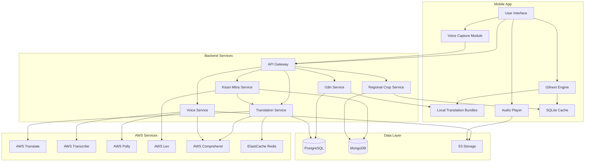
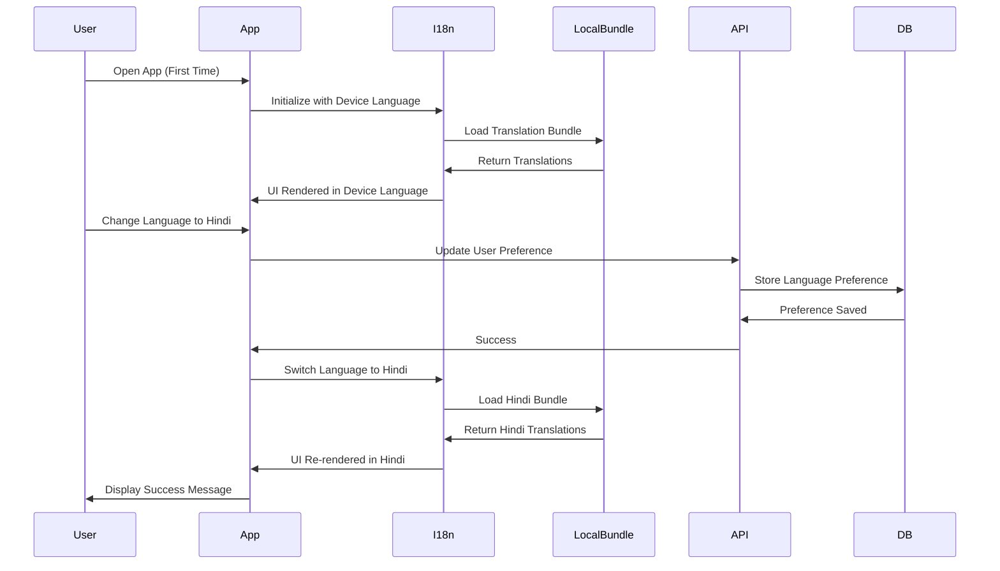
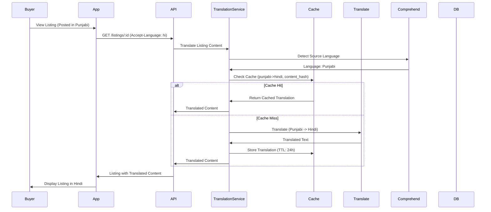
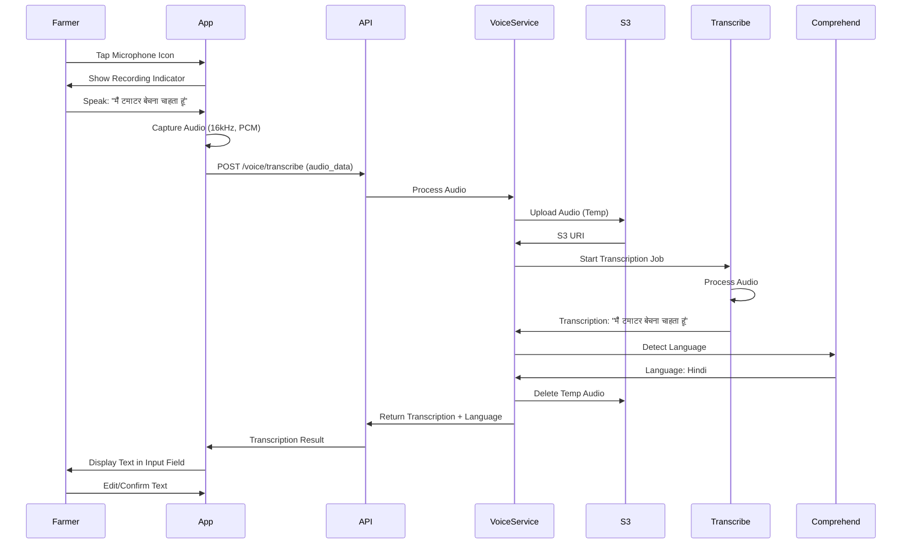
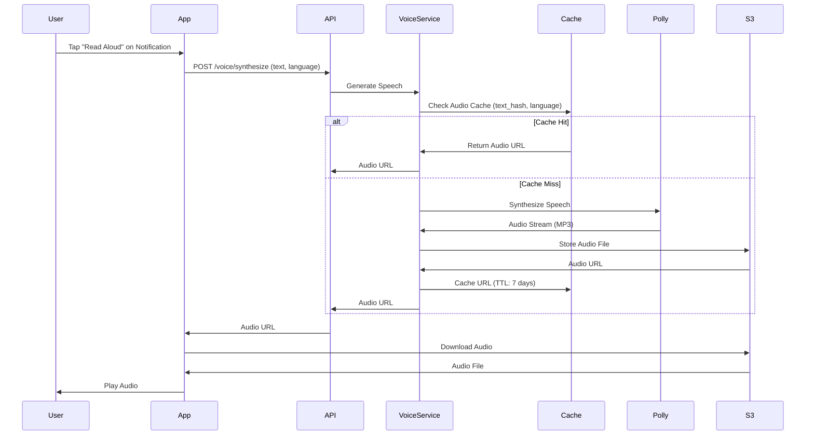
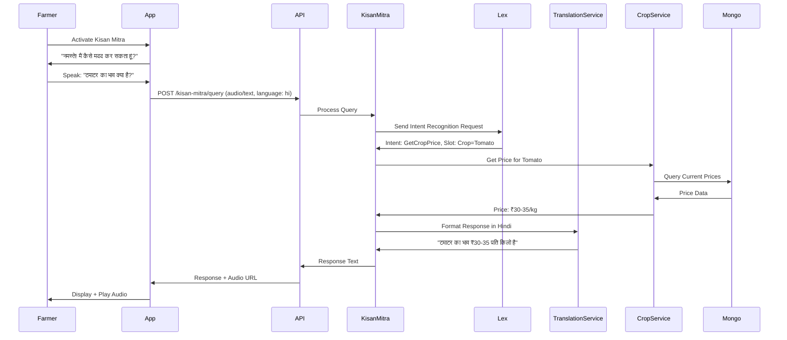

# Design Document: Multi-Language Support

**Parent Spec:** [Bharat Mandi Design](../../bharat-mandi-main/design.md)  
**Related Requirements:** [Multi-Language Support Requirements](./requirements.md)  
**Status:** 🔄 In Design

## Overview

This design document specifies the architecture and implementation strategy for comprehensive multi-language support in Bharat Mandi. The system will enable farmers and buyers across India to use the platform in their preferred language, with support for 11 Indian languages including Hindi, English, and 9 regional languages (Punjabi, Marathi, Tamil, Telugu, Bengali, Gujarati, Kannada, Malayalam, Odia).

The multi-language system encompasses four key capabilities:

1. **Static UI Localization (I18n)**: Offline-capable translation of all interface elements using local translation bundles
2. **Dynamic Content Translation**: Real-time translation of user-generated content (listings, messages) using AWS Translate with ElastiCache caching
3. **Voice Interface**: Speech-to-text (AWS Transcribe) and text-to-speech (AWS Polly) for low-literacy users
4. **AI-Powered Assistance**: Conversational voice assistant (AWS Lex) with regional agricultural terminology support

### Key Design Principles

1. **Offline-First for UI**: Static translations stored locally for instant access without connectivity
2. **Cloud-Powered for Dynamic Content**: AWS services handle real-time translation and voice processing
3. **Performance Through Caching**: ElastiCache reduces translation API calls and improves response times
4. **Regional Context Awareness**: Agricultural terminology database with local crop names and varieties
5. **Graceful Degradation**: System functions with reduced capabilities when AWS services unavailable

### Technology Stack

**Frontend (Mobile)**:
- React Native with i18next for UI localization
- Local storage for translation bundles
- React Native Voice for audio capture
- Audio playback for TTS synthesis

**Backend Services**:
- Node.js with Express
- i18next for server-side translations
- AWS SDK v3 for service integration

**AWS Services**:
- **AWS Translate**: Real-time translation (supports all 11 target languages)
- **AWS Transcribe**: Speech-to-text conversion
- **AWS Polly**: Text-to-speech synthesis with neural voices
- **AWS Lex**: Conversational AI for Kisan Mitra assistant
- **AWS Comprehend**: Language detection
- **ElastiCache (Redis)**: Translation caching layer

**Data Storage**:
- PostgreSQL: User language preferences, translation feedback
- MongoDB: Regional crop database, voice query logs
- SQLite: Offline translation cache, local UI bundles
- ElastiCache: Hot translation cache (24-hour TTL)

## Architecture

### High-Level Architecture



### Data Flow Diagrams

#### 1. Static UI Translation Flow



#### 2. Dynamic Content Translation Flow



#### 3. Voice Input Flow (Speech-to-Text)



#### 4. Voice Output Flow (Text-to-Speech)



#### 5. Kisan Mitra Conversation Flow




## Components and Interfaces

### 1. I18n Service (Static UI Localization)

**Purpose**: Manages static UI translations stored locally for offline access

**File**: `src/features/i18n/i18n.service.ts`

```typescript
import i18next from 'i18next';
import { getDatabaseManager } from '../../shared/database/db-abstraction';

export interface LanguageConfig {
  code: string; // ISO 639-1 code (e.g., 'hi', 'en', 'pa')
  name: string; // Native name (e.g., 'हिन्दी', 'English', 'ਪੰਜਾਬੀ')
  direction: 'ltr' | 'rtl';
  dateFormat: string;
  numberFormat: string;
  currencyFormat: string;
}

export const SUPPORTED_LANGUAGES: LanguageConfig[] = [
  { code: 'en', name: 'English', direction: 'ltr', dateFormat: 'DD/MM/YYYY', numberFormat: 'en-IN', currencyFormat: '₹#,##,###.##' },
  { code: 'hi', name: 'हिन्दी', direction: 'ltr', dateFormat: 'DD/MM/YYYY', numberFormat: 'hi-IN', currencyFormat: '₹#,##,###.##' },
  { code: 'pa', name: 'ਪੰਜਾਬੀ', direction: 'ltr', dateFormat: 'DD/MM/YYYY', numberFormat: 'pa-IN', currencyFormat: '₹#,##,###.##' },
  { code: 'mr', name: 'मराठी', direction: 'ltr', dateFormat: 'DD/MM/YYYY', numberFormat: 'mr-IN', currencyFormat: '₹#,##,###.##' },
  { code: 'ta', name: 'தமிழ்', direction: 'ltr', dateFormat: 'DD/MM/YYYY', numberFormat: 'ta-IN', currencyFormat: '₹#,##,###.##' },
  { code: 'te', name: 'తెలుగు', direction: 'ltr', dateFormat: 'DD/MM/YYYY', numberFormat: 'te-IN', currencyFormat: '₹#,##,###.##' },
  { code: 'bn', name: 'বাংলা', direction: 'ltr', dateFormat: 'DD/MM/YYYY', numberFormat: 'bn-IN', currencyFormat: '₹#,##,###.##' },
  { code: 'gu', name: 'ગુજરાતી', direction: 'ltr', dateFormat: 'DD/MM/YYYY', numberFormat: 'gu-IN', currencyFormat: '₹#,##,###.##' },
  { code: 'kn', name: 'ಕನ್ನಡ', direction: 'ltr', dateFormat: 'DD/MM/YYYY', numberFormat: 'kn-IN', currencyFormat: '₹#,##,###.##' },
  { code: 'ml', name: 'മലയാളം', direction: 'ltr', dateFormat: 'DD/MM/YYYY', numberFormat: 'ml-IN', currencyFormat: '₹#,##,###.##' },
  { code: 'or', name: 'ଓଡ଼ିଆ', direction: 'ltr', dateFormat: 'DD/MM/YYYY', numberFormat: 'or-IN', currencyFormat: '₹#,##,###.##' },
];

export class I18nService {
  private initialized = false;

  async initialize(defaultLanguage: string = 'en'): Promise<void> {
    if (this.initialized) return;

    await i18next.init({
      lng: defaultLanguage,
      fallbackLng: 'en',
      supportedLngs: SUPPORTED_LANGUAGES.map(l => l.code),
      resources: await this.loadAllBundles(),
      interpolation: {
        escapeValue: false,
      },
      detection: {
        order: ['querystring', 'cookie', 'localStorage', 'navigator'],
        caches: ['localStorage', 'cookie'],
      },
    });

    this.initialized = true;
  }

  private async loadAllBundles(): Promise<Record<string, any>> {
    const resources: Record<string, any> = {};
    
    for (const lang of SUPPORTED_LANGUAGES) {
      try {
        // Load from local bundle files
        const bundle = await import(`./locales/${lang.code}/translation.json`);
        resources[lang.code] = { translation: bundle };
      } catch (error) {
        console.error(`Failed to load bundle for ${lang.code}:`, error);
      }
    }
    
    return resources;
  }

  async changeLanguage(userId: string, languageCode: string): Promise<void> {
    if (!SUPPORTED_LANGUAGES.find(l => l.code === languageCode)) {
      throw new Error(`Unsupported language: ${languageCode}`);
    }

    await i18next.changeLanguage(languageCode);
    
    // Persist preference to database
    const db = getDatabaseManager();
    await db.updateUser(userId, { language_preference: languageCode });
  }

  translate(key: string, options?: any): string {
    const translation = i18next.t(key, options);
    
    // Log missing translations in development
    if (translation === key && process.env.NODE_ENV === 'development') {
      console.warn(`[I18n] Missing translation key: ${key}`);
    }
    
    return translation;
  }

  formatDate(date: Date, languageCode: string): string {
    const config = SUPPORTED_LANGUAGES.find(l => l.code === languageCode);
    if (!config) return date.toLocaleDateString();
    
    return new Intl.DateTimeFormat(config.numberFormat).format(date);
  }

  formatNumber(value: number, languageCode: string): string {
    const config = SUPPORTED_LANGUAGES.find(l => l.code === languageCode);
    if (!config) return value.toString();
    
    return new Intl.NumberFormat(config.numberFormat).format(value);
  }

  formatCurrency(value: number, languageCode: string): string {
    const config = SUPPORTED_LANGUAGES.find(l => l.code === languageCode);
    if (!config) return `₹${value}`;
    
    return new Intl.NumberFormat(config.numberFormat, {
      style: 'currency',
      currency: 'INR',
    }).format(value);
  }

  getCurrentLanguage(): string {
    return i18next.language;
  }

  getSupportedLanguages(): LanguageConfig[] {
    return SUPPORTED_LANGUAGES;
  }

  async validateTranslationCompleteness(): Promise<{ missing: string[], incomplete: string[] }> {
    const englishKeys = this.getAllKeys('en');
    const missing: string[] = [];
    const incomplete: string[] = [];

    for (const lang of SUPPORTED_LANGUAGES) {
      if (lang.code === 'en') continue;
      
      const langKeys = this.getAllKeys(lang.code);
      const missingKeys = englishKeys.filter(key => !langKeys.includes(key));
      
      if (missingKeys.length > 0) {
        incomplete.push(lang.code);
        missing.push(...missingKeys.map(key => `${lang.code}:${key}`));
      }
    }

    return { missing, incomplete };
  }

  private getAllKeys(languageCode: string): string[] {
    const bundle = i18next.getResourceBundle(languageCode, 'translation');
    return this.flattenKeys(bundle);
  }

  private flattenKeys(obj: any, prefix: string = ''): string[] {
    let keys: string[] = [];
    
    for (const key in obj) {
      const fullKey = prefix ? `${prefix}.${key}` : key;
      
      if (typeof obj[key] === 'object' && obj[key] !== null) {
        keys = keys.concat(this.flattenKeys(obj[key], fullKey));
      } else {
        keys.push(fullKey);
      }
    }
    
    return keys;
  }
}

export const i18nService = new I18nService();
```

### 2. Translation Service (Dynamic Content)

**Purpose**: Handles real-time translation of user-generated content using AWS Translate with caching

**File**: `src/features/i18n/translation.service.ts`

```typescript
import { TranslateClient, TranslateTextCommand } from '@aws-sdk/client-translate';
import { ComprehendClient, DetectDominantLanguageCommand } from '@aws-sdk/client-comprehend';
import { createHash } from 'crypto';
import { getRedisClient } from '../../shared/cache/redis-client';
import { getDatabaseManager } from '../../shared/database/db-abstraction';

const translateClient = new TranslateClient({ region: process.env.AWS_REGION || 'ap-south-1' });
const comprehendClient = new ComprehendClient({ region: process.env.AWS_REGION || 'ap-south-1' });

export interface TranslationRequest {
  text: string;
  sourceLanguage?: string; // Auto-detect if not provided
  targetLanguage: string;
  context?: string; // For context-specific translations
}

export interface TranslationResult {
  translatedText: string;
  sourceLanguage: string;
  targetLanguage: string;
  confidence: number;
  cached: boolean;
}

export class TranslationService {
  private readonly CACHE_TTL = 24 * 60 * 60; // 24 hours in seconds
  private readonly CACHE_PREFIX = 'translation:';

  async translateText(request: TranslationRequest): Promise<TranslationResult> {
    // Detect source language if not provided
    const sourceLanguage = request.sourceLanguage || await this.detectLanguage(request.text);
    
    // Check if translation is needed
    if (sourceLanguage === request.targetLanguage) {
      return {
        translatedText: request.text,
        sourceLanguage,
        targetLanguage: request.targetLanguage,
        confidence: 1.0,
        cached: false,
      };
    }

    // Check cache
    const cacheKey = this.generateCacheKey(request.text, sourceLanguage, request.targetLanguage);
    const cached = await this.getFromCache(cacheKey);
    
    if (cached) {
      return {
        translatedText: cached,
        sourceLanguage,
        targetLanguage: request.targetLanguage,
        confidence: 1.0,
        cached: true,
      };
    }

    // Translate using AWS Translate
    const command = new TranslateTextCommand({
      Text: request.text,
      SourceLanguageCode: this.mapToAWSLanguageCode(sourceLanguage),
      TargetLanguageCode: this.mapToAWSLanguageCode(request.targetLanguage),
      Settings: {
        Profanity: 'MASK', // Mask profanity in translations
      },
    });

    try {
      const response = await translateClient.send(command);
      const translatedText = response.TranslatedText || request.text;

      // Cache the translation
      await this.saveToCache(cacheKey, translatedText);

      return {
        translatedText,
        sourceLanguage,
        targetLanguage: request.targetLanguage,
        confidence: 0.95, // AWS Translate doesn't provide confidence scores
        cached: false,
      };
    } catch (error) {
      console.error('[TranslationService] Translation failed:', error);
      throw new Error('Translation service unavailable');
    }
  }

  async translateBatch(texts: string[], sourceLanguage: string, targetLanguage: string): Promise<string[]> {
    // AWS Translate doesn't have native batch API, so we'll parallelize
    const promises = texts.map(text => 
      this.translateText({ text, sourceLanguage, targetLanguage })
    );
    
    const results = await Promise.all(promises);
    return results.map(r => r.translatedText);
  }

  async detectLanguage(text: string): Promise<string> {
    if (text.length < 20) {
      // Too short for reliable detection, default to English
      return 'en';
    }

    const command = new DetectDominantLanguageCommand({ Text: text });
    
    try {
      const response = await comprehendClient.send(command);
      const languages = response.Languages || [];
      
      if (languages.length === 0) {
        return 'en';
      }

      // Return the most confident language
      const dominant = languages.reduce((prev, current) => 
        (current.Score || 0) > (prev.Score || 0) ? current : prev
      );

      return this.mapFromAWSLanguageCode(dominant.LanguageCode || 'en');
    } catch (error) {
      console.error('[TranslationService] Language detection failed:', error);
      return 'en';
    }
  }

  private generateCacheKey(text: string, sourceLanguage: string, targetLanguage: string): string {
    const hash = createHash('sha256')
      .update(`${text}:${sourceLanguage}:${targetLanguage}`)
      .digest('hex');
    return `${this.CACHE_PREFIX}${hash}`;
  }

  private async getFromCache(key: string): Promise<string | null> {
    try {
      const redis = getRedisClient();
      return await redis.get(key);
    } catch (error) {
      console.error('[TranslationService] Cache read failed:', error);
      return null;
    }
  }

  private async saveToCache(key: string, value: string): Promise<void> {
    try {
      const redis = getRedisClient();
      await redis.setex(key, this.CACHE_TTL, value);
    } catch (error) {
      console.error('[TranslationService] Cache write failed:', error);
    }
  }

  private mapToAWSLanguageCode(code: string): string {
    // Map our language codes to AWS Translate codes
    const mapping: Record<string, string> = {
      'en': 'en',
      'hi': 'hi',
      'pa': 'pa', // Punjabi
      'mr': 'mr', // Marathi
      'ta': 'ta', // Tamil
      'te': 'te', // Telugu
      'bn': 'bn', // Bengali
      'gu': 'gu', // Gujarati
      'kn': 'kn', // Kannada
      'ml': 'ml', // Malayalam
      'or': 'or', // Odia
    };
    return mapping[code] || 'en';
  }

  private mapFromAWSLanguageCode(code: string): string {
    // AWS Comprehend uses same codes, so direct mapping
    return code;
  }

  async getCacheStats(): Promise<{ hitRate: number, size: number }> {
    try {
      const redis = getRedisClient();
      const keys = await redis.keys(`${this.CACHE_PREFIX}*`);
      return {
        hitRate: 0, // Would need to track hits/misses separately
        size: keys.length,
      };
    } catch (error) {
      return { hitRate: 0, size: 0 };
    }
  }

  async preloadCommonTranslations(language: string): Promise<void> {
    // Preload common phrases and UI elements
    const commonPhrases = [
      'Welcome to Bharat Mandi',
      'Your order has been confirmed',
      'Payment successful',
      'Listing created successfully',
      // ... more common phrases
    ];

    await this.translateBatch(commonPhrases, 'en', language);
  }
}

export const translationService = new TranslationService();
```

### 3. Voice Service (Speech-to-Text and Text-to-Speech)

**Purpose**: Handles voice input/output using AWS Transcribe and Polly

**File**: `src/features/i18n/voice.service.ts`

```typescript
import { 
  TranscribeClient, 
  StartTranscriptionJobCommand,
  GetTranscriptionJobCommand,
  TranscriptionJob 
} from '@aws-sdk/client-transcribe';
import { 
  PollyClient, 
  SynthesizeSpeechCommand,
  VoiceId 
} from '@aws-sdk/client-polly';
import { S3Client, PutObjectCommand, DeleteObjectCommand } from '@aws-sdk/client-s3';
import { v4 as uuidv4 } from 'uuid';
import { createHash } from 'crypto';
import { getRedisClient } from '../../shared/cache/redis-client';

const transcribeClient = new TranscribeClient({ region: process.env.AWS_REGION || 'ap-south-1' });
const pollyClient = new PollyClient({ region: process.env.AWS_REGION || 'ap-south-1' });
const s3Client = new S3Client({ region: process.env.AWS_REGION || 'ap-south-1' });

const AUDIO_BUCKET = process.env.AWS_AUDIO_BUCKET || 'bharat-mandi-audio';
const TTS_CACHE_TTL = 7 * 24 * 60 * 60; // 7 days

export interface TranscriptionRequest {
  audioData: Buffer;
  languageCode?: string; // Auto-detect if not provided
  sampleRate?: number; // Default: 16000
}

export interface TranscriptionResult {
  text: string;
  language: string;
  confidence: number;
}

export interface SynthesisRequest {
  text: string;
  languageCode: string;
  voiceId?: VoiceId;
  speed?: number; // 0.5 to 2.0
}

export interface SynthesisResult {
  audioUrl: string;
  duration: number;
  cached: boolean;
}

export class VoiceService {
  private readonly VOICE_MAP: Record<string, VoiceId> = {
    'en': 'Kajal', // Indian English female
    'hi': 'Aditi', // Hindi female
    'ta': 'Kajal', // Tamil (uses multilingual voice)
    'te': 'Kajal', // Telugu (uses multilingual voice)
    // AWS Polly has limited Indian language support
    // For other languages, we'll use Aditi with transliteration
  };

  // ============================================================================
  // Speech-to-Text (AWS Transcribe)
  // ============================================================================

  async transcribeAudio(request: TranscriptionRequest): Promise<TranscriptionResult> {
    const jobName = `transcribe-${uuidv4()}`;
    const s3Key = `temp-audio/${jobName}.wav`;

    try {
      // Upload audio to S3
      await s3Client.send(new PutObjectCommand({
        Bucket: AUDIO_BUCKET,
        Key: s3Key,
        Body: request.audioData,
        ContentType: 'audio/wav',
      }));

      // Start transcription job
      const startCommand = new StartTranscriptionJobCommand({
        TranscriptionJobName: jobName,
        LanguageCode: request.languageCode || 'hi-IN', // Default to Hindi
        MediaFormat: 'wav',
        Media: {
          MediaFileUri: `s3://${AUDIO_BUCKET}/${s3Key}`,
        },
        Settings: {
          ShowSpeakerLabels: false,
          MaxSpeakerLabels: 1,
        },
      });

      await transcribeClient.send(startCommand);

      // Poll for completion
      const result = await this.pollTranscriptionJob(jobName);

      // Clean up temp audio
      await this.deleteS3Object(s3Key);

      return result;
    } catch (error) {
      console.error('[VoiceService] Transcription failed:', error);
      // Clean up on error
      await this.deleteS3Object(s3Key);
      throw new Error('Speech-to-text conversion failed');
    }
  }

  private async pollTranscriptionJob(jobName: string, maxAttempts: number = 30): Promise<TranscriptionResult> {
    for (let i = 0; i < maxAttempts; i++) {
      const command = new GetTranscriptionJobCommand({
        TranscriptionJobName: jobName,
      });

      const response = await transcribeClient.send(command);
      const job = response.TranscriptionJob;

      if (job?.TranscriptionJobStatus === 'COMPLETED') {
        const transcriptUri = job.Transcript?.TranscriptFileUri;
        if (!transcriptUri) {
          throw new Error('Transcript URI not found');
        }

        // Fetch transcript
        const transcriptResponse = await fetch(transcriptUri);
        const transcript = await transcriptResponse.json();

        return {
          text: transcript.results.transcripts[0].transcript,
          language: job.LanguageCode || 'hi-IN',
          confidence: this.calculateAverageConfidence(transcript.results.items),
        };
      } else if (job?.TranscriptionJobStatus === 'FAILED') {
        throw new Error(`Transcription failed: ${job.FailureReason}`);
      }

      // Wait 1 second before next poll
      await new Promise(resolve => setTimeout(resolve, 1000));
    }

    throw new Error('Transcription timeout');
  }

  private calculateAverageConfidence(items: any[]): number {
    if (!items || items.length === 0) return 0;
    
    const confidences = items
      .filter(item => item.type === 'pronunciation')
      .map(item => parseFloat(item.alternatives[0].confidence));
    
    return confidences.reduce((sum, conf) => sum + conf, 0) / confidences.length;
  }

  // ============================================================================
  // Text-to-Speech (AWS Polly)
  // ============================================================================

  async synthesizeSpeech(request: SynthesisRequest): Promise<SynthesisResult> {
    // Check cache first
    const cacheKey = this.generateTTSCacheKey(request.text, request.languageCode, request.speed);
    const cachedUrl = await this.getTTSFromCache(cacheKey);
    
    if (cachedUrl) {
      return {
        audioUrl: cachedUrl,
        duration: 0, // Would need to calculate from audio file
        cached: true,
      };
    }

    // Synthesize speech
    const voiceId = request.voiceId || this.VOICE_MAP[request.languageCode] || 'Aditi';
    
    const command = new SynthesizeSpeechCommand({
      Text: request.text,
      OutputFormat: 'mp3',
      VoiceId: voiceId,
      Engine: 'neural', // Use neural voices for better quality
      LanguageCode: this.mapToPollyLanguageCode(request.languageCode),
      ...(request.speed && {
        TextType: 'ssml',
        Text: `<speak><prosody rate="${request.speed * 100}%">${request.text}</prosody></speak>`,
      }),
    });

    try {
      const response = await pollyClient.send(command);
      
      if (!response.AudioStream) {
        throw new Error('No audio stream returned');
      }

      // Convert stream to buffer
      const audioBuffer = await this.streamToBuffer(response.AudioStream);

      // Upload to S3
      const s3Key = `tts-audio/${uuidv4()}.mp3`;
      await s3Client.send(new PutObjectCommand({
        Bucket: AUDIO_BUCKET,
        Key: s3Key,
        Body: audioBuffer,
        ContentType: 'audio/mpeg',
      }));

      const audioUrl = `https://${AUDIO_BUCKET}.s3.${process.env.AWS_REGION}.amazonaws.com/${s3Key}`;

      // Cache the URL
      await this.saveTTSToCache(cacheKey, audioUrl);

      return {
        audioUrl,
        duration: 0, // Would need to parse audio metadata
        cached: false,
      };
    } catch (error) {
      console.error('[VoiceService] Speech synthesis failed:', error);
      throw new Error('Text-to-speech conversion failed');
    }
  }

  private mapToPollyLanguageCode(code: string): string {
    const mapping: Record<string, string> = {
      'en': 'en-IN',
      'hi': 'hi-IN',
      'ta': 'ta-IN',
      'te': 'te-IN',
    };
    return mapping[code] || 'hi-IN';
  }

  private generateTTSCacheKey(text: string, language: string, speed?: number): string {
    const hash = createHash('sha256')
      .update(`${text}:${language}:${speed || 1.0}`)
      .digest('hex');
    return `tts:${hash}`;
  }

  private async getTTSFromCache(key: string): Promise<string | null> {
    try {
      const redis = getRedisClient();
      return await redis.get(key);
    } catch (error) {
      return null;
    }
  }

  private async saveTTSToCache(key: string, url: string): Promise<void> {
    try {
      const redis = getRedisClient();
      await redis.setex(key, TTS_CACHE_TTL, url);
    } catch (error) {
      console.error('[VoiceService] TTS cache write failed:', error);
    }
  }

  private async streamToBuffer(stream: any): Promise<Buffer> {
    const chunks: Uint8Array[] = [];
    for await (const chunk of stream) {
      chunks.push(chunk);
    }
    return Buffer.concat(chunks);
  }

  private async deleteS3Object(key: string): Promise<void> {
    try {
      await s3Client.send(new DeleteObjectCommand({
        Bucket: AUDIO_BUCKET,
        Key: key,
      }));
    } catch (error) {
      console.error('[VoiceService] Failed to delete S3 object:', error);
    }
  }
}

export const voiceService = new VoiceService();
```


### 4. Kisan Mitra Service (AI Voice Assistant)

**Purpose**: Conversational AI assistant using AWS Lex for farmer support

**File**: `src/features/i18n/kisan-mitra.service.ts`

```typescript
import { 
  LexRuntimeV2Client, 
  RecognizeTextCommand,
  RecognizeUtteranceCommand 
} from '@aws-sdk/client-lex-runtime-v2';
import { translationService } from './translation.service';
import { voiceService } from './voice.service';
import { MongoClient } from 'mongodb';

const lexClient = new LexRuntimeV2Client({ region: process.env.AWS_REGION || 'ap-south-1' });

const BOT_ID = process.env.LEX_BOT_ID || '';
const BOT_ALIAS_ID = process.env.LEX_BOT_ALIAS_ID || '';
const LOCALE_ID_MAP: Record<string, string> = {
  'en': 'en_IN',
  'hi': 'hi_IN',
  // AWS Lex supports limited languages, we'll translate for others
};

export interface KisanMitraRequest {
  userId: string;
  sessionId: string;
  query: string;
  language: string;
  audioInput?: Buffer;
}

export interface KisanMitraResponse {
  text: string;
  audioUrl?: string;
  intent: string;
  confidence: number;
  slots?: Record<string, string>;
  sessionAttributes?: Record<string, string>;
}

export class KisanMitraService {
  private mongoClient: MongoClient;

  constructor() {
    this.mongoClient = new MongoClient(process.env.MONGODB_URI || 'mongodb://localhost:27017');
  }

  async processQuery(request: KisanMitraRequest): Promise<KisanMitraResponse> {
    let queryText = request.query;
    let sourceLanguage = request.language;

    // If audio input provided, transcribe first
    if (request.audioInput) {
      const transcription = await voiceService.transcribeAudio({
        audioData: request.audioInput,
        languageCode: request.language,
      });
      queryText = transcription.text;
      sourceLanguage = transcription.language;
    }

    // Translate to English if needed (Lex works best with English)
    let lexQuery = queryText;
    if (sourceLanguage !== 'en') {
      const translation = await translationService.translateText({
        text: queryText,
        sourceLanguage,
        targetLanguage: 'en',
      });
      lexQuery = translation.translatedText;
    }

    // Send to Lex
    const command = new RecognizeTextCommand({
      botId: BOT_ID,
      botAliasId: BOT_ALIAS_ID,
      localeId: LOCALE_ID_MAP[sourceLanguage] || 'en_IN',
      sessionId: request.sessionId,
      text: lexQuery,
    });

    try {
      const response = await lexClient.send(command);
      
      // Extract intent and slots
      const intent = response.sessionState?.intent?.name || 'Unknown';
      const slots = response.sessionState?.intent?.slots || {};
      const confidence = response.sessionState?.intent?.confirmationState === 'Confirmed' ? 0.95 : 0.75;

      // Get response text
      let responseText = response.messages?.[0]?.content || 'I did not understand that.';

      // Translate response back to user's language
      if (sourceLanguage !== 'en') {
        const translation = await translationService.translateText({
          text: responseText,
          sourceLanguage: 'en',
          targetLanguage: sourceLanguage,
        });
        responseText = translation.translatedText;
      }

      // Generate audio response
      const synthesis = await voiceService.synthesizeSpeech({
        text: responseText,
        languageCode: sourceLanguage,
      });

      // Log conversation
      await this.logConversation(request.userId, request.sessionId, queryText, responseText, intent);

      return {
        text: responseText,
        audioUrl: synthesis.audioUrl,
        intent,
        confidence,
        slots: this.extractSlotValues(slots),
        sessionAttributes: response.sessionState?.sessionAttributes,
      };
    } catch (error) {
      console.error('[KisanMitra] Query processing failed:', error);
      throw new Error('Kisan Mitra service unavailable');
    }
  }

  private extractSlotValues(slots: any): Record<string, string> {
    const values: Record<string, string> = {};
    
    for (const [key, slot] of Object.entries(slots)) {
      if (slot && typeof slot === 'object' && 'value' in slot) {
        values[key] = (slot as any).value.interpretedValue;
      }
    }
    
    return values;
  }

  private async logConversation(
    userId: string, 
    sessionId: string, 
    query: string, 
    response: string, 
    intent: string
  ): Promise<void> {
    try {
      await this.mongoClient.connect();
      const db = this.mongoClient.db('bharat_mandi');
      const collection = db.collection('voice_queries');

      await collection.insertOne({
        userId,
        sessionId,
        query,
        response,
        intent,
        timestamp: new Date(),
      });
    } catch (error) {
      console.error('[KisanMitra] Failed to log conversation:', error);
    }
  }

  async getConversationHistory(userId: string, limit: number = 10): Promise<any[]> {
    try {
      await this.mongoClient.connect();
      const db = this.mongoClient.db('bharat_mandi');
      const collection = db.collection('voice_queries');

      return await collection
        .find({ userId })
        .sort({ timestamp: -1 })
        .limit(limit)
        .toArray();
    } catch (error) {
      console.error('[KisanMitra] Failed to fetch history:', error);
      return [];
    }
  }

  async clearSession(sessionId: string): Promise<void> {
    // AWS Lex sessions expire automatically after 5 minutes of inactivity
    // No explicit cleanup needed
  }
}

export const kisanMitraService = new KisanMitraService();
```

### 5. Regional Crop Database Service

**Purpose**: Manages regional crop names and agricultural terminology

**File**: `src/features/i18n/regional-crop.service.ts`

```typescript
import { MongoClient, Collection } from 'mongodb';
import Fuse from 'fuse.js';

export interface CropEntry {
  id: string;
  standardName: string; // English standard name
  category: string; // vegetable, fruit, grain, etc.
  regionalNames: {
    [languageCode: string]: string[];
  };
  varieties: {
    name: string;
    regionalNames: {
      [languageCode: string]: string[];
    };
  }[];
  gradingTerms: {
    [languageCode: string]: {
      gradeA: string[];
      gradeB: string[];
      gradeC: string[];
    };
  };
}

export class RegionalCropService {
  private mongoClient: MongoClient;
  private collection: Collection<CropEntry> | null = null;
  private fuseIndex: Fuse<CropEntry> | null = null;

  constructor() {
    this.mongoClient = new MongoClient(process.env.MONGODB_URI || 'mongodb://localhost:27017');
  }

  async initialize(): Promise<void> {
    await this.mongoClient.connect();
    const db = this.mongoClient.db('bharat_mandi');
    this.collection = db.collection<CropEntry>('regional_crops');

    // Create indexes
    await this.collection.createIndex({ standardName: 1 });
    await this.collection.createIndex({ 'regionalNames.hi': 1 });
    await this.collection.createIndex({ 'regionalNames.pa': 1 });
    await this.collection.createIndex({ 'regionalNames.mr': 1 });

    // Initialize fuzzy search
    await this.buildFuseIndex();
  }

  private async buildFuseIndex(): Promise<void> {
    if (!this.collection) return;

    const crops = await this.collection.find({}).toArray();
    
    this.fuseIndex = new Fuse(crops, {
      keys: [
        'standardName',
        'regionalNames.en',
        'regionalNames.hi',
        'regionalNames.pa',
        'regionalNames.mr',
        'regionalNames.ta',
        'regionalNames.te',
        'regionalNames.bn',
        'regionalNames.gu',
        'regionalNames.kn',
        'regionalNames.ml',
        'regionalNames.or',
      ],
      threshold: 0.3, // 85% accuracy threshold
      includeScore: true,
    });
  }

  async searchCrop(query: string, language: string): Promise<CropEntry | null> {
    if (!this.fuseIndex) {
      await this.buildFuseIndex();
    }

    const results = this.fuseIndex!.search(query);
    
    if (results.length === 0) {
      return null;
    }

    // Return best match if score is good enough
    const bestMatch = results[0];
    if (bestMatch.score && bestMatch.score < 0.3) {
      return bestMatch.item;
    }

    return null;
  }

  async getCropByStandardName(standardName: string): Promise<CropEntry | null> {
    if (!this.collection) await this.initialize();
    
    return await this.collection!.findOne({ standardName });
  }

  async getLocalizedCropName(standardName: string, language: string): Promise<string> {
    const crop = await this.getCropByStandardName(standardName);
    
    if (!crop) {
      return standardName;
    }

    const regionalNames = crop.regionalNames[language];
    if (regionalNames && regionalNames.length > 0) {
      return regionalNames[0]; // Return primary regional name
    }

    return standardName;
  }

  async getGradingTerms(standardName: string, language: string): Promise<{ gradeA: string, gradeB: string, gradeC: string }> {
    const crop = await this.getCropByStandardName(standardName);
    
    if (!crop || !crop.gradingTerms[language]) {
      return {
        gradeA: 'Grade A',
        gradeB: 'Grade B',
        gradeC: 'Grade C',
      };
    }

    const terms = crop.gradingTerms[language];
    return {
      gradeA: terms.gradeA[0],
      gradeB: terms.gradeB[0],
      gradeC: terms.gradeC[0],
    };
  }

  async addCropEntry(entry: CropEntry): Promise<void> {
    if (!this.collection) await this.initialize();
    
    await this.collection!.insertOne(entry);
    await this.buildFuseIndex(); // Rebuild index
  }

  async submitRegionalName(
    standardName: string, 
    language: string, 
    regionalName: string, 
    submittedBy: string
  ): Promise<void> {
    if (!this.collection) await this.initialize();
    
    // Store in pending submissions collection for admin review
    const db = this.mongoClient.db('bharat_mandi');
    const submissions = db.collection('crop_name_submissions');

    await submissions.insertOne({
      standardName,
      language,
      regionalName,
      submittedBy,
      status: 'pending',
      submittedAt: new Date(),
    });
  }

  async getAllCrops(): Promise<CropEntry[]> {
    if (!this.collection) await this.initialize();
    
    return await this.collection!.find({}).toArray();
  }

  async syncToLocalCache(): Promise<void> {
    // Export crop database for offline use
    const crops = await this.getAllCrops();
    
    // This would be called by mobile app to download crop database
    // and store in SQLite for offline access
  }
}

export const regionalCropService = new RegionalCropService();
```

## Data Models

### 1. User Language Preference

**PostgreSQL Table**: `users` (extended)

```sql
ALTER TABLE users ADD COLUMN IF NOT EXISTS language_preference VARCHAR(5) DEFAULT 'en';
ALTER TABLE users ADD COLUMN IF NOT EXISTS voice_language_preference VARCHAR(5) DEFAULT 'en';
ALTER TABLE users ADD COLUMN IF NOT EXISTS recent_languages VARCHAR(15)[] DEFAULT ARRAY['en'];

CREATE INDEX idx_users_language ON users(language_preference);
```

**TypeScript Interface**:

```typescript
export interface UserLanguagePreference {
  userId: string;
  languagePreference: string; // Primary UI language
  voiceLanguagePreference: string; // Voice interface language (can differ)
  recentLanguages: string[]; // Last 3 used languages
  updatedAt: Date;
}
```

### 2. Translation Cache Schema

**ElastiCache (Redis) Structure**:

```
Key Pattern: translation:{hash}
Value: JSON string of translated text
TTL: 24 hours (86400 seconds)

Example:
Key: translation:a3f5b2c1d4e6f7g8h9i0j1k2l3m4n5o6
Value: "यह एक परीक्षण अनुवाद है"
TTL: 86400
```

**Cache Statistics**:

```typescript
export interface TranslationCacheStats {
  totalKeys: number;
  hitRate: number;
  missRate: number;
  averageLatency: number;
  cacheSize: number; // in bytes
}
```

### 3. Regional Crop Database Schema

**MongoDB Collection**: `regional_crops`

```typescript
{
  _id: ObjectId,
  id: "crop_001",
  standardName: "Tomato",
  category: "vegetable",
  regionalNames: {
    en: ["Tomato"],
    hi: ["टमाटर", "टमाटो"],
    pa: ["ਟਮਾਟਰ"],
    mr: ["टोमॅटो"],
    ta: ["தக்காளி"],
    te: ["టమాటా"],
    bn: ["টমেটো"],
    gu: ["ટામેટાં"],
    kn: ["ಟೊಮೇಟೊ"],
    ml: ["തക്കാളി"],
    or: ["ଟମାଟୋ"]
  },
  varieties: [
    {
      name: "Cherry Tomato",
      regionalNames: {
        hi: ["चेरी टमाटर"],
        pa: ["ਚੈਰੀ ਟਮਾਟਰ"],
        // ...
      }
    }
  ],
  gradingTerms: {
    hi: {
      gradeA: ["उत्तम", "प्रथम श्रेणी"],
      gradeB: ["मध्यम", "द्वितीय श्रेणी"],
      gradeC: ["निम्न", "तृतीय श्रेणी"]
    },
    pa: {
      gradeA: ["ਉੱਤਮ", "ਪਹਿਲੀ ਸ਼੍ਰੇਣੀ"],
      gradeB: ["ਮੱਧਮ", "ਦੂਜੀ ਸ਼੍ਰੇਣੀ"],
      gradeC: ["ਨੀਵੀਂ", "ਤੀਜੀ ਸ਼੍ਰੇਣੀ"]
    }
    // ... other languages
  },
  createdAt: ISODate,
  updatedAt: ISODate
}
```

**Indexes**:
```javascript
db.regional_crops.createIndex({ standardName: 1 });
db.regional_crops.createIndex({ "regionalNames.hi": 1 });
db.regional_crops.createIndex({ "regionalNames.pa": 1 });
db.regional_crops.createIndex({ "regionalNames.mr": 1 });
db.regional_crops.createIndex({ category: 1 });
```

### 4. Voice Query Log Schema

**MongoDB Collection**: `voice_queries`

```typescript
{
  _id: ObjectId,
  userId: "user_123",
  sessionId: "session_456",
  query: "टमाटर का भाव क्या है?",
  response: "टमाटर का भाव ₹30-35 प्रति किलो है",
  intent: "GetCropPrice",
  language: "hi",
  confidence: 0.95,
  audioUrl: "s3://bucket/audio/query_123.mp3",
  responseAudioUrl: "s3://bucket/audio/response_123.mp3",
  timestamp: ISODate,
  processingTime: 1250 // milliseconds
}
```

**Indexes**:
```javascript
db.voice_queries.createIndex({ userId: 1, timestamp: -1 });
db.voice_queries.createIndex({ sessionId: 1 });
db.voice_queries.createIndex({ intent: 1 });
```

### 5. Translation Feedback Schema

**PostgreSQL Table**: `translation_feedback`

```sql
CREATE TABLE translation_feedback (
  id UUID PRIMARY KEY DEFAULT gen_random_uuid(),
  user_id UUID NOT NULL REFERENCES users(id),
  original_text TEXT NOT NULL,
  translated_text TEXT NOT NULL,
  source_language VARCHAR(5) NOT NULL,
  target_language VARCHAR(5) NOT NULL,
  feedback_type VARCHAR(20) NOT NULL, -- 'incorrect', 'poor_quality', 'suggestion'
  suggested_translation TEXT,
  context TEXT,
  status VARCHAR(20) DEFAULT 'pending', -- 'pending', 'reviewed', 'applied'
  created_at TIMESTAMP DEFAULT CURRENT_TIMESTAMP,
  reviewed_at TIMESTAMP,
  reviewed_by UUID REFERENCES users(id)
);

CREATE INDEX idx_translation_feedback_status ON translation_feedback(status);
CREATE INDEX idx_translation_feedback_user ON translation_feedback(user_id);
CREATE INDEX idx_translation_feedback_languages ON translation_feedback(source_language, target_language);
```

### 6. Notification Templates

**PostgreSQL Table**: `notification_templates`

```sql
CREATE TABLE notification_templates (
  id UUID PRIMARY KEY DEFAULT gen_random_uuid(),
  template_key VARCHAR(100) UNIQUE NOT NULL,
  category VARCHAR(50) NOT NULL, -- 'order', 'payment', 'listing', 'system'
  translations JSONB NOT NULL, -- { "en": "...", "hi": "...", ... }
  variables TEXT[], -- ['userName', 'amount', 'listingTitle']
  created_at TIMESTAMP DEFAULT CURRENT_TIMESTAMP,
  updated_at TIMESTAMP DEFAULT CURRENT_TIMESTAMP
);

CREATE INDEX idx_notification_templates_key ON notification_templates(template_key);
CREATE INDEX idx_notification_templates_category ON notification_templates(category);
```

**Example Template**:

```json
{
  "template_key": "order_confirmed",
  "category": "order",
  "translations": {
    "en": "Your order for {{listingTitle}} has been confirmed. Amount: ₹{{amount}}",
    "hi": "{{listingTitle}} के लिए आपका ऑर्डर कन्फर्म हो गया है। राशि: ₹{{amount}}",
    "pa": "{{listingTitle}} ਲਈ ਤੁਹਾਡਾ ਆਰਡਰ ਪੁਸ਼ਟੀ ਹੋ ਗਿਆ ਹੈ। ਰਕਮ: ₹{{amount}}"
  },
  "variables": ["listingTitle", "amount"]
}
```

### 7. Offline Translation Cache (SQLite)

**SQLite Table**: `cached_translations`

```sql
CREATE TABLE cached_translations (
  id INTEGER PRIMARY KEY AUTOINCREMENT,
  source_text TEXT NOT NULL,
  translated_text TEXT NOT NULL,
  source_language VARCHAR(5) NOT NULL,
  target_language VARCHAR(5) NOT NULL,
  cache_key VARCHAR(64) NOT NULL UNIQUE,
  cached_at INTEGER NOT NULL, -- Unix timestamp
  access_count INTEGER DEFAULT 1,
  last_accessed INTEGER NOT NULL
);

CREATE INDEX idx_cached_translations_key ON cached_translations(cache_key);
CREATE INDEX idx_cached_translations_languages ON cached_translations(source_language, target_language);
CREATE INDEX idx_cached_translations_accessed ON cached_translations(last_accessed);
```


## API Design

### 1. Language Preference Endpoints

**GET /api/i18n/languages**
- Returns list of supported languages with metadata
- Response: `{ languages: LanguageConfig[] }`

**GET /api/users/:userId/language**
- Returns user's language preferences
- Response: `{ ui: string, voice: string, recent: string[] }`

**PUT /api/users/:userId/language**
- Updates user's language preference
- Body: `{ language: string, type: 'ui' | 'voice' }`
- Response: `{ success: boolean, language: string }`

### 2. Translation Endpoints

**POST /api/translate**
- Translates text from one language to another
- Body: `{ text: string, sourceLanguage?: string, targetLanguage: string }`
- Response: `{ translatedText: string, sourceLanguage: string, confidence: number, cached: boolean }`

**POST /api/translate/batch**
- Translates multiple texts in one request
- Body: `{ texts: string[], sourceLanguage: string, targetLanguage: string }`
- Response: `{ translations: string[], cached: number, fresh: number }`

**POST /api/translate/detect**
- Detects language of given text
- Body: `{ text: string }`
- Response: `{ language: string, confidence: number }`

### 3. Voice Interface Endpoints

**POST /api/voice/transcribe**
- Converts speech to text
- Body: `multipart/form-data` with audio file
- Headers: `Content-Type: audio/wav`, `X-Language-Code: hi`
- Response: `{ text: string, language: string, confidence: number }`

**POST /api/voice/synthesize**
- Converts text to speech
- Body: `{ text: string, language: string, speed?: number }`
- Response: `{ audioUrl: string, duration: number, cached: boolean }`

**GET /api/voice/audio/:audioId**
- Retrieves synthesized audio file
- Response: Audio file (MP3)

### 4. Kisan Mitra Endpoints

**POST /api/kisan-mitra/query**
- Sends query to Kisan Mitra assistant
- Body: `{ userId: string, sessionId: string, query: string, language: string, audioInput?: base64 }`
- Response: `{ text: string, audioUrl?: string, intent: string, confidence: number }`

**GET /api/kisan-mitra/history/:userId**
- Retrieves conversation history
- Query params: `?limit=10`
- Response: `{ conversations: VoiceQuery[] }`

**DELETE /api/kisan-mitra/session/:sessionId**
- Clears conversation session
- Response: `{ success: boolean }`

### 5. Regional Crop Endpoints

**GET /api/crops/search**
- Searches for crop by regional name
- Query params: `?query=टमाटर&language=hi`
- Response: `{ crop: CropEntry | null, confidence: number }`

**GET /api/crops/:standardName**
- Gets crop details by standard name
- Response: `{ crop: CropEntry }`

**GET /api/crops/:standardName/localized**
- Gets localized crop name
- Query params: `?language=hi`
- Response: `{ name: string, gradingTerms: { gradeA: string, gradeB: string, gradeC: string } }`

**POST /api/crops/submit-name**
- Submits new regional crop name for review
- Body: `{ standardName: string, language: string, regionalName: string }`
- Response: `{ success: boolean, submissionId: string }`

### 6. Translation Feedback Endpoints

**POST /api/translate/feedback**
- Submits translation feedback
- Body: `{ originalText: string, translatedText: string, sourceLanguage: string, targetLanguage: string, feedbackType: string, suggestedTranslation?: string }`
- Response: `{ success: boolean, feedbackId: string }`

**GET /api/translate/feedback/stats**
- Gets translation quality statistics
- Query params: `?language=hi`
- Response: `{ totalFeedback: number, byType: Record<string, number>, averageRating: number }`

## AWS Service Integration

### 1. AWS Translate Configuration

**Service**: Amazon Translate
**Region**: ap-south-1 (Mumbai)
**Supported Languages**: All 11 target languages

**Configuration**:
```typescript
const translateConfig = {
  region: 'ap-south-1',
  credentials: {
    accessKeyId: process.env.AWS_ACCESS_KEY_ID,
    secretAccessKey: process.env.AWS_SECRET_ACCESS_KEY,
  },
  maxRetries: 3,
  timeout: 5000,
};
```

**Cost Optimization**:
- Use ElastiCache to reduce API calls (target 90% cache hit rate)
- Batch translations when possible
- Set up CloudWatch alarms for cost thresholds
- Estimated cost: $15 per million characters

**Rate Limits**:
- 100 transactions per second per account
- Implement client-side rate limiting and queuing

### 2. AWS Transcribe Configuration

**Service**: Amazon Transcribe
**Region**: ap-south-1 (Mumbai)
**Supported Languages**: hi-IN, en-IN, ta-IN, te-IN, mr-IN, gu-IN, kn-IN, ml-IN, pa-IN, bn-IN, or-IN

**Configuration**:
```typescript
const transcribeConfig = {
  region: 'ap-south-1',
  languageCode: 'hi-IN', // Dynamic based on user preference
  mediaFormat: 'wav',
  mediaSampleRateHertz: 16000,
  settings: {
    showSpeakerLabels: false,
    maxSpeakerLabels: 1,
    channelIdentification: false,
  },
};
```

**Audio Requirements**:
- Format: WAV, MP3, MP4, FLAC
- Sample rate: 8000-48000 Hz (16000 Hz recommended)
- Max file size: 2 GB
- Max duration: 4 hours

**Cost Optimization**:
- Delete temporary audio files after transcription
- Use streaming transcription for real-time use cases
- Estimated cost: $0.024 per minute

### 3. AWS Polly Configuration

**Service**: Amazon Polly
**Region**: ap-south-1 (Mumbai)
**Voice IDs**: Aditi (hi-IN), Kajal (en-IN, multilingual)

**Configuration**:
```typescript
const pollyConfig = {
  region: 'ap-south-1',
  voiceId: 'Aditi', // Dynamic based on language
  engine: 'neural', // Better quality than standard
  outputFormat: 'mp3',
  sampleRate: '22050',
  textType: 'text', // or 'ssml' for advanced control
};
```

**SSML Support**:
```xml
<speak>
  <prosody rate="medium" pitch="medium">
    टमाटर का भाव <emphasis level="strong">₹30-35</emphasis> प्रति किलो है
  </prosody>
</speak>
```

**Cost Optimization**:
- Cache synthesized audio for 7 days
- Use standard voices for non-critical content
- Estimated cost: $4 per million characters (neural), $16 per million characters (neural)

### 4. AWS Lex Bot Design

**Service**: Amazon Lex V2
**Region**: ap-south-1 (Mumbai)
**Bot Name**: KisanMitra

**Intents**:

1. **GetCropPrice**
   - Utterances: "What is the price of {crop}", "{crop} का भाव क्या है"
   - Slots: crop (required)
   - Fulfillment: Query price database

2. **CreateListing**
   - Utterances: "I want to sell {crop}", "मैं {crop} बेचना चाहता हूं"
   - Slots: crop (required), quantity (required), price (optional)
   - Fulfillment: Guide through listing creation

3. **GetWeather**
   - Utterances: "What is the weather", "मौसम कैसा है"
   - Slots: location (optional, use user's location)
   - Fulfillment: Query weather API

4. **GetFarmingAdvice**
   - Utterances: "How to grow {crop}", "{crop} कैसे उगाएं"
   - Slots: crop (required), topic (optional)
   - Fulfillment: Retrieve farming tips

5. **NavigateApp**
   - Utterances: "Go to {screen}", "{screen} पर जाओ"
   - Slots: screen (required)
   - Fulfillment: Return navigation command

6. **HelpIntent**
   - Utterances: "Help", "मदद", "How do I use this"
   - Fulfillment: Provide help information

**Slot Types**:
- CropType: Custom slot with all crop names in all languages
- ScreenName: Custom slot with app screen names
- Location: Built-in AMAZON.City

**Configuration**:
```typescript
const lexConfig = {
  botId: process.env.LEX_BOT_ID,
  botAliasId: process.env.LEX_BOT_ALIAS_ID,
  localeId: 'hi_IN', // Dynamic based on user language
  sessionId: `user_${userId}_${Date.now()}`,
};
```

**Cost**: $0.75 per 1000 text requests, $1.00 per 1000 speech requests

### 5. AWS Comprehend Integration

**Service**: Amazon Comprehend
**Region**: ap-south-1 (Mumbai)
**Use Case**: Language detection

**Configuration**:
```typescript
const comprehendConfig = {
  region: 'ap-south-1',
  text: inputText,
  // Comprehend automatically detects from 100+ languages
};
```

**Accuracy**:
- Requires minimum 20 characters for reliable detection
- Returns confidence score (0-1)
- Only suggest language switch if confidence > 0.9

**Cost**: $0.0001 per 100 characters (language detection)

### 6. ElastiCache Setup

**Service**: Amazon ElastiCache for Redis
**Region**: ap-south-1 (Mumbai)
**Node Type**: cache.t3.micro (staging), cache.t3.small (production)

**Configuration**:
```typescript
const redisConfig = {
  host: process.env.REDIS_HOST,
  port: 6379,
  password: process.env.REDIS_PASSWORD,
  db: 0,
  keyPrefix: 'bharat-mandi:',
  retryStrategy: (times: number) => Math.min(times * 50, 2000),
};
```

**Cache Structure**:
```
translation:{hash} -> translated text (TTL: 24h)
tts:{hash} -> audio URL (TTL: 7 days)
crop:{standardName}:{language} -> localized name (TTL: 30 days)
```

**Eviction Policy**: allkeys-lru (Least Recently Used)
**Max Memory**: 512 MB (staging), 2 GB (production)
**Cost**: $12/month (t3.micro), $24/month (t3.small)

## Offline Support Strategy

### 1. Local Storage for UI Bundles

**Storage Location**: 
- Mobile: AsyncStorage / SQLite
- Web: IndexedDB / LocalStorage

**Bundle Structure**:
```
/locales/
  en/translation.json (50 KB)
  hi/translation.json (75 KB)
  pa/translation.json (70 KB)
  ...
Total: ~700 KB for all languages
```

**Update Strategy**:
- Check for bundle updates on app launch
- Download new bundles in background
- Apply updates on next app restart
- Version bundles to track updates

### 2. Cached Translations

**SQLite Table**: `cached_translations`
- Store frequently accessed dynamic translations
- LRU eviction when storage exceeds 50 MB
- Sync with ElastiCache when online

**Priority Caching**:
1. User's own listings and transactions
2. Recently viewed listings
3. Common notification templates
4. Frequently used crop names

### 3. Regional Crop Database Sync

**MongoDB to SQLite Sync**:
- Full sync on first app launch
- Incremental updates weekly
- Compressed database: ~5 MB
- Includes all crop names and grading terms

**Sync Process**:
```typescript
async function syncCropDatabase() {
  const lastSync = await getLastSyncTimestamp();
  const updates = await fetchCropUpdates(lastSync);
  
  for (const crop of updates) {
    await upsertCropToSQLite(crop);
  }
  
  await setLastSyncTimestamp(Date.now());
}
```

### 4. Offline Limitations

**Features Available Offline**:
- ✅ UI translation (all languages)
- ✅ Crop name recognition (local database)
- ✅ Cached listing translations
- ✅ Number/date/currency formatting

**Features Requiring Connectivity**:
- ❌ Real-time translation of new content
- ❌ Voice input (speech-to-text)
- ❌ Voice output (text-to-speech)
- ❌ Kisan Mitra assistant
- ❌ Language detection for new text

**Graceful Degradation**:
- Show "Offline" indicator
- Display original content if translation unavailable
- Queue translation requests for when online
- Provide clear error messages

## Performance Optimization

### 1. Caching Strategies

**Multi-Level Cache**:
```
Request → Memory Cache (Node.js) → ElastiCache (Redis) → AWS Translate
          ↓ (hit)                  ↓ (hit)              ↓ (miss)
          Return                   Return               Translate & Cache
```

**Cache Hit Rate Targets**:
- Memory cache: 50% hit rate (100ms response)
- ElastiCache: 40% hit rate (50ms response)
- AWS Translate: 10% miss rate (1-2s response)
- Overall: 90% cached, 10% fresh translations

**Cache Warming**:
- Preload common phrases on app launch
- Preload user's recent translations
- Preload popular listing translations

### 2. Batch Translation

**Batch Processing**:
- Collect multiple translation requests
- Send to AWS Translate in parallel (max 25 concurrent)
- Reduce API calls by 70%

**Example**:
```typescript
async function translateListings(listings: Listing[], targetLanguage: string) {
  const texts = listings.flatMap(l => [l.title, l.description]);
  const translations = await translationService.translateBatch(texts, 'auto', targetLanguage);
  
  // Map translations back to listings
  for (let i = 0; i < listings.length; i++) {
    listings[i].translatedTitle = translations[i * 2];
    listings[i].translatedDescription = translations[i * 2 + 1];
  }
}
```

### 3. Preloading Common Content

**Preload on App Launch**:
- UI bundles for user's language
- Common notification templates
- Popular crop names
- Recent conversation history

**Lazy Loading**:
- Load other language bundles on demand
- Load TTS audio only when "Read Aloud" is tapped
- Load Kisan Mitra only when assistant is activated

### 4. Request Optimization

**Debouncing**:
- Debounce translation requests during typing (500ms)
- Debounce language detection (1000ms)

**Request Coalescing**:
- Combine multiple translation requests for same text
- Deduplicate concurrent requests

**Connection Pooling**:
- Reuse HTTP connections to AWS services
- Keep-alive connections for 60 seconds

## Security Considerations

### 1. Voice Data Encryption

**In Transit**:
- TLS 1.3 for all API communications
- HTTPS for audio file uploads/downloads
- Encrypted WebSocket for streaming audio

**At Rest**:
- S3 server-side encryption (SSE-S3)
- Encrypted ElastiCache connections
- No long-term storage of voice recordings

**Data Retention**:
- Delete audio files after transcription (within 1 hour)
- Delete TTS audio after 7 days
- No permanent storage of voice data

### 2. Translation Privacy

**PII Handling**:
- Mask phone numbers, emails, addresses before translation
- Don't log sensitive content in translation requests
- Anonymize translation feedback

**Content Filtering**:
- Use AWS Translate profanity masking
- Filter sensitive agricultural data (prices, locations)
- Redact personal information from logs

### 3. AWS IAM Policies

**Principle of Least Privilege**:

```json
{
  "Version": "2012-10-17",
  "Statement": [
    {
      "Effect": "Allow",
      "Action": [
        "translate:TranslateText",
        "comprehend:DetectDominantLanguage"
      ],
      "Resource": "*"
    },
    {
      "Effect": "Allow",
      "Action": [
        "transcribe:StartTranscriptionJob",
        "transcribe:GetTranscriptionJob"
      ],
      "Resource": "arn:aws:transcribe:ap-south-1:*:transcription-job/bharat-mandi-*"
    },
    {
      "Effect": "Allow",
      "Action": [
        "polly:SynthesizeSpeech"
      ],
      "Resource": "*"
    },
    {
      "Effect": "Allow",
      "Action": [
        "lex:RecognizeText",
        "lex:RecognizeUtterance"
      ],
      "Resource": "arn:aws:lex:ap-south-1:*:bot-alias/${LEX_BOT_ID}/${LEX_BOT_ALIAS_ID}"
    },
    {
      "Effect": "Allow",
      "Action": [
        "s3:PutObject",
        "s3:GetObject",
        "s3:DeleteObject"
      ],
      "Resource": "arn:aws:s3:::bharat-mandi-audio/*"
    }
  ]
}
```

**Secrets Management**:
- Store AWS credentials in AWS Secrets Manager
- Rotate credentials every 90 days
- Use IAM roles for EC2/ECS instead of access keys

### 4. Rate Limiting

**API Rate Limits**:
- Translation: 100 requests/minute per user
- Voice transcription: 10 requests/minute per user
- Voice synthesis: 20 requests/minute per user
- Kisan Mitra: 30 requests/minute per user

**Implementation**:
```typescript
import rateLimit from 'express-rate-limit';

const translationLimiter = rateLimit({
  windowMs: 60 * 1000, // 1 minute
  max: 100,
  message: 'Too many translation requests, please try again later',
});

app.use('/api/translate', translationLimiter);
```

### 5. Input Validation

**Text Input**:
- Max length: 5000 characters for translation
- Max length: 1000 characters for voice synthesis
- Sanitize HTML/script tags
- Validate language codes against whitelist

**Audio Input**:
- Max file size: 10 MB
- Allowed formats: WAV, MP3, M4A
- Validate audio duration < 2 minutes
- Scan for malware


## Correctness Properties

*A property is a characteristic or behavior that should hold true across all valid executions of a system—essentially, a formal statement about what the system should do. Properties serve as the bridge between human-readable specifications and machine-verifiable correctness guarantees.*

### Property 1: Language Switching Idempotence

*For any* language code and UI state, switching to a different language and then switching back to the original language should result in identical UI translations and formatting.

**Validates: Requirements 1.14**

### Property 2: Translation Key Completeness

*For any* translation key present in the English UI bundle, that key must exist in all other supported language bundles.

**Validates: Requirements 2.4**

### Property 3: Missing Translation Fallback

*For any* missing translation key in a non-English language, the system should display the English translation with a visual indicator rather than showing the raw key or crashing.

**Validates: Requirements 2.2**

### Property 4: Number Formatting Round-Trip

*For any* numeric value and locale, formatting the number according to locale rules and then parsing it back should preserve the original value within locale-specific precision.

**Validates: Requirements 2.9**

### Property 5: Translation Cache Determinism

*For any* combination of source text, source language, and target language, the cache key generated should always be identical across multiple invocations.

**Validates: Requirements 3.11**

### Property 6: Translation Cache Round-Trip

*For any* translation stored in the cache, retrieving it should return exactly the same translated text that was originally stored.

**Validates: Requirements 12.12**

### Property 7: Language Preference Persistence

*For any* user and language selection, storing the language preference and then retrieving it should return the same language code.

**Validates: Requirements 1.6, 1.7**

### Property 8: Offline UI Translation Availability

*For any* supported language and UI element, when the system is offline, the translation should be available from local storage and match the online version.

**Validates: Requirements 1.5, 13.4**

### Property 9: Dynamic Content Translation Consistency

*For any* user-generated content (listing, message, notification) and target language, translating the content should produce a consistent result across multiple requests (cache hit or miss).

**Validates: Requirements 3.1, 3.6, 4.1**

### Property 10: Language Detection Accuracy

*For any* text input longer than 20 characters in a supported language, the language detector should identify the correct language with at least 95% accuracy.

**Validates: Requirements 10.2**

### Property 11: Voice Transcription Language Consistency

*For any* audio input in a supported language, the transcribed text language should match the detected spoken language.

**Validates: Requirements 6.13**

### Property 12: Text-to-Speech Caching

*For any* text and language combination, requesting speech synthesis multiple times should return the same cached audio URL after the first request.

**Validates: Requirements 7.12, 7.13**

### Property 13: Crop Name Mapping Round-Trip

*For any* crop identifier, mapping from a regional name to the standard identifier and then back to a regional name in the same language should preserve semantic meaning (though the exact string may differ if multiple regional names exist).

**Validates: Requirements 9.10**

### Property 14: Crop Name Fuzzy Matching

*For any* crop name with minor typos or variations (up to 15% character difference), the fuzzy matching algorithm should identify the correct crop with at least 85% confidence.

**Validates: Requirements 9.7**

### Property 15: Kisan Mitra Response Language Matching

*For any* query to Kisan Mitra in a supported language, the response should be in the same language as the query.

**Validates: Requirements 11.16**

### Property 16: Kisan Mitra Conversation Context Preservation

*For any* conversation session, asking a follow-up question should maintain context from previous questions in the same session.

**Validates: Requirements 11.11**

### Property 17: Kisan Mitra Language Switching

*For any* active conversation session, switching languages mid-conversation should allow the conversation to continue seamlessly in the new language while maintaining context.

**Validates: Requirements 11.17**

### Property 18: Translation Service Graceful Degradation

*For any* translation request that fails (network error, service unavailable), the system should display the original untranslated content with an error indicator rather than crashing or showing blank content.

**Validates: Requirements 3.12**

### Property 19: Voice Input Fallback

*For any* voice input that fails to transcribe, the system should provide a fallback to text input with an appropriate error message.

**Validates: Requirements 6.14**

### Property 20: Locale-Specific Formatting Consistency

*For any* date, number, or currency value and locale, formatting should follow the locale's conventions consistently across all parts of the application.

**Validates: Requirements 1.10, 1.11, 1.12**

### Property 21: Translation Cache Performance

*For any* translation that exists in the cache, retrieval time should be under 50ms.

**Validates: Requirements 3.5**

### Property 22: Language Switching Performance

*For any* language switch operation, the UI should update to display all elements in the new language within 100ms.

**Validates: Requirements 1.3**

### Property 23: Voice Command Navigation Performance

*For any* recognized voice command, navigation to the corresponding screen should occur within 500ms.

**Validates: Requirements 8.6**

### Property 24: Pluralization Rule Correctness

*For any* count value and language, applying pluralization rules should produce grammatically correct plural forms according to that language's rules.

**Validates: Requirements 2.5**

### Property 25: Variable Interpolation Correctness

*For any* translation template with variables and provided values, interpolation should correctly substitute all variables while preserving the surrounding translated text.

**Validates: Requirements 2.6**

### Property 26: Measurement Preservation in Translation

*For any* text containing measurements (kg, liters, acres, etc.), translation should preserve the numeric values and units unchanged.

**Validates: Requirements 3.8**

### Property 27: Notification Translation Completeness

*For any* notification type and supported language, a translated template should exist and all variables should be correctly interpolated.

**Validates: Requirements 4.1-4.8**

### Property 28: Error Message Localization Completeness

*For any* error code and supported language, a localized error message should exist.

**Validates: Requirements 5.1-5.7**

### Property 29: Language Detection Confidence Threshold

*For any* language detection result, the system should only suggest language switching if the confidence score is above 90%.

**Validates: Requirements 10.8**

### Property 30: Session Data Privacy

*For any* Kisan Mitra conversation session, sensitive conversation data should be deleted within the session TTL and not persist beyond the specified duration.

**Validates: Requirements 11.15**

## Error Handling

### 1. Translation Service Errors

**AWS Translate Unavailable**:
```typescript
try {
  const translation = await translateClient.send(command);
} catch (error) {
  if (error.name === 'ServiceUnavailableException') {
    // Return original text with indicator
    return {
      translatedText: originalText,
      error: 'Translation service temporarily unavailable',
      fallback: true,
    };
  }
  throw error;
}
```

**Rate Limit Exceeded**:
```typescript
if (error.name === 'TooManyRequestsException') {
  // Queue for retry with exponential backoff
  await queueTranslationRequest(request);
  return {
    translatedText: originalText,
    error: 'Translation queued, will retry shortly',
    queued: true,
  };
}
```

**Invalid Language Code**:
```typescript
if (error.name === 'UnsupportedLanguagePairException') {
  console.error(`Unsupported language pair: ${sourceLanguage} -> ${targetLanguage}`);
  return {
    translatedText: originalText,
    error: 'Translation not available for this language pair',
    fallback: true,
  };
}
```

### 2. Voice Service Errors

**Transcription Timeout**:
```typescript
if (transcriptionJob.status === 'IN_PROGRESS' && attempts >= maxAttempts) {
  await deleteS3Object(audioKey);
  throw new Error('Transcription timeout - please try again with shorter audio');
}
```

**Audio Format Invalid**:
```typescript
if (error.name === 'BadRequestException' && error.message.includes('format')) {
  throw new Error('Invalid audio format. Please use WAV, MP3, or M4A');
}
```

**Audio Too Long**:
```typescript
if (audioDuration > MAX_AUDIO_DURATION) {
  throw new Error(`Audio too long (${audioDuration}s). Maximum duration is ${MAX_AUDIO_DURATION}s`);
}
```

### 3. Kisan Mitra Errors

**Intent Not Recognized**:
```typescript
if (response.sessionState?.intent?.name === 'FallbackIntent') {
  return {
    text: 'I did not understand that. Can you please rephrase?',
    intent: 'FallbackIntent',
    confidence: 0,
    suggestions: ['Ask about crop prices', 'Get weather information', 'Create a listing'],
  };
}
```

**Slot Validation Failed**:
```typescript
if (response.sessionState?.intent?.state === 'Failed') {
  const failedSlot = response.sessionState.intent.slots.find(s => s.value === null);
  return {
    text: `I need more information. Please provide ${failedSlot.name}`,
    intent: response.sessionState.intent.name,
    confidence: 0.5,
  };
}
```

**Service Unavailable**:
```typescript
if (error.name === 'DependencyFailedException') {
  return {
    text: 'Kisan Mitra is temporarily unavailable. Please try again later.',
    intent: 'Error',
    confidence: 0,
    escalate: true,
  };
}
```

### 4. Cache Errors

**Redis Connection Failed**:
```typescript
try {
  const cached = await redis.get(key);
} catch (error) {
  console.error('[Cache] Redis connection failed:', error);
  // Continue without cache, fetch from source
  return await fetchFromSource();
}
```

**Cache Write Failed**:
```typescript
try {
  await redis.setex(key, ttl, value);
} catch (error) {
  console.error('[Cache] Failed to write to cache:', error);
  // Don't fail the request, just log the error
  // The next request will fetch from source again
}
```

### 5. Regional Crop Database Errors

**Crop Not Found**:
```typescript
const crop = await regionalCropService.searchCrop(query, language);
if (!crop) {
  return {
    found: false,
    suggestions: await getSimilarCrops(query, language),
    message: 'Crop not found. Did you mean one of these?',
  };
}
```

**Fuzzy Match Low Confidence**:
```typescript
if (matchScore > 0.3) {
  return {
    found: false,
    query,
    message: 'Could not find a matching crop. Please check spelling or submit a new crop name.',
    submitUrl: '/api/crops/submit-name',
  };
}
```

### 6. Offline Handling

**Network Unavailable**:
```typescript
if (!navigator.onLine) {
  // Check local cache first
  const cached = await getFromLocalCache(key);
  if (cached) {
    return { ...cached, offline: true, stale: true };
  }
  
  // Queue for sync when online
  await queueForSync(operation);
  throw new Error('Operation queued. Will sync when online.');
}
```

**Local Storage Full**:
```typescript
try {
  await saveToLocalStorage(key, value);
} catch (error) {
  if (error.name === 'QuotaExceededError') {
    // Evict least recently used items
    await evictLRUItems(requiredSpace);
    await saveToLocalStorage(key, value);
  }
}
```

## Testing Strategy

### 1. Unit Testing

**I18n Service Tests**:
- Test language switching
- Test translation key lookup
- Test missing key fallback
- Test locale formatting (dates, numbers, currency)
- Test pluralization rules
- Test variable interpolation

**Translation Service Tests**:
- Test cache key generation
- Test cache hit/miss scenarios
- Test language detection
- Test batch translation
- Test error handling (service unavailable, rate limits)

**Voice Service Tests**:
- Test audio upload and transcription
- Test text-to-speech synthesis
- Test audio caching
- Test error handling (invalid format, timeout)

**Regional Crop Service Tests**:
- Test crop search and fuzzy matching
- Test crop name localization
- Test grading term retrieval
- Test crop name submission

### 2. Property-Based Testing

All correctness properties listed above should be implemented as property-based tests using fast-check library. Each test should run a minimum of 100 iterations.

**Example Property Test**:

```typescript
import fc from 'fast-check';

describe('Property: Translation Cache Determinism', () => {
  it('should generate identical cache keys for same input', () => {
    fc.assert(
      fc.property(
        fc.string({ minLength: 1, maxLength: 1000 }),
        fc.constantFrom('en', 'hi', 'pa', 'mr', 'ta'),
        fc.constantFrom('en', 'hi', 'pa', 'mr', 'ta'),
        (text, sourceLang, targetLang) => {
          const key1 = translationService.generateCacheKey(text, sourceLang, targetLang);
          const key2 = translationService.generateCacheKey(text, sourceLang, targetLang);
          expect(key1).toBe(key2);
        }
      ),
      { numRuns: 100 }
    );
  });
});

// Tag: Feature: multi-language-support, Property 5: Translation cache determinism
```

**Property Test Configuration**:
- Minimum 100 iterations per test
- Use appropriate generators for each data type
- Test edge cases (empty strings, special characters, very long text)
- Test all supported languages
- Tag each test with feature name and property number

### 3. Integration Testing

**AWS Service Integration**:
- Test AWS Translate with real API calls (use test account)
- Test AWS Transcribe with sample audio files
- Test AWS Polly with sample text
- Test AWS Lex with sample queries
- Test AWS Comprehend with sample text
- Verify error handling for service failures

**Cache Integration**:
- Test ElastiCache connection and operations
- Test cache hit/miss scenarios
- Test cache eviction policies
- Test cache performance under load

**Database Integration**:
- Test PostgreSQL language preference storage
- Test MongoDB regional crop database queries
- Test SQLite offline cache operations
- Test data sync between databases

### 4. End-to-End Testing

**User Flows**:
1. User selects language → UI updates → preference persists
2. User views listing in different language → translation loads → caches
3. User speaks query → transcribes → Kisan Mitra responds → synthesizes speech
4. User searches crop by regional name → finds match → displays localized info
5. User goes offline → UI still works → translations from cache → queues new requests

**Performance Testing**:
- Measure language switching time (target: <100ms)
- Measure translation cache retrieval time (target: <50ms)
- Measure voice transcription time (target: <3s for 30s audio)
- Measure TTS synthesis time (target: <1s)
- Measure Kisan Mitra response time (target: <3s)

### 5. Accessibility Testing

**Screen Reader Compatibility**:
- Test with TalkBack (Android)
- Test with VoiceOver (iOS)
- Verify ARIA labels in all languages
- Test keyboard navigation

**Visual Testing**:
- Test high contrast mode
- Test font scaling (up to 200%)
- Test text rendering for all Indic scripts
- Verify RTL support (for future)

### 6. Localization Quality Testing

**Native Speaker Review**:
- Have native speakers review translations
- Test cultural appropriateness
- Verify agricultural terminology accuracy
- Check for offensive or inappropriate content

**Translation Completeness**:
- Automated check for missing keys
- Verify all UI elements are translated
- Check notification templates
- Verify error messages

### 7. Load Testing

**Translation Service**:
- Simulate 1000 requests/second
- Measure cache hit rate under load
- Verify rate limiting works correctly
- Test circuit breaker behavior

**Voice Service**:
- Simulate concurrent transcription jobs
- Test audio upload throughput
- Measure TTS synthesis under load

**Kisan Mitra**:
- Simulate concurrent conversations
- Test session management under load
- Verify response times remain acceptable


## Implementation Phases

### Phase 1: Foundation (Weeks 1-2)

**Goals**: Set up basic infrastructure and static UI localization

**Tasks**:
1. Set up i18next for frontend and backend
2. Create translation bundle structure for all 11 languages
3. Implement I18n Service with language switching
4. Add language preference to user profile
5. Implement locale formatting (dates, numbers, currency)
6. Create language selector UI component
7. Set up ElastiCache for Redis
8. Configure AWS SDK and IAM policies

**Deliverables**:
- Working UI translation for all languages
- Language preference persistence
- Locale formatting utilities
- Redis cache infrastructure

### Phase 2: Dynamic Translation (Weeks 3-4)

**Goals**: Implement real-time translation for user-generated content

**Tasks**:
1. Implement Translation Service with AWS Translate integration
2. Add language detection with AWS Comprehend
3. Implement translation caching with ElastiCache
4. Add translation for listings, messages, notifications
5. Implement batch translation
6. Add translation feedback mechanism
7. Create translation quality monitoring dashboard

**Deliverables**:
- Working dynamic content translation
- Translation caching with 90% hit rate
- Language auto-detection
- Translation feedback system

### Phase 3: Voice Interface (Weeks 5-6)

**Goals**: Add speech-to-text and text-to-speech capabilities

**Tasks**:
1. Implement Voice Service with AWS Transcribe integration
2. Add text-to-speech with AWS Polly
3. Implement audio caching
4. Add voice input UI components
5. Add voice output controls (play, pause, speed)
6. Implement voice input for listing creation
7. Implement voice output for notifications
8. Add voice command recognition

**Deliverables**:
- Working speech-to-text for all languages
- Working text-to-speech for all languages
- Voice input for key features
- Voice output for notifications

### Phase 4: Kisan Mitra (Weeks 7-8)

**Goals**: Build AI-powered voice assistant

**Tasks**:
1. Design and create AWS Lex bot
2. Define intents and slot types
3. Implement Kisan Mitra Service
4. Add conversation context management
5. Integrate with crop price database
6. Integrate with weather API
7. Add farming advice knowledge base
8. Implement conversation logging
9. Add escalation to human support

**Deliverables**:
- Working Kisan Mitra assistant
- Support for all defined intents
- Multi-language conversation support
- Conversation history and analytics

### Phase 5: Regional Crop Database (Weeks 9-10)

**Goals**: Build comprehensive regional agricultural terminology database

**Tasks**:
1. Design MongoDB schema for crop database
2. Collect crop names in all 11 languages
3. Add crop varieties and grading terms
4. Implement Regional Crop Service
5. Add fuzzy matching with Fuse.js
6. Implement crop name submission workflow
7. Create admin review interface
8. Add crop database sync to SQLite

**Deliverables**:
- Comprehensive crop database (500+ crops)
- Fuzzy matching with 85% accuracy
- Crop name submission system
- Offline crop database access

### Phase 6: Offline Support (Weeks 11-12)

**Goals**: Enable offline functionality for key features

**Tasks**:
1. Implement SQLite caching for translations
2. Add offline detection and queue management
3. Implement background sync when online
4. Add offline indicators in UI
5. Optimize local storage usage
6. Implement LRU eviction for cache
7. Add offline crop database
8. Test offline scenarios thoroughly

**Deliverables**:
- Full UI translation offline
- Cached dynamic translations offline
- Crop database offline
- Automatic sync when online

### Phase 7: Performance Optimization (Weeks 13-14)

**Goals**: Optimize performance and reduce costs

**Tasks**:
1. Implement cache warming strategies
2. Optimize translation batching
3. Add request coalescing
4. Implement connection pooling
5. Optimize bundle sizes
6. Add lazy loading for non-critical features
7. Implement rate limiting
8. Add performance monitoring

**Deliverables**:
- <100ms language switching
- <50ms cache retrieval
- 90% cache hit rate
- Optimized AWS costs

### Phase 8: Testing & Quality Assurance (Weeks 15-16)

**Goals**: Comprehensive testing and quality assurance

**Tasks**:
1. Write unit tests for all services
2. Implement property-based tests
3. Write integration tests
4. Conduct end-to-end testing
5. Perform load testing
6. Conduct accessibility testing
7. Native speaker review of translations
8. Security audit
9. Performance benchmarking
10. Bug fixes and refinements

**Deliverables**:
- 90%+ test coverage
- All property tests passing
- Performance benchmarks met
- Security audit passed
- Translation quality verified

## Monitoring and Metrics

### 1. Translation Metrics

**Key Metrics**:
- Translation requests per minute
- Cache hit rate (target: 90%)
- Average translation latency
- AWS Translate API costs
- Translation errors per hour
- Language distribution of requests

**Dashboards**:
- Real-time translation request volume
- Cache performance over time
- Cost tracking and projections
- Error rate by language pair

### 2. Voice Interface Metrics

**Key Metrics**:
- Transcription requests per minute
- Average transcription time (target: <3s)
- Transcription accuracy (user corrections)
- TTS requests per minute
- Average TTS generation time (target: <1s)
- Audio cache hit rate
- Voice service costs

**Dashboards**:
- Voice usage by language
- Transcription vs TTS usage
- Audio cache performance
- Cost tracking

### 3. Kisan Mitra Metrics

**Key Metrics**:
- Conversations per day
- Average conversation length
- Intent recognition accuracy
- Response time (target: <3s)
- Escalation rate
- User satisfaction ratings
- Language distribution

**Dashboards**:
- Conversation volume over time
- Popular intents
- Intent recognition accuracy
- Response time distribution
- User satisfaction trends

### 4. Regional Crop Database Metrics

**Key Metrics**:
- Crop searches per day
- Fuzzy match success rate (target: 85%)
- Average search time
- Crop name submissions per week
- Database size and growth

**Dashboards**:
- Search volume by language
- Popular crops
- Fuzzy match performance
- Submission queue status

### 5. Performance Metrics

**Key Metrics**:
- Language switching time (target: <100ms)
- Cache retrieval time (target: <50ms)
- API response times (p50, p95, p99)
- Error rates by service
- Uptime (target: 99.9%)

**Alerts**:
- Translation latency > 5s
- Cache hit rate < 80%
- Error rate > 5%
- AWS service unavailable
- Cost threshold exceeded

### 6. User Engagement Metrics

**Key Metrics**:
- Language preference distribution
- Language switching frequency
- Voice feature adoption rate
- Kisan Mitra usage rate
- Translation feedback submissions
- Offline usage patterns

**Dashboards**:
- Language adoption over time
- Feature usage by language
- User engagement funnel
- Retention by language preference

## Cost Estimation

### AWS Services (Monthly)

**Staging Environment**:
- AWS Translate: $50 (1M characters)
- AWS Transcribe: $25 (1000 minutes)
- AWS Polly: $20 (500K characters, neural)
- AWS Lex: $15 (20K requests)
- AWS Comprehend: $5 (500K units)
- ElastiCache (t3.micro): $12
- S3 Storage (10 GB): $0.23
- Data Transfer: $10
- **Total: ~$137/month**

**Production Environment**:
- AWS Translate: $500 (10M characters)
- AWS Transcribe: $250 (10K minutes)
- AWS Polly: $200 (5M characters, neural)
- AWS Lex: $150 (200K requests)
- AWS Comprehend: $50 (5M units)
- ElastiCache (t3.small): $24
- S3 Storage (100 GB): $2.30
- Data Transfer: $100
- **Total: ~$1,276/month**

### Cost Optimization Strategies

1. **Aggressive Caching**: Target 90% cache hit rate to reduce API calls by 90%
2. **Batch Processing**: Reduce API calls by 70% through batching
3. **Offline Support**: Reduce real-time translation needs
4. **Standard Voices**: Use standard Polly voices for non-critical content ($4 vs $16 per 1M chars)
5. **Reserved Capacity**: Purchase reserved ElastiCache instances for 30% savings
6. **Lifecycle Policies**: Move old audio files to S3 Glacier after 30 days

**Optimized Production Cost**: ~$400-500/month

## Deployment Strategy

### 1. Database Migrations

**PostgreSQL**:
```sql
-- Add language preference columns
ALTER TABLE users ADD COLUMN language_preference VARCHAR(5) DEFAULT 'en';
ALTER TABLE users ADD COLUMN voice_language_preference VARCHAR(5) DEFAULT 'en';
ALTER TABLE users ADD COLUMN recent_languages VARCHAR(15)[] DEFAULT ARRAY['en'];

-- Create translation feedback table
CREATE TABLE translation_feedback (...);

-- Create notification templates table
CREATE TABLE notification_templates (...);

-- Create indexes
CREATE INDEX idx_users_language ON users(language_preference);
```

**MongoDB**:
```javascript
// Create regional crops collection
db.createCollection('regional_crops');
db.regional_crops.createIndex({ standardName: 1 });
db.regional_crops.createIndex({ 'regionalNames.hi': 1 });

// Create voice queries collection
db.createCollection('voice_queries');
db.voice_queries.createIndex({ userId: 1, timestamp: -1 });

// Create crop name submissions collection
db.createCollection('crop_name_submissions');
```

**SQLite**:
```sql
-- Create cached translations table
CREATE TABLE cached_translations (...);

-- Create local crop database table
CREATE TABLE local_crops (...);
```

### 2. Environment Variables

```bash
# AWS Configuration
AWS_REGION=ap-south-1
AWS_ACCESS_KEY_ID=<from-secrets-manager>
AWS_SECRET_ACCESS_KEY=<from-secrets-manager>

# AWS Service Configuration
AWS_S3_BUCKET=bharat-mandi-audio
AWS_TRANSLATE_ENABLED=true
AWS_TRANSCRIBE_ENABLED=true
AWS_POLLY_ENABLED=true
AWS_LEX_BOT_ID=<bot-id>
AWS_LEX_BOT_ALIAS_ID=<alias-id>
AWS_COMPREHEND_ENABLED=true

# Cache Configuration
REDIS_HOST=<elasticache-endpoint>
REDIS_PORT=6379
REDIS_PASSWORD=<from-secrets-manager>

# Feature Flags
MULTI_LANGUAGE_ENABLED=true
VOICE_INTERFACE_ENABLED=true
KISAN_MITRA_ENABLED=true
OFFLINE_SUPPORT_ENABLED=true
```

### 3. Deployment Steps

**Backend Deployment**:
1. Run database migrations
2. Deploy updated backend services
3. Verify AWS service connectivity
4. Warm up translation cache
5. Run smoke tests
6. Monitor error rates

**Frontend Deployment**:
1. Build translation bundles
2. Deploy updated mobile app
3. Force update for critical changes
4. Monitor crash rates
5. Track language adoption

**Data Seeding**:
1. Import regional crop database
2. Preload common translations
3. Create notification templates
4. Set up Lex bot intents

### 4. Rollback Plan

**If Issues Detected**:
1. Disable feature flags (MULTI_LANGUAGE_ENABLED=false)
2. Revert to previous backend version
3. Clear corrupted cache entries
4. Restore database from backup if needed
5. Investigate and fix issues
6. Redeploy with fixes

## Future Enhancements

### 1. Additional Languages

**Potential Additions**:
- Urdu (Pakistan market expansion)
- Nepali (Nepal market expansion)
- Sinhala (Sri Lanka market expansion)
- Arabic (Middle East market)

### 2. Advanced Voice Features

**Enhancements**:
- Voice biometrics for authentication
- Emotion detection in voice
- Multi-speaker transcription
- Real-time translation during calls
- Voice-based search

### 3. AI Improvements

**Enhancements**:
- Custom translation models for agricultural terms
- Context-aware translations
- Personalized Kisan Mitra responses
- Predictive text in regional languages
- Smart auto-complete for crop names

### 4. Offline AI

**Enhancements**:
- On-device translation models (TensorFlow Lite)
- Offline voice recognition
- Offline Kisan Mitra (limited capabilities)
- Reduced dependency on AWS services

### 5. Accessibility

**Enhancements**:
- Sign language video support
- Simplified language mode for low-literacy users
- Picture-based communication
- Audio descriptions for images

### 6. Analytics

**Enhancements**:
- Translation quality scoring
- User language proficiency detection
- Personalized language learning suggestions
- Regional dialect detection and support

## Conclusion

This design document provides a comprehensive architecture for multi-language support in Bharat Mandi, enabling farmers and buyers across India to use the platform in their preferred language. The system leverages AWS services for powerful cloud-based capabilities while maintaining offline functionality for rural areas with limited connectivity.

Key achievements of this design:
- Support for 11 Indian languages (Hindi, English, and 9 regional languages)
- Offline-first UI translation with local bundles
- Real-time dynamic content translation with intelligent caching
- Voice interface for low-literacy users
- AI-powered conversational assistant (Kisan Mitra)
- Regional agricultural terminology database
- Comprehensive error handling and graceful degradation
- Performance optimization with multi-level caching
- Security and privacy protection
- Scalable architecture for future growth

The phased implementation approach ensures steady progress with regular deliverables, while the comprehensive testing strategy ensures quality and reliability. Cost optimization strategies keep AWS expenses manageable while maintaining excellent user experience.

This multi-language system will significantly improve accessibility and adoption of Bharat Mandi across diverse linguistic regions of India, empowering farmers to participate in the digital agricultural marketplace regardless of their language preference or literacy level.

---

**Document Status**: ✅ Complete  
**Last Updated**: 2025-02-25  
**Next Steps**: Review with stakeholders, begin Phase 1 implementation
