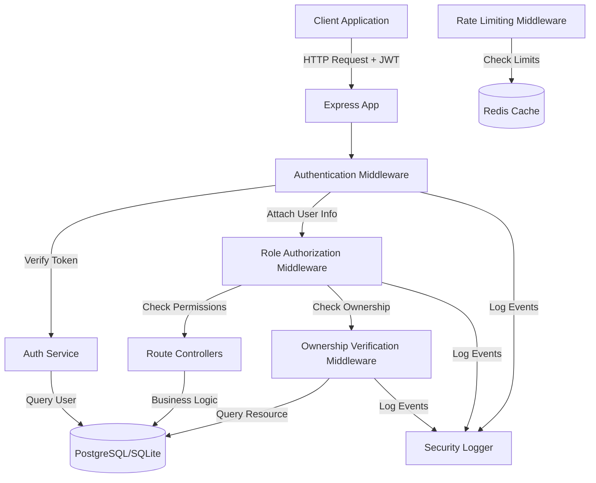
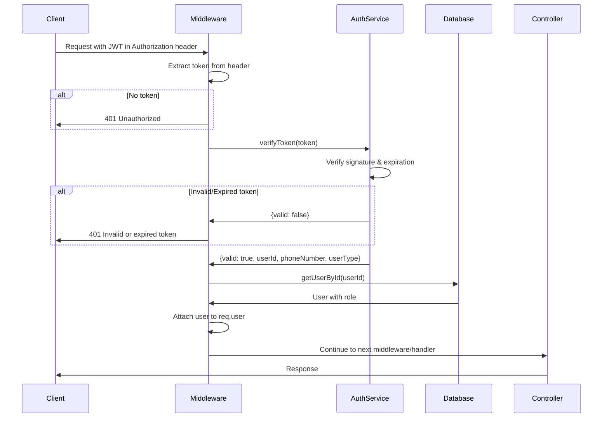
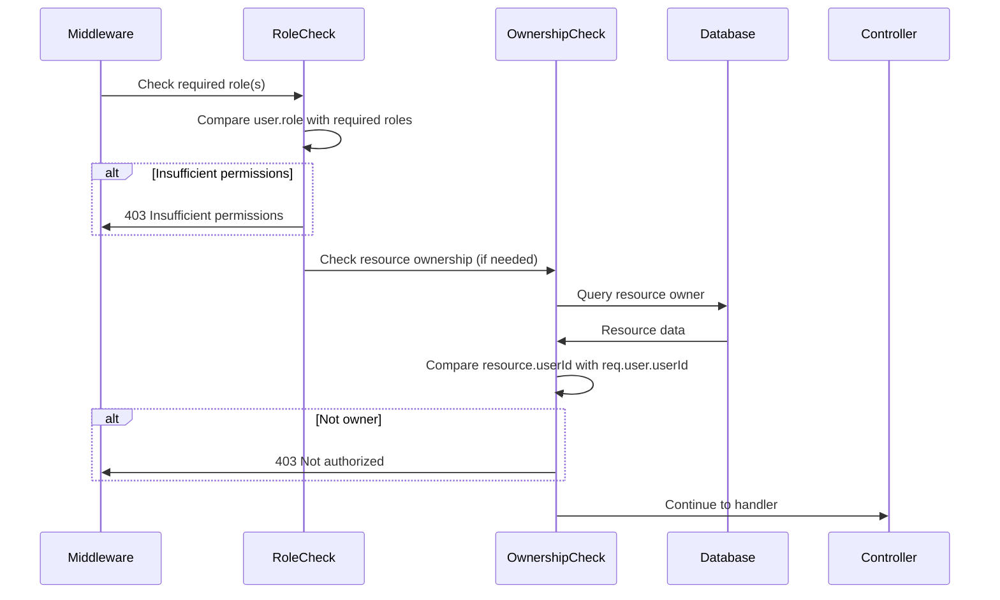

# Design Document: RBAC Authentication System

## Overview

The RBAC Authentication System addresses a critical security vulnerability in Bharat Mandi where NO authentication currently exists on production endpoints. This design implements a comprehensive JWT-based authentication and role-based access control (RBAC) system that secures all endpoints while maintaining backward compatibility with existing user data and authentication flows.

The system introduces four distinct roles (FARMER, BUYER, ADMIN, SUPERADMIN) with granular permissions, ownership verification for resource access, and comprehensive security logging. The design leverages existing JWT infrastructure while adding middleware-based authorization, rate limiting for expensive operations, and audit trails for security monitoring.

Key design principles:
- Defense in depth: Multiple layers of security (authentication, authorization, ownership verification)
- Backward compatibility: Works seamlessly with existing user data and login flows
- Minimal disruption: Reuses existing JWT generation and validation logic
- Composable middleware: Easy to apply and chain authorization checks
- Security by default: All endpoints require authentication unless explicitly marked public

## Architecture

### High-Level Architecture



### Authentication Flow



### Authorization Flow



## Components and Interfaces

### 1. Authentication Middleware (`src/shared/middleware/auth.middleware.ts`)

The authentication middleware provides the foundation for all security checks.


**Interface:**
```typescript
// Extended Express Request with authenticated user
export interface AuthenticatedRequest extends Request {
  user?: {
    userId: string;
    phoneNumber: string;
    userType: UserType;
    role: UserRole;
  };
}

// Main authentication middleware
export function requireAuth(
  req: AuthenticatedRequest, 
  res: Response, 
  next: NextFunction
): Promise<void>;

// Public endpoints that skip authentication
export const publicEndpoints: string[];
```

**Responsibilities:**
- Extract JWT token from Authorization header (format: `Bearer <token>`)
- Validate token using existing `verifyToken()` function from auth.service.ts
- Query database to get full user information including role
- Attach user information to request object as `req.user`
- Return 401 for missing, invalid, or expired tokens
- Log authentication attempts (success and failure)
- Skip authentication for public endpoints

**Error Responses:**
- 401: "No token provided" - Missing Authorization header
- 401: "Invalid token format" - Malformed token
- 401: "Invalid or expired token" - Token verification failed

### 2. Role Authorization Middleware (`src/shared/middleware/role.middleware.ts`)

Provides role-based access control for endpoints requiring specific permissions.

**Interface:**
```typescript
export enum UserRole {
  FARMER = 'FARMER',
  BUYER = 'BUYER',
  ADMIN = 'ADMIN',
  SUPERADMIN = 'SUPERADMIN'
}

export interface Permission {
  // Resource permissions
  manage_own_listings: boolean;
  manage_own_transactions: boolean;
  manage_own_profile: boolean;
  create_listings: boolean;
  upload_media: boolean;
  create_transactions: boolean;
  
  // Admin permissions
  view_all_users: boolean;
  view_statistics: boolean;
  manage_users: boolean;
  view_cache_stats: boolean;
  
  // SuperAdmin permissions
  access_dev_endpoints: boolean;
  clear_caches: boolean;
  delete_data: boolean;
}

// Role-based authorization middleware
export function requireRole(...roles: UserRole[]): RequestHandler;

// Permission checker
export function hasPermission(role: UserRole, permission: keyof Permission): boolean;

// Role-permission mapping
export const rolePermissions: Record<UserRole, Permission>;
```

**Responsibilities:**
- Check if authenticated user has one of the required roles
- Return 403 if user lacks required role
- Log authorization failures with user ID and attempted action
- Support multiple acceptable roles (OR logic)
- Provide permission checking utility functions

**Role-Permission Mapping:**
```typescript
FARMER: {
  manage_own_listings: true,
  manage_own_transactions: true,
  manage_own_profile: true,
  create_listings: true,
  upload_media: true,
  create_transactions: true,
  // All admin/superadmin permissions: false
}

BUYER: {
  manage_own_transactions: true,
  manage_own_profile: true,
  create_transactions: true,
  // All other permissions: false
}

ADMIN: {
  manage_own_profile: true,
  view_all_users: true,
  view_statistics: true,
  manage_users: true,
  view_cache_stats: true,
  // SuperAdmin permissions: false
}

SUPERADMIN: {
  // All permissions: true
}
```

**Error Responses:**
- 403: "Insufficient permissions" - User lacks required role
- 403: "Admin access required" - Admin/SuperAdmin role needed
- 403: "SuperAdmin access required" - SuperAdmin role needed


### 3. Ownership Verification Middleware (`src/shared/middleware/ownership.middleware.ts`)

Ensures users can only access and modify resources they own.

**Interface:**
```typescript
export enum ResourceType {
  LISTING = 'listing',
  TRANSACTION = 'transaction',
  PROFILE = 'profile',
  MEDIA = 'media'
}

// Ownership verification for specific resource types
export function requireOwnership(
  resourceType: ResourceType,
  resourceIdParam: string
): RequestHandler;

// Transaction participant verification (buyer OR seller)
export function requireTransactionParticipant(
  transactionIdParam: string
): RequestHandler;

// Generic ownership checker
export async function verifyOwnership(
  userId: string,
  resourceType: ResourceType,
  resourceId: string
): Promise<boolean>;
```

**Responsibilities:**
- Extract resource ID from request parameters
- Query database to determine resource owner
- Compare resource owner with authenticated user ID
- For transactions: verify user is buyer OR seller
- Cache ownership checks within same request to avoid duplicate queries
- Return 403 if ownership verification fails
- Log ownership verification failures

**Ownership Rules:**
- Listings: User must be the listing creator (userId matches listing.userId)
- Transactions: User must be buyer OR seller (userId matches transaction.buyerId OR listing.userId)
- Profile: User must be the profile owner (userId matches profile userId from URL)
- Media: User must own the listing the media belongs to

**Error Responses:**
- 403: "You do not have permission to access this resource" - Ownership verification failed
- 404: "Resource not found" - Resource doesn't exist (prevents information leakage)

### 4. Rate Limiting Middleware (`src/shared/middleware/rate-limit.middleware.ts`)

Prevents abuse of expensive operations (AWS Translate, AI grading).

**Interface:**
```typescript
export interface RateLimitConfig {
  windowMs: number;        // Time window in milliseconds
  maxRequests: number;     // Maximum requests per window
  keyPrefix: string;       // Redis key prefix
  message?: string;        // Custom error message
}

// Create rate limiter for specific endpoint
export function createRateLimiter(config: RateLimitConfig): RequestHandler;

// Pre-configured rate limiters
export const translateBatchLimiter: RequestHandler;  // 10 req/min
export const gradingLimiter: RequestHandler;         // 20 req/min
```

**Responsibilities:**
- Track request counts per user per time window using Redis
- Increment counter on each request
- Return 429 if limit exceeded
- Include Retry-After header in rate limit responses
- Reset counters after time window expires
- Log rate limit violations

**Rate Limit Configuration:**
- Translation batch: 10 requests per minute per user
- AI grading (with/without image): 20 requests per minute per user
- Key format: `ratelimit:{endpoint}:{userId}`
- Window: 60 seconds (sliding window)

**Error Responses:**
- 429: "Rate limit exceeded. Please try again later." with Retry-After header


### 5. Security Logger (`src/shared/logging/security-logger.ts`)

Centralized security event logging for audit trails and incident investigation.

**Interface:**
```typescript
export enum SecurityEventType {
  LOGIN_SUCCESS = 'LOGIN_SUCCESS',
  LOGIN_FAILURE = 'LOGIN_FAILURE',
  AUTH_FAILURE = 'AUTH_FAILURE',
  AUTHZ_FAILURE = 'AUTHZ_FAILURE',
  OWNERSHIP_FAILURE = 'OWNERSHIP_FAILURE',
  RATE_LIMIT_EXCEEDED = 'RATE_LIMIT_EXCEEDED',
  ADMIN_ACTION = 'ADMIN_ACTION',
  SUPERADMIN_ACTION = 'SUPERADMIN_ACTION'
}

export interface SecurityEvent {
  eventType: SecurityEventType;
  userId?: string;
  phoneNumber?: string;
  ipAddress?: string;
  endpoint?: string;
  resourceType?: string;
  resourceId?: string;
  requiredRole?: string;
  userRole?: string;
  failureReason?: string;
  timestamp: Date;
  correlationId: string;
}

export function logSecurityEvent(event: SecurityEvent): void;
export function getCorrelationId(req: Request): string;
```

**Responsibilities:**
- Log all authentication and authorization events
- Include correlation IDs for request tracing
- Write to separate security log file or service
- Capture IP addresses, user IDs, timestamps
- Log admin and superadmin actions with full request details
- Provide structured logging for analysis tools

**Log Destinations:**
- Development: Console + `logs/security.log`
- Production: Structured logging service (e.g., CloudWatch, Datadog)

### 6. Type Extensions (`src/shared/types/auth.types.ts`)

Extended type definitions for the RBAC system.

**Interface:**
```typescript
// Extend UserType enum with admin roles
export enum UserType {
  FARMER = 'FARMER',
  BUYER = 'BUYER',
  LOGISTICS_PROVIDER = 'LOGISTICS_PROVIDER',
  SERVICE_PROVIDER = 'SERVICE_PROVIDER',
  COLD_STORAGE_PROVIDER = 'COLD_STORAGE_PROVIDER',
  SUPPLIER = 'SUPPLIER',
  ADMIN = 'ADMIN',              // New
  SUPERADMIN = 'SUPERADMIN'     // New
}

// User role type (alias for clarity)
export type UserRole = UserType;

// Extended JWT payload
export interface TokenPayload {
  userId: string;
  phoneNumber: string;
  userType: UserType;
  iat?: number;
  exp?: number;
}

// Extended User interface with role
export interface User {
  id: string;
  phoneNumber: string;
  name: string;
  userType: UserType;
  role: UserRole;  // Computed from userType
  location: Location;
  bankAccount?: BankAccount;
  languagePreference?: string;
  voiceLanguagePreference?: string;
  recentLanguages?: string[];
  createdAt: Date;
  updatedAt?: Date;
}
```

## Data Models

### Database Schema Changes

**Users Table Migration:**
```sql
-- Add role column to users table (optional, can use userType directly)
-- This migration is optional since we can derive role from userType
-- Only needed if we want role to be independent of userType in the future

ALTER TABLE users 
ADD COLUMN role VARCHAR(50);

-- Set default roles based on existing userType
UPDATE users 
SET role = userType 
WHERE role IS NULL;

-- Add index for role-based queries
CREATE INDEX idx_users_role ON users(role);
```

**Note:** The design supports deriving role directly from userType without a separate column. The migration above is optional and provides flexibility for future role management independent of userType.

### Role Mapping Logic

Since we're maintaining backward compatibility, the role is derived from userType:

```typescript
function getUserRole(userType: UserType): UserRole {
  // Direct mapping - userType IS the role
  return userType as UserRole;
}
```

This approach:
- Requires no database migration for existing users
- Maintains backward compatibility
- Allows future decoupling if needed
- Simplifies the initial implementation


### Endpoint Protection Configuration

**Public Endpoints (No Authentication Required):**
```typescript
const publicEndpoints = [
  'POST /api/auth/request-otp',
  'POST /api/auth/verify-otp',
  'POST /api/auth/register',
  'POST /api/auth/setup-pin',
  'POST /api/auth/login',
  'POST /api/auth/login/biometric',
  'POST /api/i18n/detect-language',
  'GET /api/i18n/languages',
  'GET /api/health'
];
```

**Protected Endpoints with Role Requirements:**
```typescript
const endpointProtection = {
  // Admin endpoints
  'GET /api/users': [UserRole.ADMIN, UserRole.SUPERADMIN],
  'GET /api/i18n/cache-stats': [UserRole.ADMIN, UserRole.SUPERADMIN],
  'GET /api/i18n/translate/feedback/stats': [UserRole.ADMIN, UserRole.SUPERADMIN],
  
  // SuperAdmin endpoints
  'POST /api/dev/clear-translation-cache': [UserRole.SUPERADMIN],
  'POST /api/dev/clear-sync-queue': [UserRole.SUPERADMIN],
  'POST /api/dev/clean-all-data': [UserRole.SUPERADMIN],
  'POST /api/dev/delete-media': [UserRole.SUPERADMIN],
  'POST /api/dev/delete-listings': [UserRole.SUPERADMIN],
  'GET /api/dev/stats': [UserRole.SUPERADMIN],
  
  // Ownership-based endpoints (authenticated + owner check)
  'PUT /api/auth/profile/:userId': 'OWNER',
  'DELETE /api/marketplace/listings/:id': 'OWNER',
  'PUT /api/marketplace/listings/:id': 'OWNER',
  'POST /api/marketplace/listings/:listingId/media': 'OWNER',
  
  // Transaction participant endpoints (buyer OR seller)
  'POST /api/transactions/:id/accept': 'PARTICIPANT',
  'POST /api/transactions/:id/lock-payment': 'PARTICIPANT',
  'POST /api/transactions/:id/dispatch': 'PARTICIPANT',
  'POST /api/transactions/:id/mark-delivered': 'PARTICIPANT',
  'POST /api/transactions/:id/release-funds': 'PARTICIPANT',
  'GET /api/transactions/:id': 'PARTICIPANT',
  
  // Rate-limited endpoints
  'POST /api/i18n/translate-batch': 'RATE_LIMITED_10',
  'POST /api/grading/grade': 'RATE_LIMITED_20',
  'POST /api/grading/grade-with-image': 'RATE_LIMITED_20'
};
```

### Middleware Application Strategy

**Global Middleware (Applied to all routes):**
```typescript
// In app.ts
app.use(attachCorrelationId);  // Add correlation ID to all requests
app.use(logRequest);            // Log all incoming requests
```

**Route-Level Middleware (Applied per route):**
```typescript
// Example: Marketplace routes
router.delete(
  '/listings/:id',
  requireAuth,                                    // Step 1: Authenticate
  requireOwnership(ResourceType.LISTING, 'id'),  // Step 2: Verify ownership
  deleteListingHandler                            // Step 3: Execute
);

// Example: Admin routes
router.get(
  '/users',
  requireAuth,                                    // Step 1: Authenticate
  requireRole(UserRole.ADMIN, UserRole.SUPERADMIN), // Step 2: Check role
  getUsersHandler                                 // Step 3: Execute
);

// Example: Rate-limited routes
router.post(
  '/translate-batch',
  requireAuth,                                    // Step 1: Authenticate
  translateBatchLimiter,                          // Step 2: Check rate limit
  translateBatchHandler                           // Step 3: Execute
);

// Example: Transaction participant routes
router.post(
  '/transactions/:id/release-funds',
  requireAuth,                                    // Step 1: Authenticate
  requireTransactionParticipant('id'),           // Step 2: Verify participant
  releaseFundsHandler                             // Step 3: Execute
);
```

**Middleware Composition Pattern:**
The middleware functions are designed to be composable and chainable:
1. Each middleware calls `next()` on success
2. Each middleware returns error response on failure (short-circuits the chain)
3. Middleware can be combined in any order
4. User information flows through `req.user` attached by `requireAuth`


## Correctness Properties

*A property is a characteristic or behavior that should hold true across all valid executions of a system—essentially, a formal statement about what the system should do. Properties serve as the bridge between human-readable specifications and machine-verifiable correctness guarantees.*

### Property 1: JWT Token Structure Completeness

*For any* successful login, the generated JWT token when decoded SHALL contain userId, phoneNumber, and userType fields.

**Validates: Requirements 1.1**

### Property 2: JWT Token Signature Round-Trip

*For any* JWT token generated by the system, verifying the token with the same secret key SHALL succeed, and verifying with a different secret key SHALL fail.

**Validates: Requirements 1.2, 1.8**

### Property 3: JWT Token Expiration Time

*For any* generated JWT token, the expiration time (exp claim) SHALL be exactly 7 days (604800 seconds) after the issued-at time (iat claim).

**Validates: Requirements 1.3**

### Property 4: Token Extraction from Authorization Header

*For any* protected endpoint request with a valid Authorization header in format "Bearer <token>", the middleware SHALL successfully extract the token.

**Validates: Requirements 1.4**

### Property 5: Valid Token User Attachment

*For any* valid JWT token, when the authentication middleware processes it, the decoded user information (userId, phoneNumber, userType) SHALL be attached to req.user.

**Validates: Requirements 1.7, 3.6**

### Property 6: Role Permission Consistency

*For any* role, querying permissions for that role SHALL return a consistent set of permissions that matches the role definition.

**Validates: Requirements 2.3, 2.4, 2.5, 2.6, 2.7**

### Property 7: Role Persistence Round-Trip

*For any* user with a role, storing the user to the database and then retrieving them SHALL return the same role value.

**Validates: Requirements 2.8, 11.7**

### Property 8: Middleware Chaining Composition

*For any* sequence of middleware functions (requireAuth, requireRole, requireOwnership), applying them in order SHALL result in each middleware being called in sequence until one fails or all succeed.

**Validates: Requirements 3.5, 13.5**

### Property 9: Authorization Failure Logging

*For any* authorization failure (role check or ownership check), a security log entry SHALL be created with userId, attempted action, and timestamp.

**Validates: Requirements 3.7, 10.2**

### Property 10: Profile Ownership Verification

*For any* user attempting to update a profile, the operation SHALL succeed if and only if the user's ID matches the profile's user ID.

**Validates: Requirements 4.1**

### Property 11: Listing Ownership Verification

*For any* user attempting to delete or modify a listing, the operation SHALL succeed if and only if the user's ID matches the listing's owner ID.

**Validates: Requirements 4.2, 4.3**

### Property 12: Transaction Participant Verification

*For any* user attempting to modify a transaction, the operation SHALL succeed if and only if the user is either the buyer or the seller in that transaction.

**Validates: Requirements 4.4, 7.6**

### Property 13: Ownership Check Caching

*For any* request that checks ownership of the same resource multiple times, the database SHALL be queried at most once for that resource.

**Validates: Requirements 4.7**

### Property 14: Non-Public Endpoint Authentication Requirement

*For any* endpoint not in the public endpoints list, requests without valid authentication SHALL be rejected with HTTP 401.

**Validates: Requirements 5.9**

### Property 15: Dev Endpoint SuperAdmin Requirement

*For any* endpoint under /api/dev/*, requests from users without SUPERADMIN role SHALL be rejected with HTTP 403.

**Validates: Requirements 6.9**

### Property 16: Transaction Action Authorization

*For any* transaction action (accept, lock-payment, dispatch, mark-delivered, release-funds), the action SHALL succeed only if performed by the authorized participant (buyer or seller as specified).

**Validates: Requirements 7.1, 7.2, 7.3, 7.4, 7.5**

### Property 17: Admin Action Logging

*For any* admin or superadmin action, a security log entry SHALL be created with full request details including userId, endpoint, and timestamp.

**Validates: Requirements 8.5, 14.5**

### Property 18: Error Message Information Leakage Prevention

*For any* authentication or authorization failure, the error message SHALL not contain sensitive information (passwords, tokens, secrets, stack traces in production, or user existence information).

**Validates: Requirements 10.1, 10.3, 10.4**

### Property 19: Security Event Comprehensive Logging

*For any* authentication or authorization event (success or failure), a security log entry SHALL be created with appropriate event type and context.

**Validates: Requirements 10.7, 14.1, 14.2, 14.3, 14.4**

### Property 20: Authentication Rate Limiting

*For any* IP address, making more than 5 failed authentication attempts within a 1-minute window SHALL result in subsequent attempts being rate-limited.

**Validates: Requirements 10.6**

### Property 21: Existing User Role Defaulting

*For any* existing user without an explicit role, the system SHALL derive their role from their userType (FARMER → FARMER, BUYER → BUYER, etc.).

**Validates: Requirements 11.3**

### Property 22: Backward Compatible Login

*For any* user with existing credentials, logging in via PIN or biometric authentication SHALL continue to work and generate valid JWT tokens.

**Validates: Requirements 11.5**

### Property 23: Translate Batch Rate Limiting

*For any* authenticated user, making more than 10 requests to POST /api/i18n/translate-batch within a 1-minute window SHALL result in HTTP 429 response.

**Validates: Requirements 12.1**

### Property 24: Grading Endpoint Rate Limiting

*For any* authenticated user, making more than 20 requests to POST /api/grading/grade or POST /api/grading/grade-with-image within a 1-minute window SHALL result in HTTP 429 response.

**Validates: Requirements 12.2, 12.3**

### Property 25: Rate Limit Response Headers

*For any* rate-limited request (HTTP 429), the response SHALL include a Retry-After header indicating the number of seconds until the rate limit resets.

**Validates: Requirements 12.5**

### Property 26: Rate Limit Window Reset

*For any* rate-limited endpoint, after the 1-minute window expires, the request counter SHALL reset and new requests SHALL be allowed.

**Validates: Requirements 12.7**

### Property 27: Successful Authentication Flow Control

*For any* request with valid authentication, the requireAuth middleware SHALL call next() to pass control to the next middleware or route handler.

**Validates: Requirements 13.3**

### Property 28: Failed Authentication Flow Control

*For any* request with invalid authentication, the requireAuth middleware SHALL return an error response and SHALL NOT call next().

**Validates: Requirements 13.4**

### Property 29: Log Correlation ID Presence

*For any* security log entry, the log SHALL include a correlation ID that can be used to trace the request across multiple services.

**Validates: Requirements 14.8**

### Property 30: Rate Limit Violation Logging

*For any* rate limit violation, a security log entry SHALL be created with userId, endpoint, and timestamp.

**Validates: Requirements 14.6**


## Error Handling

### Error Response Structure

All authentication and authorization errors follow a consistent structure:

```typescript
interface ErrorResponse {
  success: false;
  message: string;
  statusCode: number;
  timestamp: Date;
  correlationId: string;
  // NO sensitive information (tokens, passwords, stack traces in production)
}
```

### Error Categories and Handling

**1. Authentication Errors (HTTP 401)**

| Scenario | Error Message | Logging |
|----------|--------------|---------|
| No token provided | "No token provided" | Log attempt with IP, endpoint, timestamp |
| Invalid token format | "Invalid token format" | Log attempt with IP, endpoint, timestamp |
| Invalid or expired token | "Invalid or expired token" | Log attempt with IP, endpoint, timestamp, userId (if decodable) |
| Malformed token | "Invalid token format" | Log attempt with IP, endpoint, timestamp |

**2. Authorization Errors (HTTP 403)**

| Scenario | Error Message | Logging |
|----------|--------------|---------|
| Insufficient role | "Insufficient permissions" | Log userId, required role, user role, endpoint, timestamp |
| Admin access required | "Admin access required" | Log userId, user role, endpoint, timestamp |
| SuperAdmin access required | "SuperAdmin access required" | Log userId, user role, endpoint, timestamp |
| Ownership verification failed | "You do not have permission to access this resource" | Log userId, resource type, resource ID, timestamp |
| Not transaction participant | "You do not have permission to access this resource" | Log userId, transaction ID, timestamp |

**3. Rate Limiting Errors (HTTP 429)**

| Scenario | Error Message | Headers | Logging |
|----------|--------------|---------|---------|
| Rate limit exceeded | "Rate limit exceeded. Please try again later." | Retry-After: {seconds} | Log userId, endpoint, timestamp, current count |

**4. Resource Not Found (HTTP 404)**

When ownership verification is performed, if the resource doesn't exist, return 404 instead of 403 to prevent information leakage about resource existence.

### Security Considerations

**Information Leakage Prevention:**
- Never reveal whether a user exists in error messages
- Never include token values in error responses
- Never include database query details in error messages
- Never include stack traces in production error responses
- Return 404 for non-existent resources instead of 403 to prevent enumeration

**Generic Error Messages:**
- Authentication failures use generic messages
- Don't distinguish between "user not found" and "wrong password"
- Don't reveal role requirements in error messages to unauthorized users

**Error Logging vs. Error Responses:**
- Log detailed information (user IDs, resource IDs, failure reasons)
- Return generic messages to clients
- Include correlation IDs in both logs and responses for tracing

### Error Recovery

**Token Expiration:**
- Client should catch 401 errors with "Invalid or expired token"
- Client should redirect to login flow
- Client should clear stored token

**Rate Limiting:**
- Client should respect Retry-After header
- Client should implement exponential backoff
- Client should display user-friendly message about temporary limit

**Ownership Failures:**
- Client should not retry (403 is permanent for that user)
- Client should display appropriate "access denied" message
- Client should not expose internal resource IDs to users


## Testing Strategy

### Dual Testing Approach

The RBAC Authentication System requires both unit tests and property-based tests for comprehensive coverage:

**Unit Tests:** Verify specific examples, edge cases, and error conditions
- Specific endpoint protection scenarios
- Error message formats
- Middleware integration with Express
- Edge cases (missing tokens, malformed tokens, expired tokens)
- Specific role permission mappings

**Property-Based Tests:** Verify universal properties across all inputs
- Token generation and verification for any user data
- Ownership verification for any user/resource combination
- Rate limiting behavior across many requests
- Middleware chaining for any combination of middleware
- Role-based access control for any role/permission combination

Both approaches are complementary and necessary. Unit tests catch concrete bugs in specific scenarios, while property-based tests verify general correctness across the input space.

### Property-Based Testing Configuration

**Library:** fast-check (TypeScript/JavaScript property-based testing library)

**Configuration:**
- Minimum 100 iterations per property test (due to randomization)
- Each property test references its design document property
- Tag format: `Feature: rbac-authentication-system, Property {number}: {property_text}`

**Example Property Test Structure:**
```typescript
import fc from 'fast-check';

describe('Feature: rbac-authentication-system, Property 1: JWT Token Structure Completeness', () => {
  it('should include userId, phoneNumber, and userType in all generated tokens', () => {
    fc.assert(
      fc.property(
        fc.record({
          userId: fc.uuid(),
          phoneNumber: fc.string({ minLength: 10, maxLength: 10 }),
          userType: fc.constantFrom('FARMER', 'BUYER', 'ADMIN', 'SUPERADMIN')
        }),
        (userData) => {
          const token = generateToken(userData);
          const decoded = jwt.decode(token);
          
          expect(decoded).toHaveProperty('userId', userData.userId);
          expect(decoded).toHaveProperty('phoneNumber', userData.phoneNumber);
          expect(decoded).toHaveProperty('userType', userData.userType);
        }
      ),
      { numRuns: 100 }
    );
  });
});
```

### Test Organization

```
src/shared/middleware/__tests__/
├── auth.middleware.test.ts              # Unit tests for authentication
├── auth.middleware.pbt.test.ts          # Property tests for authentication
├── role.middleware.test.ts              # Unit tests for authorization
├── role.middleware.pbt.test.ts          # Property tests for authorization
├── ownership.middleware.test.ts         # Unit tests for ownership
├── ownership.middleware.pbt.test.ts     # Property tests for ownership
├── rate-limit.middleware.test.ts        # Unit tests for rate limiting
└── rate-limit.middleware.pbt.test.ts    # Property tests for rate limiting

src/shared/logging/__tests__/
├── security-logger.test.ts              # Unit tests for logging
└── security-logger.pbt.test.ts          # Property tests for logging

src/features/auth/__tests__/
├── rbac-integration.test.ts             # Integration tests for full RBAC flow
└── rbac-integration.pbt.test.ts         # Property tests for integration
```

### Unit Test Coverage

**Authentication Middleware:**
- ✓ Missing token returns 401
- ✓ Malformed token returns 401
- ✓ Expired token returns 401
- ✓ Valid token attaches user to request
- ✓ Public endpoints skip authentication
- ✓ Invalid signature returns 401

**Role Authorization Middleware:**
- ✓ FARMER role has correct permissions
- ✓ BUYER role has correct permissions
- ✓ ADMIN role has correct permissions
- ✓ SUPERADMIN role has all permissions
- ✓ Insufficient role returns 403
- ✓ Multiple acceptable roles (OR logic)

**Ownership Verification Middleware:**
- ✓ Owner can access their listing
- ✓ Non-owner cannot access listing
- ✓ Buyer can access their transaction
- ✓ Seller can access their transaction
- ✓ Non-participant cannot access transaction
- ✓ Non-existent resource returns 404

**Rate Limiting Middleware:**
- ✓ Requests within limit succeed
- ✓ Requests exceeding limit return 429
- ✓ Retry-After header is present
- ✓ Counter resets after window
- ✓ Different users have separate counters

**Security Logger:**
- ✓ Successful login logged with required fields
- ✓ Failed login logged with required fields
- ✓ Authorization failure logged
- ✓ Ownership failure logged
- ✓ Admin action logged
- ✓ Rate limit violation logged
- ✓ Correlation ID present in all logs

**Integration Tests:**
- ✓ Full authentication flow (login → token → protected endpoint)
- ✓ Full authorization flow (auth → role check → handler)
- ✓ Full ownership flow (auth → ownership check → handler)
- ✓ Middleware chaining (auth → role → ownership → handler)
- ✓ Public endpoint access without token
- ✓ Admin endpoint access with admin role
- ✓ SuperAdmin endpoint access with superadmin role
- ✓ Rate limiting across multiple requests

### Property-Based Test Coverage

**Property 1-5: JWT Token Properties**
- Generators: Random user data (userId, phoneNumber, userType)
- Assertions: Token structure, signature verification, expiration time

**Property 6-7: Role and Permission Properties**
- Generators: Random roles, random permission queries
- Assertions: Permission consistency, role persistence

**Property 8-9: Middleware Composition Properties**
- Generators: Random middleware sequences, random requests
- Assertions: Middleware chaining, logging on failures

**Property 10-13: Ownership Verification Properties**
- Generators: Random users, random resources (listings, transactions, profiles)
- Assertions: Ownership rules, caching behavior

**Property 14-15: Endpoint Protection Properties**
- Generators: Random endpoints, random user roles
- Assertions: Public endpoint access, protected endpoint rejection

**Property 16-17: Transaction Authorization Properties**
- Generators: Random transactions, random users, random actions
- Assertions: Buyer/seller authorization, admin action logging

**Property 18-19: Security and Logging Properties**
- Generators: Random authentication failures, random authorization failures
- Assertions: No information leakage, comprehensive logging

**Property 20-26: Rate Limiting Properties**
- Generators: Random request sequences, random users
- Assertions: Rate limit enforcement, window reset, header presence

**Property 27-30: Flow Control and Logging Properties**
- Generators: Random valid/invalid requests
- Assertions: Middleware flow control, correlation IDs, logging

### Test Data Generators

**fast-check Generators:**
```typescript
// User data generator
const userDataArb = fc.record({
  userId: fc.uuid(),
  phoneNumber: fc.string({ minLength: 10, maxLength: 10 }).map(s => s.replace(/\D/g, '')),
  userType: fc.constantFrom('FARMER', 'BUYER', 'ADMIN', 'SUPERADMIN'),
  name: fc.string({ minLength: 1, maxLength: 50 })
});

// Listing generator
const listingArb = fc.record({
  id: fc.uuid(),
  userId: fc.uuid(),
  title: fc.string({ minLength: 1, maxLength: 100 }),
  price: fc.nat({ max: 1000000 })
});

// Transaction generator
const transactionArb = fc.record({
  id: fc.uuid(),
  buyerId: fc.uuid(),
  listingId: fc.uuid(),
  status: fc.constantFrom('PENDING', 'ACCEPTED', 'COMPLETED')
});

// JWT token generator
const jwtTokenArb = userDataArb.map(userData => generateToken(userData));

// Role generator
const roleArb = fc.constantFrom('FARMER', 'BUYER', 'ADMIN', 'SUPERADMIN');

// Endpoint generator
const endpointArb = fc.constantFrom(
  '/api/marketplace/listings',
  '/api/transactions',
  '/api/users',
  '/api/dev/stats',
  '/api/i18n/translate-batch'
);
```

### Mocking Strategy

**Database Mocking:**
- Use in-memory SQLite for integration tests
- Mock DatabaseManager for unit tests
- Provide test data factories for users, listings, transactions

**Redis Mocking:**
- Use ioredis-mock for rate limiting tests
- Verify Redis commands are called correctly
- Test rate limit counter behavior

**Express Mocking:**
- Mock Request, Response, NextFunction for middleware tests
- Verify response methods called correctly (status, json, send)
- Verify next() called or not called as expected

**Logger Mocking:**
- Capture log output for verification
- Verify log entries contain required fields
- Test log filtering and formatting

### Performance Testing

While not part of the correctness properties, performance testing should verify:
- Authentication middleware adds < 10ms latency
- Ownership verification with caching adds < 20ms latency
- Rate limiting with Redis adds < 5ms latency
- Security logging is non-blocking (async)

### Security Testing

Additional security testing beyond correctness properties:
- Penetration testing for common vulnerabilities (OWASP Top 10)
- Token tampering attempts
- Role escalation attempts
- Brute force attack simulation
- Rate limit bypass attempts
- Information leakage verification


## Implementation Notes

### Migration Strategy

**Phase 1: Foundation (No Breaking Changes)**
1. Create middleware files (auth, role, ownership, rate-limit)
2. Create security logger
3. Extend UserType enum with ADMIN and SUPERADMIN
4. Add role-permission mapping configuration
5. Write comprehensive tests (unit + property-based)

**Phase 2: Gradual Rollout**
1. Apply requireAuth to non-public endpoints (start with new endpoints)
2. Apply requireRole to admin endpoints
3. Apply requireOwnership to resource modification endpoints
4. Apply rate limiting to expensive endpoints
5. Monitor logs for issues

**Phase 3: Full Enforcement**
1. Enable authentication on all protected endpoints
2. Remove NODE_ENV checks from dev endpoints (rely on SUPERADMIN role)
3. Enable comprehensive security logging
4. Document endpoint protection in API documentation

### Backward Compatibility Considerations

**Existing Users:**
- No database migration required initially
- Role derived from userType (FARMER → FARMER, BUYER → BUYER)
- Existing JWT tokens continue to work
- Existing login flows (PIN, biometric) unchanged

**Existing Endpoints:**
- Public endpoints explicitly listed (no auth required)
- Protected endpoints gradually secured
- Error responses maintain consistent format
- No changes to request/response payloads

**Existing Code:**
- Reuse existing verifyToken() function
- Reuse existing JWT generation logic
- Reuse existing DatabaseManager
- No changes to service layer

### Configuration

**Environment Variables:**
```bash
# Existing (already in use)
JWT_SECRET=<secure-secret-key>
JWT_EXPIRY=7d

# New (for rate limiting)
REDIS_URL=redis://localhost:6379
RATE_LIMIT_ENABLED=true

# New (for logging)
SECURITY_LOG_LEVEL=info
SECURITY_LOG_FILE=logs/security.log
```

**Rate Limit Configuration:**
```typescript
// src/shared/middleware/rate-limit.config.ts
export const rateLimitConfig = {
  translateBatch: {
    windowMs: 60000,      // 1 minute
    maxRequests: 10,
    keyPrefix: 'ratelimit:translate-batch'
  },
  grading: {
    windowMs: 60000,      // 1 minute
    maxRequests: 20,
    keyPrefix: 'ratelimit:grading'
  },
  authentication: {
    windowMs: 60000,      // 1 minute
    maxRequests: 5,
    keyPrefix: 'ratelimit:auth'
  }
};
```

### Dependencies

**New Dependencies:**
```json
{
  "dependencies": {
    "ioredis": "^5.3.2"           // Redis client for rate limiting
  },
  "devDependencies": {
    "fast-check": "^3.15.0",      // Property-based testing
    "ioredis-mock": "^8.9.0",     // Redis mocking for tests
    "@types/express": "^4.17.21"  // Express type definitions
  }
}
```

**Existing Dependencies (Already in use):**
- jsonwebtoken: JWT generation and verification
- express: Web framework
- bcrypt: Password hashing (for PIN)

### Monitoring and Observability

**Metrics to Track:**
- Authentication success/failure rate
- Authorization failure rate by endpoint
- Rate limit violations by endpoint
- Average authentication latency
- Ownership verification cache hit rate

**Alerts to Configure:**
- High authentication failure rate (potential attack)
- High authorization failure rate (misconfiguration or attack)
- Rate limit violations exceeding threshold
- Security log write failures

**Dashboards:**
- Authentication metrics over time
- Authorization failures by endpoint
- Rate limiting effectiveness
- Admin/SuperAdmin action audit trail

### Security Best Practices

**Token Management:**
- Store JWT_SECRET in secure environment variables
- Rotate JWT_SECRET periodically (requires re-authentication)
- Use HTTPS in production to protect tokens in transit
- Set appropriate token expiration (7 days balances security and UX)

**Rate Limiting:**
- Use Redis for distributed rate limiting
- Configure appropriate limits based on usage patterns
- Monitor for rate limit bypass attempts
- Adjust limits based on abuse patterns

**Logging:**
- Log all security events asynchronously (non-blocking)
- Rotate security logs regularly
- Protect log files with appropriate permissions
- Send logs to centralized logging service in production

**Defense in Depth:**
- Multiple layers: authentication → authorization → ownership
- Maintain NODE_ENV checks as secondary defense
- Validate input at multiple layers
- Use parameterized queries to prevent SQL injection

### Future Enhancements

**Potential Improvements (Out of Scope for Initial Implementation):**
1. **Refresh Tokens:** Implement refresh token mechanism for better security
2. **Multi-Factor Authentication:** Add SMS or TOTP-based MFA
3. **Session Management:** Track active sessions and allow revocation
4. **Fine-Grained Permissions:** Move from role-based to permission-based authorization
5. **Audit Trail UI:** Admin dashboard for viewing security logs
6. **Anomaly Detection:** ML-based detection of suspicious authentication patterns
7. **IP Whitelisting:** Allow restricting admin access to specific IPs
8. **API Key Authentication:** Support API keys for programmatic access

### Documentation Requirements

**API Documentation Updates:**
- Document authentication requirements for each endpoint
- Document required roles for protected endpoints
- Document rate limits for expensive endpoints
- Provide examples of Authorization header format
- Document error responses (401, 403, 429)

**Developer Documentation:**
- Guide for applying middleware to new endpoints
- Guide for adding new roles and permissions
- Guide for implementing ownership verification for new resources
- Guide for configuring rate limits for new endpoints

**Operations Documentation:**
- Deployment guide (Redis setup, environment variables)
- Monitoring and alerting setup
- Security log analysis guide
- Incident response procedures

---

## Summary

This design provides a comprehensive RBAC authentication system that addresses the critical security vulnerability of unprotected production endpoints. The system is built on these key principles:

1. **Defense in Depth:** Multiple layers of security (authentication, authorization, ownership verification)
2. **Backward Compatibility:** Works seamlessly with existing user data and authentication flows
3. **Composable Middleware:** Easy to apply and chain authorization checks
4. **Security by Default:** All endpoints require authentication unless explicitly marked public
5. **Comprehensive Logging:** Full audit trail for security monitoring and incident investigation

The design leverages existing JWT infrastructure while adding middleware-based authorization, rate limiting for expensive operations, and comprehensive security logging. The implementation can be rolled out gradually without breaking existing functionality, and the testing strategy ensures correctness through both unit tests and property-based tests.

