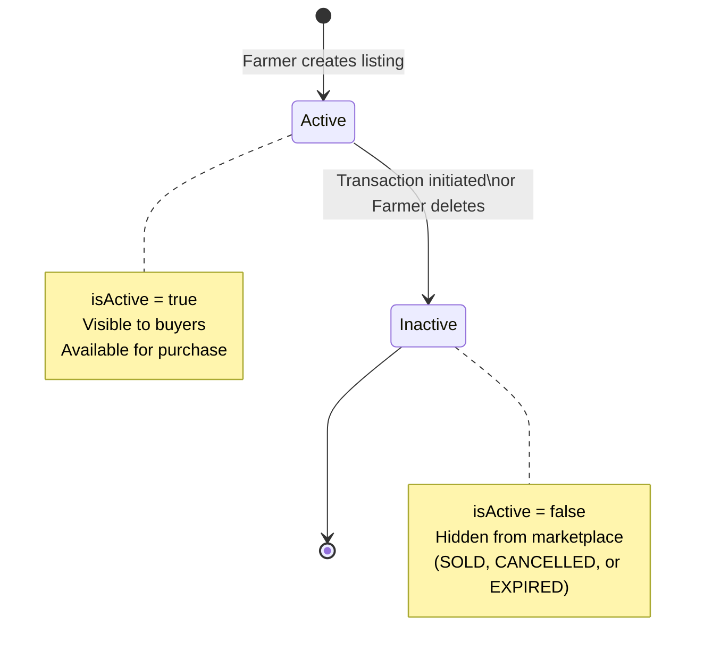
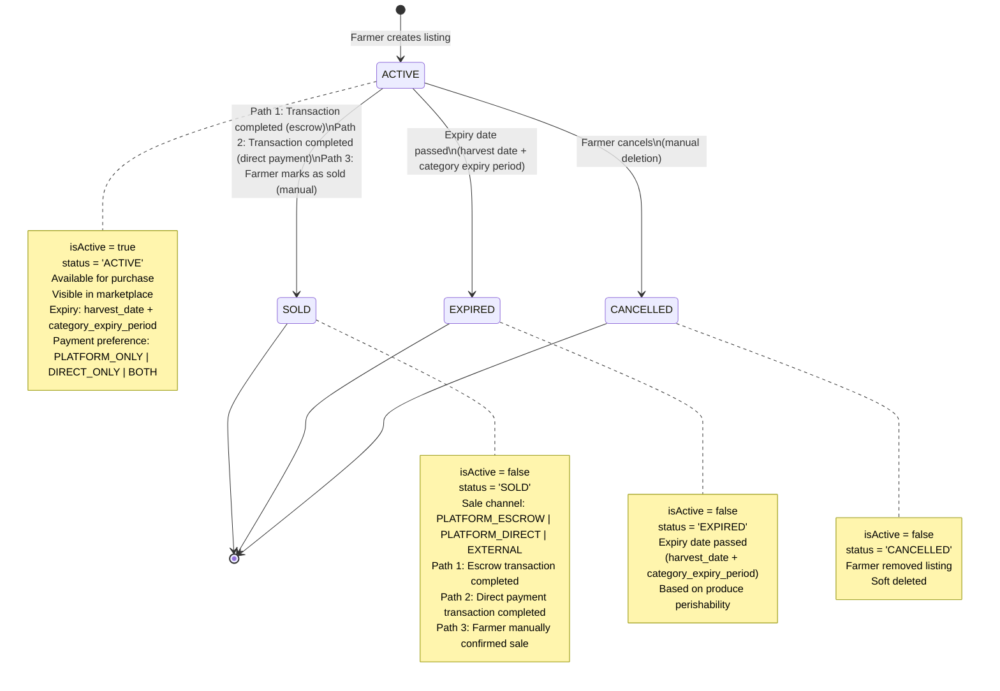
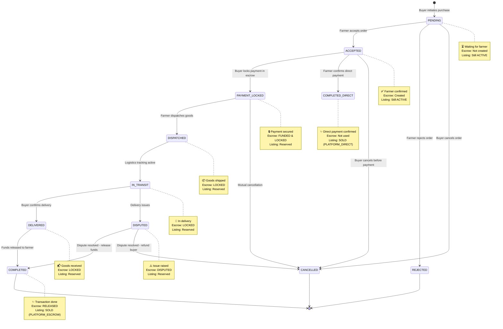
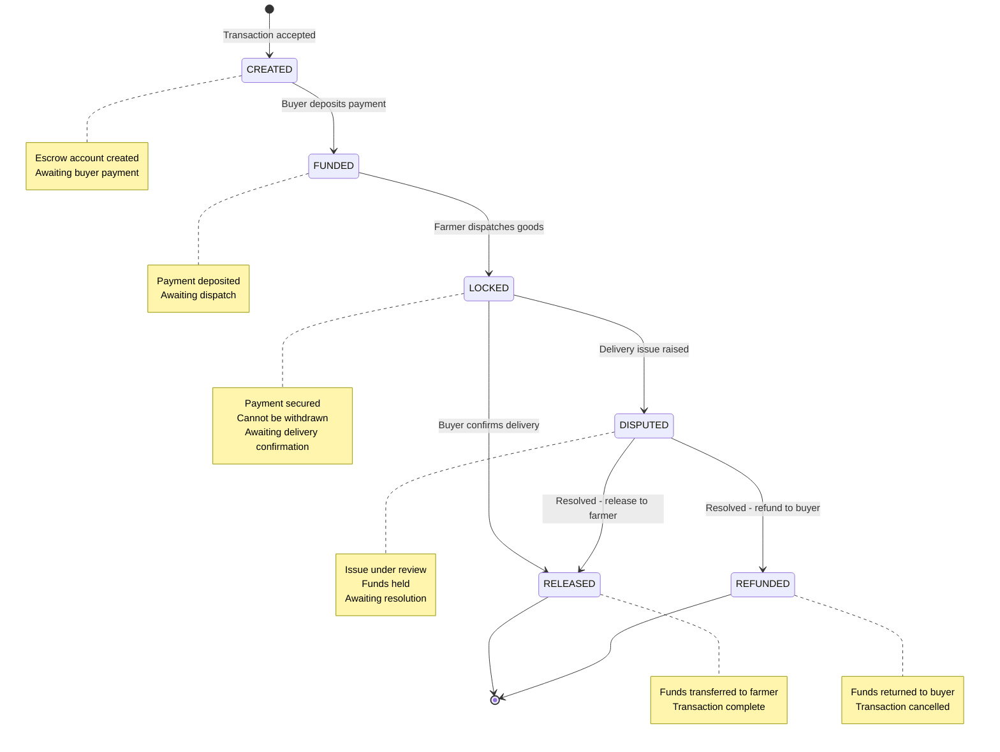
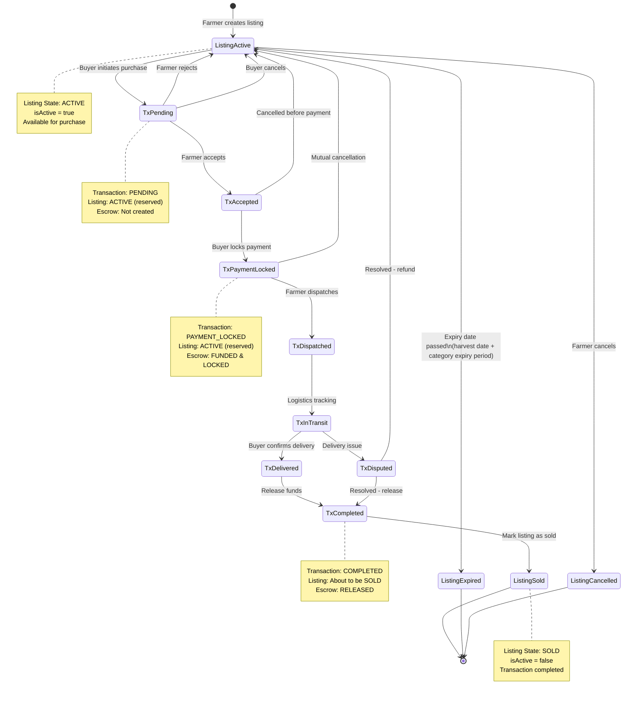

# Bharat Mandi - State Transition Diagrams

> **Shared Documentation**: This document provides visual state machine diagrams for the entire Bharat Mandi marketplace, covering Listing, Transaction, and Escrow states.
>
> **Referenced by**:
> - [Enhanced Listing Status Management](../enhanced-listing-status-management/requirements.md)
> - [Enhanced Listing Status Management - Design](../enhanced-listing-status-management/design.md)
> - [State Synchronization](../enhanced-listing-status-management/STATE-SYNCHRONIZATION.md)

## 1. Listing States

### Current Implementation (Simplified)

### Recommended Enhanced Implementation

---

## 2. Transaction States (Current Implementation + Direct Payment)

### Transaction Flow with Escrow and Direct Payment

---

## 3. Escrow States

---

## 4. Complete Marketplace Flow

### Listing Lifecycle with Transaction Integration

---

## 5. Transaction Flow Steps (As Shown in UI)

### Escrow Flow (5-step process)

1. **Farmer Accepts Order** (PENDING → ACCEPTED)
   - Farmer reviews and accepts the purchase request
   - Escrow account is created

2. **Buyer Locks Payment** (ACCEPTED → PAYMENT_LOCKED)
   - Buyer deposits payment into escrow
   - Funds are secured and locked

3. **Farmer Dispatches** (PAYMENT_LOCKED → DISPATCHED/IN_TRANSIT)
   - Farmer ships the goods
   - Tracking information updated

4. **Buyer Confirms Delivery** (IN_TRANSIT → DELIVERED)
   - Buyer receives and verifies goods
   - Confirms delivery in system

5. **Release Funds** (DELIVERED → COMPLETED)
   - System releases funds from escrow to farmer
   - Listing marked as SOLD (PLATFORM_ESCROW)
   - Transaction complete

### Direct Payment Flow (2-step process)

1. **Farmer Accepts Order** (PENDING → ACCEPTED)
   - Farmer reviews and accepts the purchase request
   - No escrow account created (direct payment agreed)

2. **Farmer Confirms Payment** (ACCEPTED → COMPLETED_DIRECT)
   - Farmer confirms direct payment received from buyer
   - Listing marked as SOLD (PLATFORM_DIRECT)
   - Transaction complete

### Manual Sale Confirmation (No transaction)

1. **Farmer Marks as Sold**
   - Farmer sold produce outside Bharat Mandi or through direct arrangement
   - Farmer manually marks listing as SOLD
   - Selects sale channel: PLATFORM_DIRECT or EXTERNAL
   - Listing marked as SOLD (EXTERNAL)
   - Helps platform track all sales for analytics

---

## Implementation Notes

### Current Database Schema
- **Listings Table**: Uses `isActive` boolean (true/false)
- **Transactions Table**: Uses `status` enum with all states
- **Escrow Table**: Uses `status` enum with escrow states

### Recommended Enhancements
1. Add `status` column to listings table (ACTIVE, SOLD, EXPIRED, CANCELLED)
2. Add `payment_method_preference` column (PLATFORM_ONLY, DIRECT_ONLY, BOTH)
3. Add `sale_channel` column (PLATFORM_ESCROW, PLATFORM_DIRECT, EXTERNAL)
4. Add `COMPLETED_DIRECT` to transaction status enum
5. Keep `isActive` as computed field for backward compatibility
6. Implement automatic expiration based on produce category perishability (harvest_date + category_expiry_period)
7. Update listing status to SOLD when transaction reaches COMPLETED or COMPLETED_DIRECT state
8. Allow farmers to manually mark listings as SOLD for external sales
9. Add webhook/event system to sync listing and transaction states

### State Synchronization Rules
- When transaction → COMPLETED: listing → SOLD (sale_channel = PLATFORM_ESCROW)
- When transaction → COMPLETED_DIRECT: listing → SOLD (sale_channel = PLATFORM_DIRECT)
- When farmer marks as sold: listing → SOLD (sale_channel = PLATFORM_DIRECT or EXTERNAL)
- When transaction → CANCELLED (before PAYMENT_LOCKED): listing → ACTIVE
- When transaction → DISPUTED → REFUNDED: listing → ACTIVE
- When expiry date passes (harvest_date + category_expiry_period): listing → EXPIRED (automatic job)
- When farmer deletes: listing → CANCELLED
