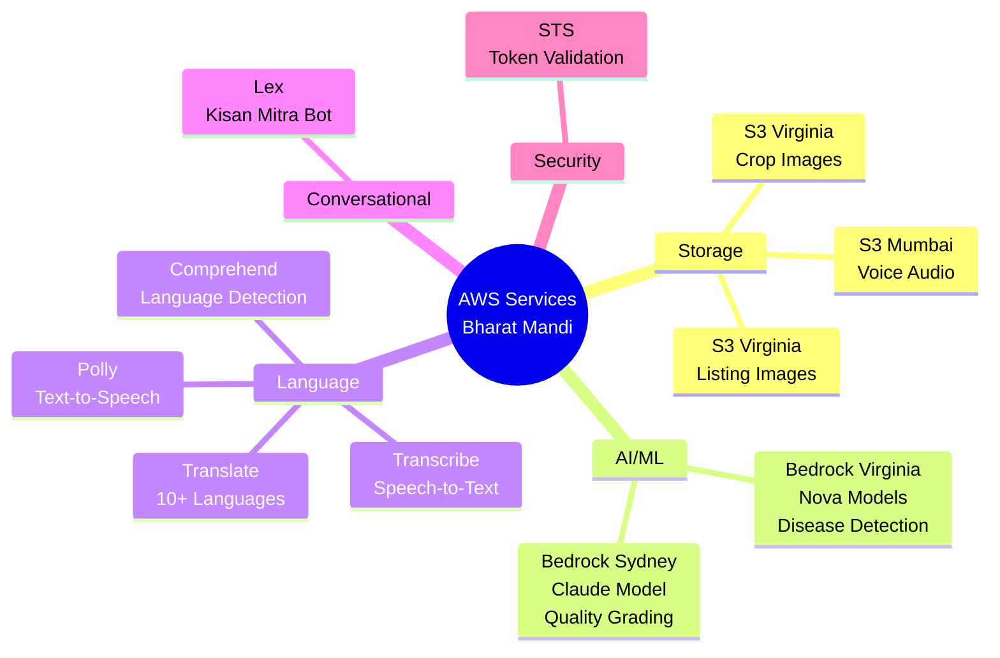
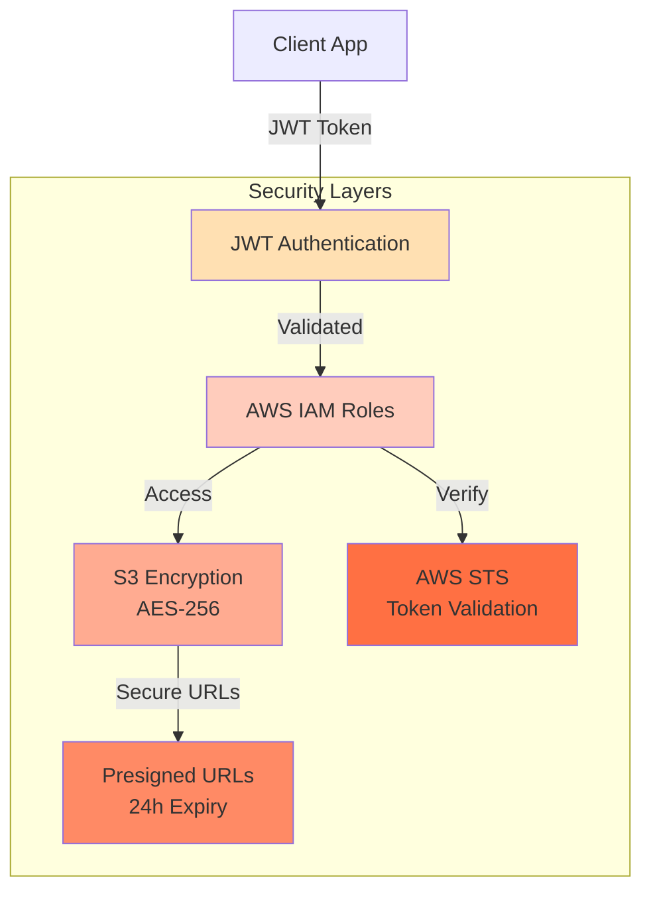
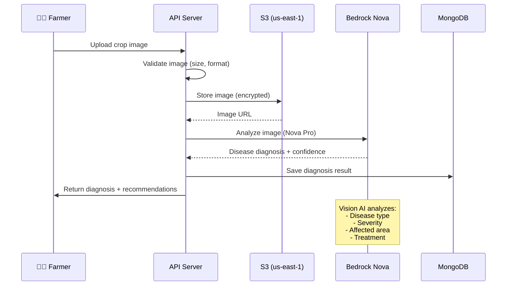
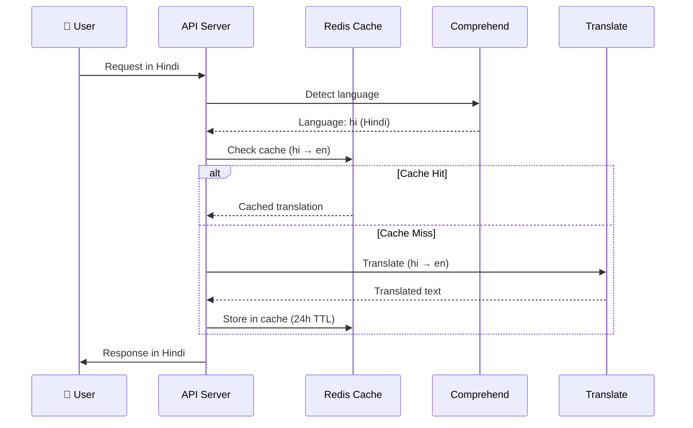

# Bharat Mandi - AWS Cloud Architecture

## Simplified AWS Architecture Diagram (Mermaid)

```mermaid
graph TB
    subgraph "Client Applications"
        Client[📱 Mobile & Web Apps]
    end

    subgraph "Application Server"
        API[🚪 Express.js API<br/>Node.js Backend]
    end

    subgraph "AWS Cloud - Multi-Region"
        
        subgraph "Region: ap-south-1 (Mumbai)"
            S3_Voice[☁️ S3 Bucket<br/>bharat-mandi-voice<br/>Audio Files]
        end

        subgraph "Region: us-east-1 (N. Virginia)"
            S3_Diagnosis[☁️ S3 Bucket<br/>crop-diagnosis<br/>Disease Images]
            S3_Listings[☁️ S3 Bucket<br/>listings-testing<br/>Marketplace Images]
            
            Bedrock_Nova[🤖 Amazon Bedrock<br/>Nova Pro/Lite/Micro<br/>Vision & Text AI]
            
            Translate[🌍 AWS Translate<br/>10+ Languages]
            Comprehend[📝 AWS Comprehend<br/>Language Detection]
            Polly[🔊 AWS Polly<br/>Text-to-Speech<br/>Aditi, Raveena]
            Transcribe[🎤 AWS Transcribe<br/>Speech-to-Text]
            Lex[💭 AWS Lex<br/>Kisan Mitra Bot]
        end

        subgraph "Region: ap-southeast-2 (Sydney)"
            Bedrock_Claude[🤖 Amazon Bedrock<br/>Claude Sonnet 4.6<br/>Advanced AI]
        end

        STS[🔑 AWS STS<br/>Security Tokens<br/>Global]
    end

    subgraph "Local Infrastructure"
        MongoDB[(🗄️ MongoDB<br/>Primary Database)]
        Redis[(⚡ Redis<br/>Translation Cache)]
        SQLite[(💾 SQLite<br/>Audio Cache)]
    end

    %% Client to API
    Client -->|HTTPS| API

    %% API to Local Data
    API --> MongoDB
    API --> Redis
    API --> SQLite

    %% API to AWS Services
    API -->|Crop Images| S3_Diagnosis
    API -->|Listing Images| S3_Listings
    API -->|Audio Files| S3_Voice
    
    API -->|Disease Analysis| Bedrock_Nova
    API -->|Quality Grading| Bedrock_Claude
    
    API -->|Translation| Translate
    API -->|Language Detect| Comprehend
    API -->|Voice Output| Polly
    API -->|Voice Input| Transcribe
    API -->|Chat Queries| Lex
    
    API -->|Auth Validation| STS

    %% Inter-service dependencies
    Lex -.->|Fulfillment| Bedrock_Nova
    Translate -.->|Cache| Redis
    Polly -.->|Cache| SQLite

    %% Styling
    classDef clientStyle fill:#E3F2FD,stroke:#1976D2,stroke-width:3px
    classDef apiStyle fill:#FFF3E0,stroke:#F57C00,stroke-width:3px
    classDef s3Style fill:#FF9800,stroke:#E65100,stroke-width:2px
    classDef aiStyle fill:#9C27B0,stroke:#4A148C,stroke-width:2px
    classDef langStyle fill:#4CAF50,stroke:#1B5E20,stroke-width:2px
    classDef dataStyle fill:#00BCD4,stroke:#006064,stroke-width:2px
    classDef secStyle fill:#F44336,stroke:#B71C1C,stroke-width:2px

    class Client clientStyle
    class API apiStyle
    class S3_Diagnosis,S3_Listings,S3_Voice s3Style
    class Bedrock_Nova,Bedrock_Claude aiStyle
    class Translate,Comprehend,Polly,Transcribe,Lex langStyle
    class MongoDB,Redis,SQLite dataStyle
    class STS secStyle
```



## AWS Service Integration Flow (Mermaid)

```mermaid
graph LR
    subgraph "Feature: Crop Diagnosis"
        F1[Farmer uploads<br/>crop image]
        F1 --> S3A[S3: Store Image]
        S3A --> BR1[Bedrock Nova Pro:<br/>Analyze Disease]
        BR1 --> DB1[MongoDB:<br/>Save Result]
    end

    subgraph "Feature: Quality Grading"
        F2[Buyer views<br/>produce]
        F2 --> S3B[S3: Get Image]
        S3B --> BR2[Bedrock Claude:<br/>Grade Quality]
        BR2 --> DB2[MongoDB:<br/>Save Grade]
    end

    subgraph "Feature: Kisan Mitra Assistant"
        F3[Farmer asks<br/>question]
        F3 --> TR[Transcribe:<br/>Voice to Text]
        TR --> LEX[Lex:<br/>Process Intent]
        LEX --> BR3[Bedrock:<br/>Generate Answer]
        BR3 --> TRANS[Translate:<br/>Local Language]
        TRANS --> POL[Polly:<br/>Text to Speech]
        POL --> F3
    end

    subgraph "Feature: Multi-Language"
        F4[User changes<br/>language]
        F4 --> COMP[Comprehend:<br/>Detect Language]
        COMP --> CACHE{Redis Cache?}
        CACHE -->|Hit| F4
        CACHE -->|Miss| TR2[Translate:<br/>Get Translation]
        TR2 --> CACHE
    end

    style F1 fill:#90EE90
    style F2 fill:#87CEEB
    style F3 fill:#FFD700
    style F4 fill:#FFA07A
```



## AWS Regional Distribution (PlantUML)

```plantuml
@startuml AWS Regional Architecture

!define AWSPuml https://raw.githubusercontent.com/awslabs/aws-icons-for-plantuml/v18.0/dist
!include AWSPuml/AWSCommon.puml
!include AWSPuml/Storage/SimpleStorageService.puml
!include AWSPuml/MachineLearning/Bedrock.puml
!include AWSPuml/MachineLearning/Translate.puml
!include AWSPuml/MachineLearning/Comprehend.puml
!include AWSPuml/MachineLearning/Polly.puml
!include AWSPuml/MachineLearning/Transcribe.puml
!include AWSPuml/MachineLearning/Lex.puml
!include AWSPuml/SecurityIdentityCompliance/SecurityTokenService.puml

skinparam linetype ortho

rectangle "Application Server" as App {
    [Express.js API\nNode.js Backend] as API
}

package "AWS Region: us-east-1 (N. Virginia)" #LightYellow {
    SimpleStorageService(S3_Diag, "S3", "crop-diagnosis")
    SimpleStorageService(S3_List, "S3", "listings-testing")
    Bedrock(Nova, "Bedrock", "Nova Pro/Lite/Micro")
    Translate(Trans, "Translate", "10+ Languages")
    Comprehend(Comp, "Comprehend", "NLP")
    Polly(Poll, "Polly", "TTS")
    Transcribe(Transc, "Transcribe", "STT")
    Lex(LexBot, "Lex", "Kisan Mitra")
}

package "AWS Region: ap-south-1 (Mumbai)" #LightBlue {
    SimpleStorageService(S3_Voice, "S3", "voice-audio")
}

package "AWS Region: ap-southeast-2 (Sydney)" #LightGreen {
    Bedrock(Claude, "Bedrock", "Claude Sonnet 4.6")
}

package "AWS Global" #LightGray {
    SecurityTokenService(STS, "STS", "Token Service")
}

' API to S3
API --> S3_Diag : Store/Retrieve\nDisease Images
API --> S3_List : Store/Retrieve\nListing Images
API --> S3_Voice : Store/Retrieve\nAudio Files

' API to AI Services
API --> Nova : Disease Analysis\nVision AI
API --> Claude : Quality Grading\nAdvanced AI

' API to Language Services
API --> Trans : Translate Text
API --> Comp : Detect Language
API --> Poll : Generate Speech
API --> Transc : Transcribe Audio
API --> LexBot : Process Queries

' API to Security
API --> STS : Validate Credentials

' Inter-service
LexBot ..> Nova : Fulfillment
Trans ..> Comp : Auto-detect

note right of Nova
  Models:
  - amazon.nova-pro-v1:0
  - amazon.nova-lite-v1:0
  - amazon.nova-micro-v1:0
end note

note right of Claude
  Model:
  - anthropic.claude-sonnet-4-20250514-v1:0
end note

note bottom of S3_Diag
  Encryption: AES-256
  Lifecycle: 90 days
end note

@enduml
```

## Simplified AWS Service Map



## Architecture Components

### Application Server (On-Premise/Cloud)
- **Technology**: Node.js + Express.js + TypeScript
- **Role**: Central API server orchestrating all AWS service calls
- **Local Data**: MongoDB (primary), Redis (cache), SQLite (audio cache)

### AWS Storage Layer

| Service | Region | Bucket Name | Purpose | Features |
|---------|--------|-------------|---------|----------|
| S3 | us-east-1 | crop-diagnosis | Disease images | AES-256, 90-day lifecycle |
| S3 | us-east-1 | listings-testing | Marketplace images | Presigned URLs (24h) |
| S3 | ap-south-1 | voice-ap-south-1 | Audio files | Low-latency for India |

### AWS AI/ML Layer

| Service | Region | Models/Features | Use Case |
|---------|--------|-----------------|----------|
| Bedrock | us-east-1 | Nova Pro/Lite/Micro | Crop disease diagnosis, vision analysis |
| Bedrock | ap-southeast-2 | Claude Sonnet 4.6 | Quality grading, advanced reasoning |
| Lex | us-east-1 | Kisan Mitra Bot | Conversational farming assistant |

### AWS Language Services Layer

| Service | Region | Capability | Use Case |
|---------|--------|------------|----------|
| Translate | us-east-1 | 10+ Indian languages | Real-time translation |
| Comprehend | us-east-1 | Language detection | Auto-detect user language |
| Polly | us-east-1 | Neural TTS (Aditi, Raveena) | Voice responses |
| Transcribe | us-east-1 | Indian language STT | Voice input processing |

### AWS Security Layer

| Service | Scope | Purpose |
|---------|-------|---------|
| STS | Global | Credential validation, account verification |

## Key Integration Patterns

### Pattern 1: Image Analysis Pipeline
```
Client → API → S3 (store) → Bedrock (analyze) → MongoDB (save) → Client
```

### Pattern 2: Voice Interaction Pipeline
```
Client → API → Transcribe (STT) → Lex (intent) → Bedrock (response) → Translate → Polly (TTS) → S3 (cache) → Client
```

### Pattern 3: Translation Pipeline
```
Client → API → Comprehend (detect) → Redis (check) → Translate → Redis (cache) → Client
```

### Pattern 4: Multi-Region AI Strategy
```
Disease Diagnosis → Bedrock us-east-1 (Nova - fast, cost-effective)
Quality Grading → Bedrock ap-southeast-2 (Claude - advanced reasoning)
```

## Regional Strategy

### Why Multi-Region?

1. **us-east-1 (N. Virginia)**: Primary region
   - Most AWS services available
   - Nova models exclusive to this region
   - Cost-effective for high-volume operations

2. **ap-south-1 (Mumbai)**: India-specific
   - Low latency for Indian users
   - Voice audio storage closer to users
   - Compliance with data residency

3. **ap-southeast-2 (Sydney)**: Advanced AI
   - Claude Sonnet 4.6 availability
   - High-quality reasoning for grading
   - Fallback for complex analysis

## Cost Optimization Features

1. **Caching Strategy**
   - Redis: Translation cache (24h TTL)
   - SQLite: Audio file cache (offline playback)
   - Reduces repeated AWS API calls

2. **Model Selection**
   - Nova Micro: Simple queries (lowest cost)
   - Nova Lite: Standard diagnosis (balanced)
   - Nova Pro: Complex analysis (high accuracy)
   - Claude: Premium grading only

3. **Storage Lifecycle**
   - S3 lifecycle policies (90-day retention)
   - Automatic cleanup of old images
   - Presigned URLs (24h expiry)

4. **Batch Processing**
   - Batch translation requests
   - Parallel image processing
   - Request deduplication

## Security Architecture



## Data Flow: Crop Diagnosis Example



## Data Flow: Multi-Language Translation



## AWS Service Summary

| Category | Services | Count | Purpose |
|----------|----------|-------|---------|
| **Storage** | S3 | 3 buckets | Images, audio files |
| **AI/ML** | Bedrock | 2 regions | Disease diagnosis, quality grading |
| **Language** | Translate, Comprehend, Polly, Transcribe | 4 services | Multi-language support, voice |
| **Conversational** | Lex | 1 bot | Kisan Mitra assistant |
| **Security** | STS | Global | Token validation |
| **Total** | - | **8 services** | Full-stack AI platform |

## Key Architectural Decisions

1. **Multi-Region Strategy**: Services distributed across 3 regions for performance and availability
2. **Hybrid Storage**: AWS S3 for media, local MongoDB for structured data
3. **Intelligent Caching**: Redis and SQLite reduce AWS costs and improve response times
4. **Model Diversity**: Multiple Bedrock models for different use cases and cost optimization
5. **Security First**: Encryption at rest (S3), in transit (HTTPS), token-based auth (JWT + STS)

## Export Instructions

To export these diagrams as PNG/JPG:

1. **Mermaid Diagrams**:
   - Copy any Mermaid code block
   - Use [Mermaid Live Editor](https://mermaid.live)
   - Paste and export as PNG/SVG
   - Or use VS Code extension: "Markdown Preview Mermaid Support"

2. **PlantUML Diagram**:
   - Copy the PlantUML code block
   - Use [PlantUML Online Editor](http://www.plantuml.com/plantuml/uml/)
   - Paste and export as PNG/SVG
   - Or use VS Code extension: "PlantUML"

See `docs/architecture/README.md` for detailed export instructions.
