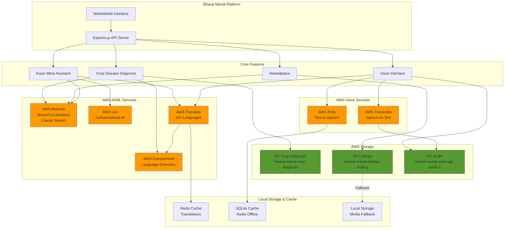
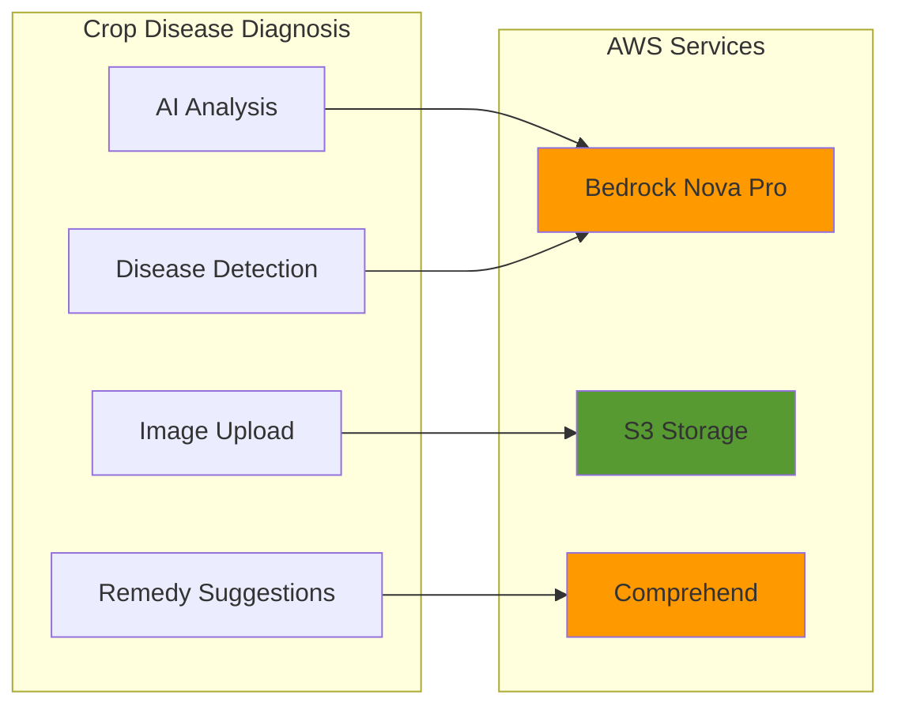
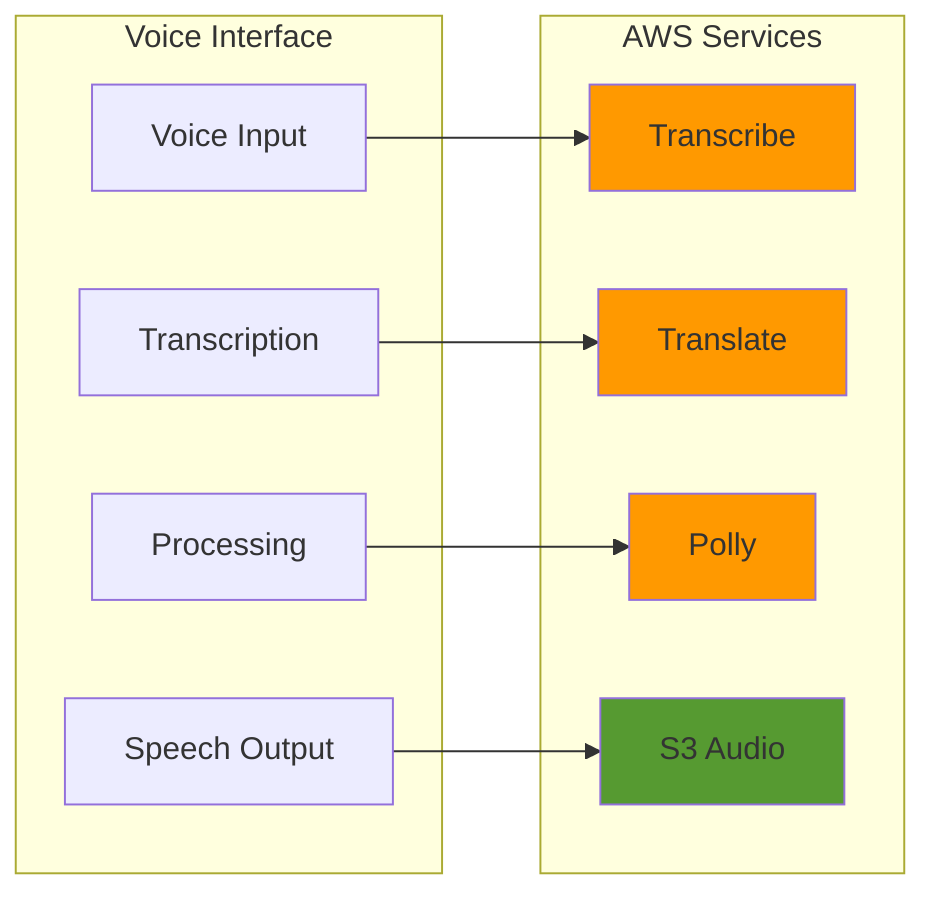
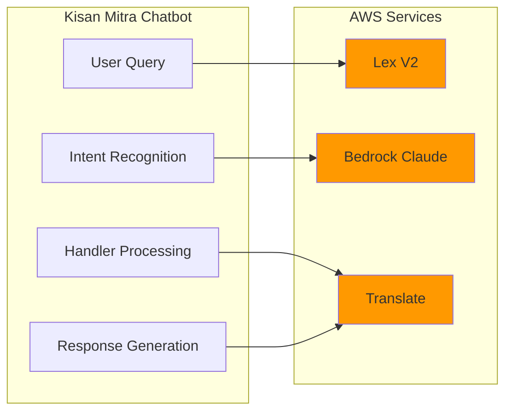
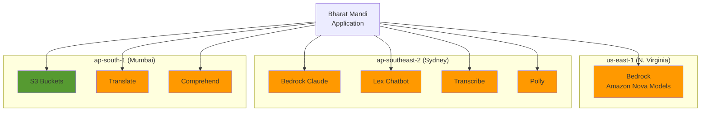
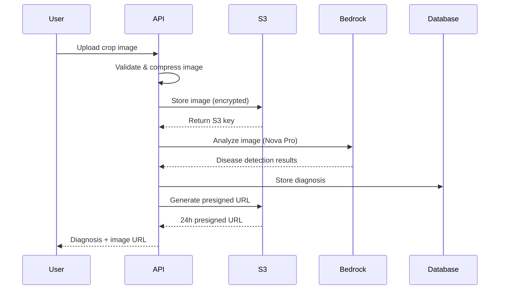
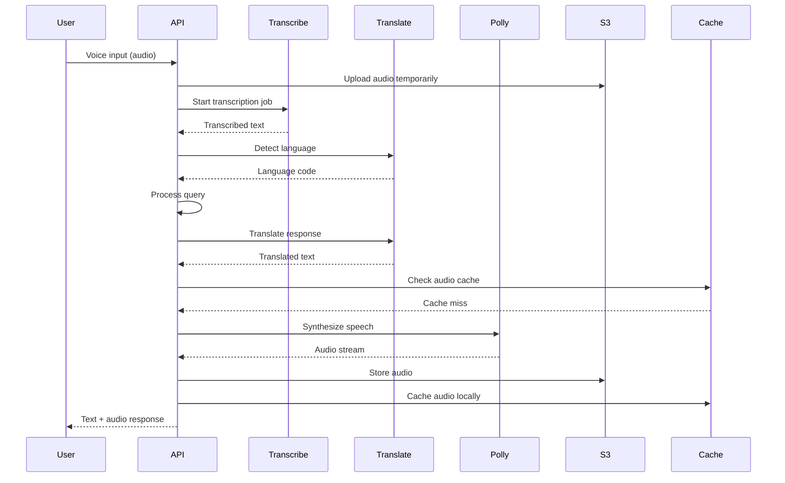
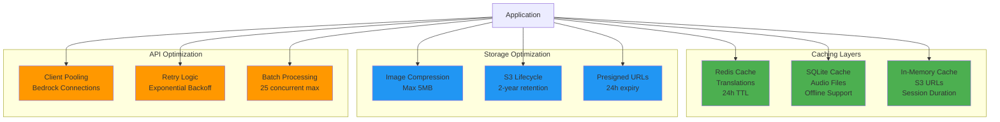

# Bharat Mandi - AWS Services Architecture

## High-Level Architecture Diagram



## Feature-to-Service Mapping







## Regional Distribution



## Data Flow - Crop Disease Diagnosis



## Data Flow - Voice Interface



## Cost Optimization Strategy



---

## How to Export These Diagrams

### Method 1: Using Mermaid Live Editor
1. Visit https://mermaid.live/
2. Copy any diagram code from above
3. Paste into the editor
4. Click "Download PNG" or "Download SVG"

### Method 2: Using VS Code Extension
1. Install "Markdown Preview Mermaid Support" extension
2. Open this file in VS Code
3. Right-click on diagram → "Export to PNG"

### Method 3: Using CLI Tools
```bash
# Install mermaid-cli
npm install -g @mermaid-js/mermaid-cli

# Convert to PNG
mmdc -i aws-services-overview.md -o architecture-diagram.png

# Convert to SVG
mmdc -i aws-services-overview.md -o architecture-diagram.svg
```

### Method 4: Using Online Tools
- **Mermaid Chart**: https://www.mermaidchart.com/
- **Kroki**: https://kroki.io/
- **Draw.io**: Import Mermaid diagrams

---

## Diagram Legend

- 🟠 Orange boxes: AWS AI/ML Services
- 🟢 Green boxes: AWS Storage Services
- 🔵 Blue boxes: Optimization Strategies
- 🟡 Yellow boxes: API Optimizations
