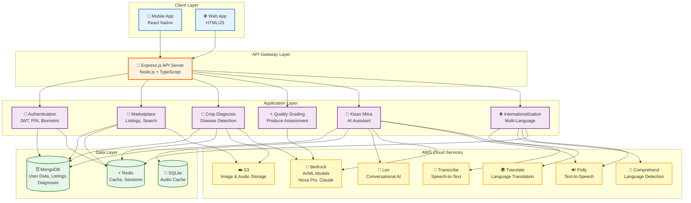
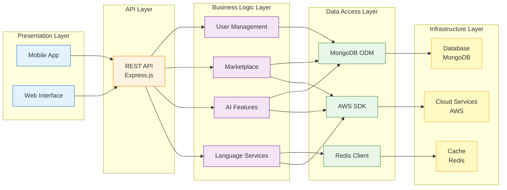

# Bharat Mandi - High-Level Architecture

## Simplified Architecture Diagram (Mermaid)



## Layered Architecture Diagram (Mermaid)



## Component Architecture (PlantUML)

```plantuml
@startuml Bharat Mandi Architecture

!define AWSPuml https://raw.githubusercontent.com/awslabs/aws-icons-for-plantuml/v18.0/dist
!include AWSPuml/AWSCommon.puml
!include AWSPuml/Storage/SimpleStorageService.puml
!include AWSPuml/MachineLearning/Bedrock.puml
!include AWSPuml/MachineLearning/Translate.puml
!include AWSPuml/MachineLearning/Comprehend.puml
!include AWSPuml/MachineLearning/Polly.puml
!include AWSPuml/MachineLearning/Transcribe.puml
!include AWSPuml/MachineLearning/Lex.puml
!include AWSPuml/Database/DocumentDB.puml
!include AWSPuml/Database/ElastiCache.puml

skinparam rectangle {
    BackgroundColor<<client>> LightBlue
    BackgroundColor<<api>> Orange
    BackgroundColor<<app>> Plum
    BackgroundColor<<data>> LightGreen
}

rectangle "Client Layer" <<client>> {
    [Mobile App\nReact Native] as Mobile
    [Web Interface\nHTML/JS] as Web
}

rectangle "API Gateway" <<api>> {
    [Express.js\nREST API] as API
}

rectangle "Application Services" <<app>> {
    [Authentication\nJWT, PIN, Bio] as Auth
    [Marketplace\nListings, Search] as Market
    [Crop Diagnosis\nDisease Detection] as Diagnosis
    [Quality Grading\nProduce Assessment] as Grading
    [Kisan Mitra\nAI Assistant] as Assistant
    [i18n Services\nMulti-Language] as I18n
}

rectangle "Data Layer" <<data>> {
    DocumentDB(MongoDB, "MongoDB", "User Data\nListings\nDiagnoses")
    ElastiCache(Redis, "Redis", "Cache\nSessions")
    database "SQLite" as SQLite {
        [Audio Cache]
    }
}

cloud "AWS Services" {
    SimpleStorageService(S3, "S3", "Media Storage")
    Bedrock(BedrockSvc, "Bedrock", "AI/ML Models")
    Translate(TranslateSvc, "Translate", "Translation")
    Comprehend(ComprehendSvc, "Comprehend", "NLP")
    Polly(PollySvc, "Polly", "TTS")
    Transcribe(TranscribeSvc, "Transcribe", "STT")
    Lex(LexSvc, "Lex", "Chatbot")
}

' Client to API
Mobile --> API
Web --> API

' API to Application
API --> Auth
API --> Market
API --> Diagnosis
API --> Grading
API --> Assistant
API --> I18n

' Application to Data
Auth --> MongoDB
Auth --> Redis
Market --> MongoDB
Market --> Redis
Diagnosis --> MongoDB
Diagnosis --> Redis
Assistant --> MongoDB
Assistant --> SQLite

' Application to AWS
Market --> S3
Diagnosis --> S3
Diagnosis --> BedrockSvc
Grading --> BedrockSvc
Assistant --> LexSvc
Assistant --> BedrockSvc
Assistant --> PollySvc
Assistant --> TranscribeSvc
I18n --> TranslateSvc
I18n --> ComprehendSvc
I18n --> PollySvc
I18n --> Redis

@enduml
```

## Architecture Overview

### 1. Client Layer
- **Mobile App**: React Native application for farmers and buyers
- **Web Interface**: Browser-based interface for desktop access

### 2. API Gateway Layer
- **Express.js REST API**: Central API server handling all client requests
- **Technology**: Node.js + TypeScript
- **Features**: Request routing, authentication, error handling

### 3. Application Layer

#### Core Services
- **Authentication**: JWT tokens, PIN login, biometric authentication, OTP verification
- **Marketplace**: Listing management, search, filtering, media handling
- **Crop Diagnosis**: AI-powered disease detection from images
- **Quality Grading**: Automated produce quality assessment
- **Kisan Mitra**: Conversational AI assistant for farming queries
- **i18n Services**: Multi-language support (10+ Indian languages)

### 4. Data Layer

#### Databases
- **MongoDB**: Primary database for users, listings, diagnoses, transactions
- **Redis**: Caching layer for translations, sessions, API responses
- **SQLite**: Local audio file caching for offline playback

### 5. AWS Cloud Services

#### Storage
- **S3**: Image and audio file storage with encryption

#### AI/ML Services
- **Bedrock**: Foundation models (Nova Pro, Claude) for vision and text analysis
- **Lex**: Conversational AI for Kisan Mitra chatbot
- **Translate**: Real-time language translation
- **Comprehend**: Language detection and NLP
- **Polly**: Text-to-speech for audio responses
- **Transcribe**: Speech-to-text for voice input

## Data Flow Patterns

### Pattern 1: Crop Diagnosis Flow
```
Farmer → Mobile App → API → Diagnosis Service → S3 (store image) → Bedrock (analyze) → MongoDB (save result) → Response
```

### Pattern 2: Marketplace Listing Flow
```
Farmer → Mobile App → API → Marketplace Service → MongoDB (save listing) → S3 (store images) → Response
```

### Pattern 3: Multi-Language Flow
```
User → App → API → i18n Service → Redis (check cache) → AWS Translate → Redis (cache) → Response
```

### Pattern 4: Kisan Mitra Conversation Flow
```
Farmer → Voice Input → API → Transcribe (STT) → Lex/Bedrock (process) → Translate (if needed) → Polly (TTS) → Response
```

## Key Architectural Principles

1. **Layered Architecture**: Clear separation between presentation, API, business logic, and data layers
2. **Microservices Pattern**: Feature-based service organization (crop-diagnosis, marketplace, i18n)
3. **Caching Strategy**: Redis for translations and API responses, SQLite for audio files
4. **Cloud-Native**: Leverages AWS managed services for AI/ML capabilities
5. **Multi-Region**: Services distributed across regions for optimal performance
6. **Security**: JWT authentication, encrypted storage, secure API endpoints

## Technology Stack Summary

| Layer | Technologies |
|-------|-------------|
| **Frontend** | React Native (Mobile), HTML/JS (Web) |
| **Backend** | Node.js, Express.js, TypeScript |
| **Database** | MongoDB (primary), Redis (cache), SQLite (audio) |
| **AI/ML** | AWS Bedrock, Lex, Translate, Comprehend, Polly, Transcribe |
| **Storage** | AWS S3 |
| **Authentication** | JWT, OTP, PIN, Biometric |

## Export Instructions

To export these diagrams as PNG/JPG:

1. **Mermaid Diagrams**:
   - Use [Mermaid Live Editor](https://mermaid.live)
   - Copy the code block and paste
   - Export as PNG/SVG
   - Or use VS Code extension: "Markdown Preview Mermaid Support"

2. **PlantUML Diagram**:
   - Use [PlantUML Online Editor](http://www.plantuml.com/plantuml/uml/)
   - Copy the code block and paste
   - Export as PNG/SVG
   - Or use VS Code extension: "PlantUML"

See `docs/architecture/README.md` for detailed export instructions and CLI options.
