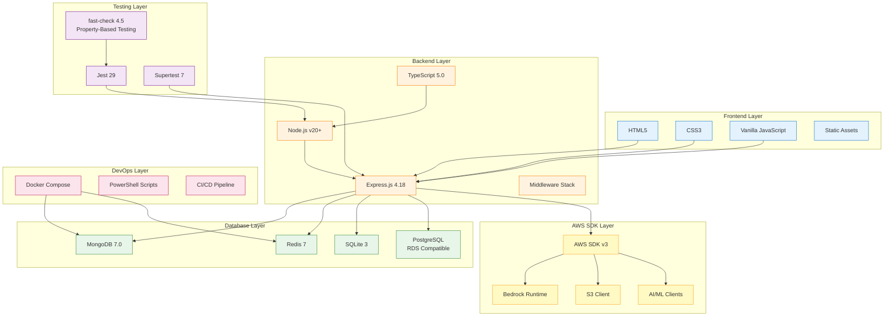
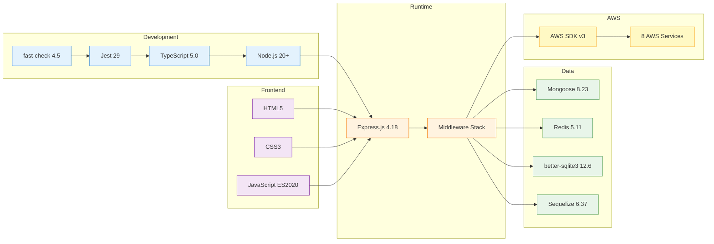

# Bharat Mandi - Technology Stack

## Complete Technology Stack Overview



## 1. Frontend Technologies

### Web Interface
| Technology | Version | Purpose |
|------------|---------|---------|
| HTML5 | - | Page structure and semantic markup |
| CSS3 | - | Styling and responsive design |
| Vanilla JavaScript | ES2020 | Client-side interactivity |
| Static Assets | - | Images, icons, fonts |

### Frontend Features
- Responsive design for mobile and desktop
- Component-based architecture (modular JS)
- Shared styles across pages
- Voice integration UI
- Real-time language switching

### Key Pages
- Marketplace (listing, browsing, search)
- Crop Diagnosis (image upload, results)
- Kisan Mitra (chat interface)
- User Profile (registration, authentication)
- Transactions (order management)

## 2. Backend Technologies

### Core Runtime
| Technology | Version | Purpose |
|------------|---------|---------|
| Node.js | 20+ | JavaScript runtime environment |
| TypeScript | 5.0 | Type-safe development |
| Express.js | 4.18.2 | Web application framework |
| ts-node-dev | 2.0.0 | Development server with hot reload |

### TypeScript Configuration
- Target: ES2020
- Module: CommonJS
- Strict mode enabled
- Source maps for debugging
- Declaration files generated

### Backend Architecture
- RESTful API design
- Feature-based module organization
- Middleware pipeline (auth, validation, error handling)
- Service layer pattern
- Controller-Service-Repository pattern

## 3. Database Technologies

### Primary Databases
| Database | Version | Purpose | Connection |
|----------|---------|---------|------------|
| MongoDB | 7.0 | Primary data store (users, listings, diagnoses) | Mongoose ODM 8.23 |
| Redis | 7 (Alpine) | Caching layer (translations, sessions) | redis 5.11 |
| SQLite | 3 | Audio file cache (offline playback) | better-sqlite3 12.6 |
| PostgreSQL | - | RDS-compatible (optional) | pg 8.18, Sequelize 6.37 |

### Database Features
- MongoDB: Document-based, flexible schema, aggregation pipelines
- Redis: In-memory cache, 24h TTL for translations
- SQLite: Embedded database, no network overhead
- PostgreSQL: Relational data support (migrations ready)

### ORM/ODM Libraries
- Mongoose: MongoDB object modeling
- Sequelize: SQL ORM with migration support
- better-sqlite3: Synchronous SQLite API

## 4. AWS Services & SDKs

### AWS SDK v3 (Modular)
| Package | Version | Service | Purpose |
|---------|---------|---------|---------|
| @aws-sdk/client-bedrock-runtime | 3.1003.0 | Bedrock | AI/ML model inference |
| @aws-sdk/client-s3 | 3.1000.0 | S3 | Object storage |
| @aws-sdk/s3-request-presigner | 3.1003.0 | S3 | Presigned URLs |
| @aws-sdk/client-translate | 3.998.0 | Translate | Language translation |
| @aws-sdk/client-comprehend | 3.998.0 | Comprehend | NLP, language detection |
| @aws-sdk/client-polly | 3.1000.0 | Polly | Text-to-speech |
| @aws-sdk/client-transcribe | 3.1000.0 | Transcribe | Speech-to-text |
| @aws-sdk/client-lex-runtime-v2 | 3.1000.0 | Lex | Conversational AI |
| @aws-sdk/client-sts | 3.998.0 | STS | Security tokens |
| @aws-sdk/client-iam | 3.998.0 | IAM | Identity management |

### AWS SDK Features
- Modular imports (tree-shaking for smaller bundles)
- Automatic retry logic with exponential backoff
- Credential management via environment variables
- Regional endpoint configuration
- Request/response logging

## 5. Core Libraries & Utilities

### Authentication & Security
| Library | Version | Purpose |
|---------|---------|---------|
| jsonwebtoken | 9.0.3 | JWT token generation and validation |
| bcrypt | 6.0.0 | Password hashing (PIN encryption) |
| cors | 2.8.6 | Cross-origin resource sharing |

### File Processing
| Library | Version | Purpose |
|---------|---------|---------|
| multer | 2.0.2 | Multipart form data (file uploads) |
| sharp | 0.34.5 | Image processing (resize, compress, thumbnails) |
| form-data | 4.0.5 | Form data construction |

### Internationalization
| Library | Version | Purpose |
|---------|---------|---------|
| i18next | 25.8.13 | Core i18n framework |
| i18next-http-middleware | 3.9.2 | Express middleware |
| i18next-fs-backend | 2.6.1 | File system backend |
| i18next-http-backend | 3.0.2 | HTTP backend |
| i18next-browser-languagedetector | 8.2.1 | Browser language detection |

### Utilities
| Library | Version | Purpose |
|---------|---------|---------|
| uuid | 9.0.0 | Unique identifier generation |
| libphonenumber-js | 1.12.38 | Phone number validation |
| axios | 1.13.5 | HTTP client |
| node-fetch | 2.7.0 | Fetch API for Node.js |
| dotenv | 16.6.1 | Environment variable management |

## 6. Testing Technologies

### Testing Framework
| Tool | Version | Purpose |
|------|---------|---------|
| Jest | 29.5.0 | Test runner and assertion library |
| ts-jest | 29.1.0 | TypeScript preprocessor for Jest |
| fast-check | 4.5.3 | Property-based testing library |
| Supertest | 7.2.2 | HTTP assertion library |

### Test Types Supported
- Unit tests (`.test.ts`)
- Integration tests (`.integration.test.ts`)
- Property-based tests (`.pbt.test.ts`)
- Database tests (`.db.test.ts`)
- AWS integration tests (`.aws.test.ts`)
- End-to-end tests (`.e2e.test.ts`)

### Testing Features
- Code coverage reporting
- Watch mode for development
- Parallel test execution
- Mock support for AWS services
- Database test isolation

### Test Scripts
```bash
npm run test              # Run all tests
npm run test:unit         # Unit tests only
npm run test:pbt          # Property-based tests
npm run test:integration  # Integration tests
npm run test:e2e          # End-to-end tests
npm run test:coverage     # Generate coverage report
```

## 7. DevOps & Infrastructure

### Containerization
| Tool | Version | Purpose |
|------|---------|---------|
| Docker | - | Container runtime |
| Docker Compose | 3.8 | Multi-container orchestration |

### Container Services
- MongoDB 7.0 (primary database)
- Redis 7 Alpine (caching layer)

### Deployment
- EC2 deployment scripts (bash, PowerShell)
- Environment-based configuration (.env files)
- Health check endpoints
- Automated setup scripts

### Scripts & Automation
- PowerShell scripts for Windows
- Bash scripts for Linux/Mac
- Database migration scripts
- S3 bucket setup automation
- Test data seeding

## 8. Development Tools

### TypeScript Tooling
| Tool | Version | Purpose |
|------|---------|---------|
| TypeScript | 5.0.0 | Type checking and compilation |
| ts-node | 10.9.2 | TypeScript execution |
| ts-node-dev | 2.0.0 | Development server with hot reload |

### Type Definitions
- @types/node (20.0.0)
- @types/express (4.17.17)
- @types/jest (29.5.0)
- @types/bcrypt (6.0.0)
- @types/jsonwebtoken (9.0.10)
- @types/multer (2.0.0)
- @types/uuid (9.0.0)
- And more...

## Technology Stack Diagram



## Complete Stack Summary

### Frontend Stack
```
HTML5 + CSS3 + Vanilla JavaScript (ES2020)
├── Responsive Design
├── Component-based Architecture
├── Voice Integration UI
└── Real-time Language Switching
```

### Backend Stack
```
Node.js 20+ + TypeScript 5.0 + Express.js 4.18
├── RESTful API
├── JWT Authentication
├── Middleware Pipeline
├── Service Layer Pattern
└── Feature-based Modules
```

### Database Stack
```
MongoDB 7.0 (Primary) + Redis 7 (Cache) + SQLite 3 (Audio)
├── Mongoose ODM
├── Redis Client
├── better-sqlite3
└── Sequelize (PostgreSQL support)
```

### AWS Stack
```
AWS SDK v3 (10 packages)
├── Bedrock (Nova + Claude)
├── S3 (3 buckets)
├── Translate + Comprehend
├── Polly + Transcribe
├── Lex
└── STS + IAM
```

### Testing Stack
```
Jest 29 + fast-check 4.5 + Supertest 7
├── Unit Tests
├── Integration Tests
├── Property-Based Tests
├── E2E Tests
└── Coverage Reports
```

### DevOps Stack
```
Docker Compose 3.8 + Scripts
├── MongoDB Container
├── Redis Container
├── PowerShell Automation
├── Bash Deployment
└── Environment Management
```

## Detailed Technology Breakdown

### 1. Programming Languages
- **TypeScript**: 100% backend code (strict mode)
- **JavaScript**: Frontend (ES2020 features)
- **SQL**: Database queries and migrations
- **PowerShell**: Windows automation scripts
- **Bash**: Linux/Mac deployment scripts

### 2. Frameworks & Libraries

#### Web Framework
- **Express.js 4.18.2**: Minimal, flexible Node.js web framework
- **Middleware**: CORS, body-parser, authentication, error handling
- **Routing**: Feature-based route organization

#### Data Access
- **Mongoose 8.23.0**: MongoDB ODM with schema validation
- **Sequelize 6.37.7**: SQL ORM with migration support
- **Redis 5.11.0**: In-memory data structure store
- **better-sqlite3 12.6.2**: Synchronous SQLite3 bindings

#### File Processing
- **Multer 2.0.2**: Multipart/form-data handling
- **Sharp 0.34.5**: High-performance image processing
  - Resize images
  - Generate thumbnails
  - Compress images (5MB max)
  - Format conversion (JPEG, PNG, WebP)

#### Security
- **jsonwebtoken 9.0.3**: JWT creation and verification
- **bcrypt 6.0.0**: Password hashing (10 rounds)
- **libphonenumber-js 1.12.38**: Phone number validation

#### Internationalization
- **i18next 25.8.13**: Full i18n framework
- **10+ Indian Languages**: Hindi, Punjabi, Marathi, Tamil, Telugu, Bengali, Gujarati, Kannada, Malayalam, Odia
- **Caching**: Redis-backed translation cache

### 3. AWS Services Integration

#### AI/ML Services
```typescript
// Bedrock Models
- amazon.nova-pro-v1:0      // Vision AI (disease diagnosis)
- amazon.nova-lite-v1:0     // Lightweight AI
- amazon.nova-micro-v1:0    // Fast, cost-effective
- anthropic.claude-sonnet-4-20250514-v1:0  // Advanced reasoning
```

#### Storage Services
```typescript
// S3 Buckets
- bharat-mandi-crop-diagnosis    // Disease images (us-east-1)
- bharat-mandi-listings-testing  // Marketplace images (us-east-1)
- bharat-mandi-voice-ap-south-1  // Audio files (ap-south-1)
```

#### Language Services
- AWS Translate: 10+ language pairs
- AWS Comprehend: Language detection, sentiment analysis
- AWS Polly: Neural TTS (Aditi, Raveena voices)
- AWS Transcribe: STT with Indian language support

#### Conversational AI
- AWS Lex: Kisan Mitra chatbot with intents (GetCropPrice, GetWeather, GetFarmingAdvice)

### 4. Testing Infrastructure

#### Test Framework
- **Jest 29.5.0**: Test runner with TypeScript support
- **ts-jest 29.1.0**: TypeScript preprocessor
- **Supertest 7.2.2**: HTTP endpoint testing

#### Property-Based Testing
- **fast-check 4.5.3**: Generative testing library
- Used for: Input validation, business logic, edge cases
- Generates thousands of test cases automatically

#### Test Coverage
- Line coverage
- Branch coverage
- Function coverage
- Statement coverage
- HTML reports generated in `docs/testing/coverage/`

### 5. Development Environment

#### Package Management
- **npm**: Node package manager
- **package.json**: Dependency management
- **package-lock.json**: Locked versions

#### Environment Configuration
- **.env**: Local development
- **.env.example**: Template
- **.env.production**: Production settings
- **.env.rds-test**: RDS testing

#### Development Scripts
```json
{
  "dev": "Hot reload development server",
  "build": "TypeScript compilation",
  "start": "Production server",
  "test": "Run all tests",
  "migrate": "Database migrations",
  "mongodb:setup": "MongoDB initialization",
  "seed:farming-tips": "Seed farming data"
}
```

### 6. DevOps & Deployment

#### Containerization
```yaml
# docker-compose.yml
services:
  - mongodb:7.0 (port 27017)
  - redis:7-alpine (port 6379)
```

#### Deployment Targets
- Local development (Docker)
- AWS EC2 (production)
- RDS (optional database)

#### Automation Scripts
- S3 bucket setup (PowerShell)
- Database migrations (TypeScript)
- Test data generation (Python, PowerShell)
- Deployment automation (bash, PowerShell)

## 7. Code Quality & Standards

### TypeScript Configuration
- Strict type checking enabled
- ES2020 target
- CommonJS modules
- Source maps for debugging
- Declaration files for type safety

### Code Organization
```
src/
├── features/           # Feature modules
│   ├── crop-diagnosis/
│   ├── marketplace/
│   ├── i18n/
│   ├── profile/
│   └── ...
├── shared/            # Shared utilities
│   ├── database/
│   ├── middleware/
│   └── utils/
└── index.ts           # Application entry point
```

### Testing Standards
- Unit test coverage > 80%
- Integration tests for critical paths
- Property-based tests for business logic
- E2E tests for user workflows

## 8. Third-Party Integrations

### HTTP & Networking
- **axios 1.13.5**: Promise-based HTTP client
- **node-fetch 2.7.0**: Fetch API implementation
- **cors 2.8.6**: CORS middleware

### Utilities
- **uuid 9.0.0**: RFC4122 UUID generation
- **dotenv 16.6.1**: Environment variable loader
- **form-data 4.0.5**: Multipart form data

## Version Compatibility Matrix

| Component | Minimum Version | Recommended | Notes |
|-----------|----------------|-------------|-------|
| Node.js | 18.x | 20.x | LTS version |
| npm | 9.x | 10.x | Comes with Node.js |
| MongoDB | 6.0 | 7.0 | Docker image |
| Redis | 6.0 | 7.0 | Alpine image |
| TypeScript | 5.0 | 5.0+ | Strict mode |
| Docker | 20.x | 24.x | For local dev |
| AWS CLI | 2.x | 2.x | For deployment |

## Performance Optimizations

### Caching Strategy
1. **Redis Cache**
   - Translation cache (24h TTL)
   - Session storage
   - API response cache

2. **SQLite Cache**
   - Audio file cache
   - Offline playback support
   - No network overhead

3. **Application Cache**
   - In-memory caching for frequently accessed data
   - Request deduplication

### Image Optimization
- Sharp library for fast processing
- Automatic compression (5MB max)
- Thumbnail generation
- Format conversion (WebP support)

### Database Optimization
- MongoDB indexes on frequently queried fields
- Redis TTL for automatic cleanup
- Connection pooling
- Query optimization

## Security Features

### Authentication
- JWT tokens (24h expiry)
- Refresh tokens (7-day expiry)
- PIN authentication (bcrypt hashed)
- Biometric authentication support
- OTP verification

### Data Security
- S3 encryption at rest (AES-256)
- HTTPS for data in transit
- Presigned URLs (24h expiry)
- Environment variable secrets
- IAM role-based access

### API Security
- CORS configuration
- Rate limiting
- Input validation
- SQL injection prevention
- XSS protection

## Development Workflow

### Local Development
```bash
# 1. Install dependencies
npm install

# 2. Setup environment
cp .env.example .env

# 3. Start databases
docker-compose up -d

# 4. Run migrations
npm run mongodb:setup

# 5. Start dev server
npm run dev
```

### Testing Workflow
```bash
# Run tests during development
npm run test:watch

# Run specific test types
npm run test:unit
npm run test:pbt
npm run test:integration

# Generate coverage
npm run test:coverage
```

### Deployment Workflow
```bash
# 1. Build application
npm run build

# 2. Run tests
npm run test:ci

# 3. Deploy to EC2
npm run deploy
```

## Technology Selection Rationale

### Why TypeScript?
- Type safety reduces runtime errors
- Better IDE support and autocomplete
- Easier refactoring and maintenance
- Self-documenting code

### Why Express.js?
- Minimal and flexible
- Large ecosystem of middleware
- Well-documented and mature
- Easy to test and deploy

### Why MongoDB?
- Flexible schema for evolving requirements
- JSON-like documents match JavaScript objects
- Powerful aggregation framework
- Horizontal scaling support

### Why AWS Services?
- Managed AI/ML services (no model training needed)
- Pay-per-use pricing
- Global infrastructure
- Enterprise-grade security

### Why Property-Based Testing?
- Finds edge cases automatically
- Tests business logic thoroughly
- Generates thousands of test cases
- Validates correctness properties

## Future Technology Considerations

### Potential Additions
- GraphQL API (alternative to REST)
- React Native (mobile app)
- WebSocket (real-time updates)
- Elasticsearch (advanced search)
- CloudFront (CDN for static assets)
- Lambda (serverless functions)

### Scalability Options
- Kubernetes for container orchestration
- Load balancer (ALB/NLB)
- Auto-scaling groups
- Multi-region deployment
- Database sharding

## Technology Stack Summary Table

| Layer | Technologies | Count |
|-------|-------------|-------|
| **Languages** | TypeScript, JavaScript, SQL, PowerShell, Bash | 5 |
| **Frontend** | HTML5, CSS3, Vanilla JS | 3 |
| **Backend** | Node.js, Express.js, TypeScript | 3 |
| **Databases** | MongoDB, Redis, SQLite, PostgreSQL | 4 |
| **AWS Services** | Bedrock, S3, Translate, Comprehend, Polly, Transcribe, Lex, STS | 8 |
| **Testing** | Jest, fast-check, Supertest | 3 |
| **DevOps** | Docker, Docker Compose, Scripts | 3 |
| **Libraries** | 30+ npm packages | 30+ |
| **Total** | - | **50+ technologies** |
