# Bharat Mandi - Use Case Diagram

## Simplified Use Case Diagram (Mermaid)

```mermaid
graph TB
    subgraph Actors
        Farmer[👨‍🌾 Farmer]
        Buyer[🛒 Buyer]
        Expert[👨‍🔬 Agricultural Expert]
        System[🤖 AI System]
    end

    subgraph "Bharat Mandi Platform"
        subgraph "User Management"
            UC1[Register/Login]
            UC2[Manage Profile]
            UC3[Setup Authentication<br/>PIN/Biometric]
        end

        subgraph "Marketplace"
            UC4[Create Listing]
            UC5[Browse Listings]
            UC6[Search & Filter]
            UC7[View Listing Details]
            UC8[Mark as Sold]
            UC9[Manage Media]
        end

        subgraph "AI-Powered Features"
            UC10[Diagnose Crop Disease<br/>📸 Image Analysis]
            UC11[Grade Produce Quality<br/>🎯 AI Grading]
            UC12[Chat with Kisan Mitra<br/>💬 AI Assistant]
            UC13[Voice Interaction<br/>🎤 Speech-to-Text]
        end

        subgraph "Language & Accessibility"
            UC14[Multi-Language Support<br/>🌐 10+ Languages]
            UC15[Text-to-Speech<br/>🔊 Audio Output]
            UC16[Auto Language Detection]
        end

        subgraph "Notifications & Support"
            UC17[Receive Notifications]
            UC18[View Diagnosis History]
            UC19[Expert Escalation]
        end
    end

    %% Farmer interactions
    Farmer --> UC1
    Farmer --> UC2
    Farmer --> UC3
    Farmer --> UC4
    Farmer --> UC5
    Farmer --> UC6
    Farmer --> UC7
    Farmer --> UC8
    Farmer --> UC9
    Farmer --> UC10
    Farmer --> UC12
    Farmer --> UC13
    Farmer --> UC14
    Farmer --> UC15
    Farmer --> UC17
    Farmer --> UC18

    %% Buyer interactions
    Buyer --> UC1
    Buyer --> UC2
    Buyer --> UC3
    Buyer --> UC5
    Buyer --> UC6
    Buyer --> UC7
    Buyer --> UC11
    Buyer --> UC14
    Buyer --> UC17

    %% Expert interactions
    Expert --> UC19
    Expert --> UC18

    %% AI System interactions
    System -.-> UC10
    System -.-> UC11
    System -.-> UC12
    System -.-> UC14
    System -.-> UC15
    System -.-> UC16

    %% Styling
    classDef farmerClass fill:#90EE90,stroke:#2E7D32,stroke-width:2px
    classDef buyerClass fill:#87CEEB,stroke:#1565C0,stroke-width:2px
    classDef expertClass fill:#FFD700,stroke:#F57C00,stroke-width:2px
    classDef aiClass fill:#FF69B4,stroke:#C2185B,stroke-width:2px
    classDef ucClass fill:#E8EAF6,stroke:#3F51B5,stroke-width:1px

    class Farmer farmerClass
    class Buyer buyerClass
    class Expert expertClass
    class System aiClass
    class UC1,UC2,UC3,UC4,UC5,UC6,UC7,UC8,UC9,UC10,UC11,UC12,UC13,UC14,UC15,UC16,UC17,UC18,UC19 ucClass
```



## PlantUML Use Case Diagram

```plantuml
@startuml Bharat Mandi Use Cases

!define ICONURL https://raw.githubusercontent.com/tupadr3/plantuml-icon-font-sprites/v3.0.0/icons
!include ICONURL/common.puml
!include ICONURL/font-awesome-5/user_tie.puml
!include ICONURL/font-awesome-5/user.puml
!include ICONURL/font-awesome-5/robot.puml

left to right direction
skinparam packageStyle rectangle
skinparam actorStyle awesome

actor "Farmer" as Farmer <<user>>
actor "Buyer" as Buyer <<user>>
actor "Agricultural\nExpert" as Expert <<user>>
actor "AI System" as AI <<system>>

rectangle "Bharat Mandi Platform" {
  
  package "User Management" {
    usecase "Register/Login\n(OTP, PIN, Biometric)" as UC1
    usecase "Manage Profile" as UC2
    usecase "Setup Authentication" as UC3
  }

  package "Marketplace" {
    usecase "Create Listing" as UC4
    usecase "Browse Listings" as UC5
    usecase "Search & Filter" as UC6
    usecase "View Details" as UC7
    usecase "Mark as Sold" as UC8
    usecase "Manage Media\n(Upload/Delete/Reorder)" as UC9
  }

  package "AI-Powered Features" #LightBlue {
    usecase "Diagnose Crop Disease\n(Image Analysis)" as UC10
    usecase "Grade Produce Quality\n(AI Grading)" as UC11
    usecase "Chat with Kisan Mitra\n(AI Assistant)" as UC12
    usecase "Voice Interaction\n(Speech-to-Text)" as UC13
  }

  package "Language & Accessibility" #LightGreen {
    usecase "Multi-Language Support\n(10+ Languages)" as UC14
    usecase "Text-to-Speech\n(Audio Output)" as UC15
    usecase "Auto Language Detection" as UC16
  }

  package "Support & History" {
    usecase "Receive Notifications" as UC17
    usecase "View Diagnosis History" as UC18
    usecase "Expert Escalation" as UC19
  }
}

' Farmer relationships
Farmer --> UC1
Farmer --> UC2
Farmer --> UC3
Farmer --> UC4
Farmer --> UC5
Farmer --> UC6
Farmer --> UC7
Farmer --> UC8
Farmer --> UC9
Farmer --> UC10
Farmer --> UC12
Farmer --> UC13
Farmer --> UC14
Farmer --> UC15
Farmer --> UC17
Farmer --> UC18

' Buyer relationships
Buyer --> UC1
Buyer --> UC2
Buyer --> UC3
Buyer --> UC5
Buyer --> UC6
Buyer --> UC7
Buyer --> UC11
Buyer --> UC14
Buyer --> UC17

' Expert relationships
Expert --> UC19
Expert --> UC18

' AI System relationships (dotted lines for system interactions)
AI ..> UC10 : powers
AI ..> UC11 : powers
AI ..> UC12 : powers
AI ..> UC14 : powers
AI ..> UC15 : powers
AI ..> UC16 : powers

' Use case relationships
UC10 ..> UC19 : <<extends>>
UC12 ..> UC13 : <<includes>>
UC12 ..> UC15 : <<includes>>
UC4 ..> UC9 : <<includes>>
UC10 ..> UC18 : <<includes>>

@enduml
```

## Detailed Use Case Descriptions

### User Management
| Use Case | Description | Primary Actor |
|----------|-------------|---------------|
| Register/Login | User registration with mobile OTP, login via PIN/Biometric/OTP | Farmer, Buyer |
| Manage Profile | Update profile information, upload profile picture | Farmer, Buyer |
| Setup Authentication | Configure PIN or biometric authentication | Farmer, Buyer |

### Marketplace
| Use Case | Description | Primary Actor |
|----------|-------------|---------------|
| Create Listing | Post produce for sale with details, pricing, and media | Farmer |
| Browse Listings | View all available produce listings | Farmer, Buyer |
| Search & Filter | Find specific produce by category, location, price | Farmer, Buyer |
| View Details | See detailed information about a listing | Farmer, Buyer |
| Mark as Sold | Update listing status when produce is sold | Farmer |
| Manage Media | Upload, delete, reorder listing images | Farmer |

### AI-Powered Features
| Use Case | Description | Primary Actor | AI Service |
|----------|-------------|---------------|------------|
| Diagnose Crop Disease | Upload crop image for disease identification and treatment recommendations | Farmer | AWS Bedrock (Nova Pro) |
| Grade Produce Quality | AI-powered quality assessment and grading | Buyer | AWS Bedrock |
| Chat with Kisan Mitra | Conversational AI assistant for farming queries | Farmer | AWS Lex + Bedrock |
| Voice Interaction | Voice input for hands-free operation | Farmer | AWS Transcribe + Polly |

### Language & Accessibility
| Use Case | Description | Primary Actor | AI Service |
|----------|-------------|---------------|------------|
| Multi-Language Support | Interface in 10+ Indian languages | All Users | AWS Translate |
| Text-to-Speech | Audio output for text content | All Users | AWS Polly |
| Auto Language Detection | Automatic detection of user's language | All Users | AWS Comprehend |

### Support & History
| Use Case | Description | Primary Actor |
|----------|-------------|---------------|
| Receive Notifications | Get updates about listings, diagnoses, messages | All Users |
| View Diagnosis History | Access past crop diagnosis results | Farmer |
| Expert Escalation | Connect with agricultural experts for complex issues | Farmer, Expert |

## Actor Descriptions

### 👨‍🌾 Farmer
Primary user who:
- Lists produce for sale
- Diagnoses crop diseases
- Seeks farming advice via Kisan Mitra
- Manages their listings and profile

### 🛒 Buyer
User who:
- Browses and searches for produce
- Views listing details and quality grades
- Contacts farmers for purchases

### 👨‍🔬 Agricultural Expert
Domain expert who:
- Reviews escalated diagnosis cases
- Provides expert opinions on complex issues
- Validates AI recommendations

### 🤖 AI System
Backend system that:
- Powers disease diagnosis
- Enables quality grading
- Provides conversational assistance
- Handles language translation and voice interaction

## Key Relationships

### Extends
- **Diagnose Crop Disease** extends to **Expert Escalation** when confidence is low or user requests expert review

### Includes
- **Chat with Kisan Mitra** includes **Voice Interaction** for voice input
- **Chat with Kisan Mitra** includes **Text-to-Speech** for audio responses
- **Create Listing** includes **Manage Media** for uploading images
- **Diagnose Crop Disease** includes **View Diagnosis History** for storing results

## Export Instructions

To export these diagrams as PNG/JPG:

1. **Mermaid Diagram**:
   - Copy the Mermaid code block
   - Use [Mermaid Live Editor](https://mermaid.live)
   - Export as PNG/SVG
   - Or use VS Code extension: "Markdown Preview Mermaid Support"

2. **PlantUML Diagram**:
   - Copy the PlantUML code block
   - Use [PlantUML Online Editor](http://www.plantuml.com/plantuml/uml/)
   - Export as PNG/SVG
   - Or use VS Code extension: "PlantUML"
   - Or use CLI: `plantuml use-case-diagram.md`

See `docs/architecture/README.md` for detailed export instructions.
