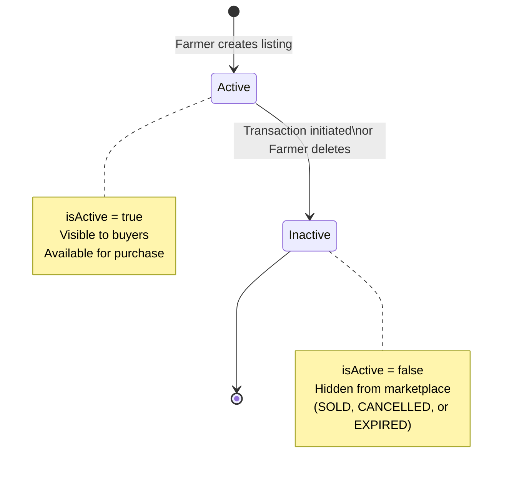
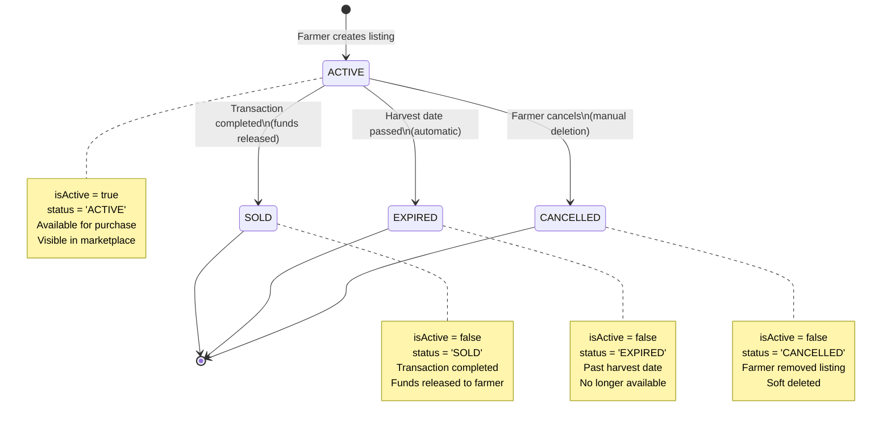
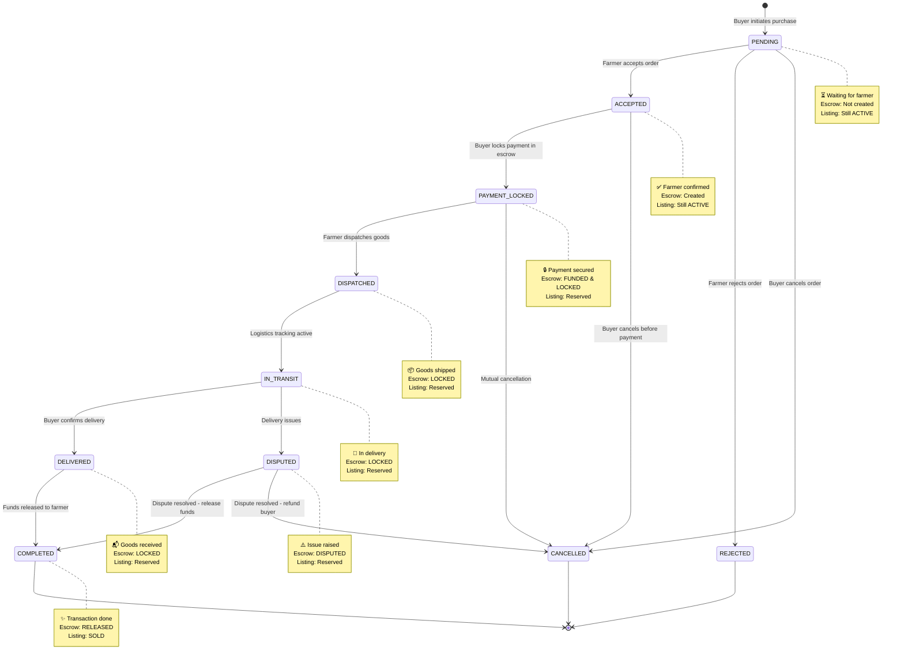
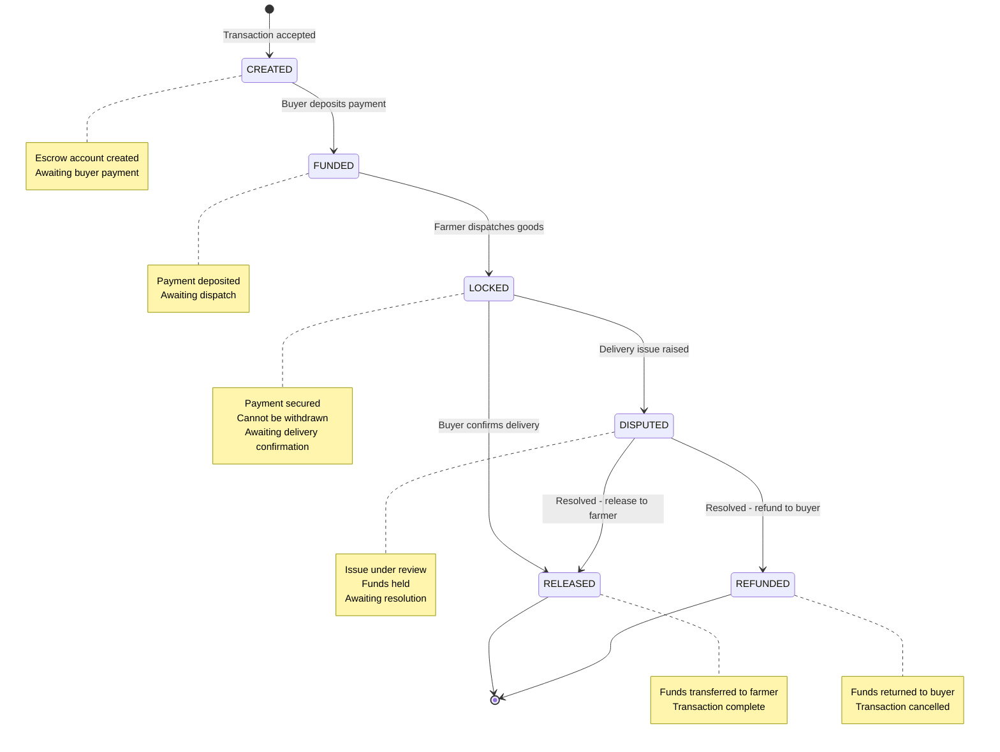
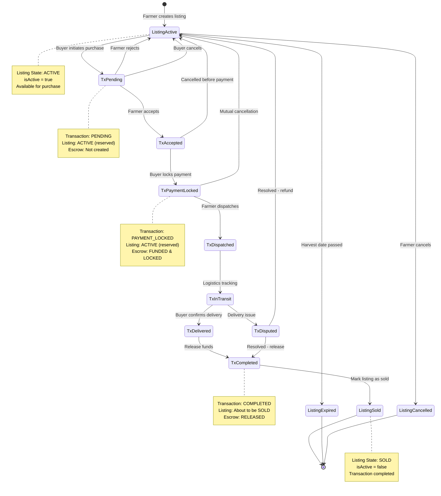

# Bharat Mandi - State Transition Diagrams

## 1. Listing States

### Current Implementation (Simplified)

### Recommended Enhanced Implementation

---

## 2. Transaction States (Current Implementation)

### Transaction Flow with Escrow

---

## 3. Escrow States

---

## 4. Complete Marketplace Flow

### Listing Lifecycle with Transaction Integration

---

## 5. Transaction Flow Steps (As Shown in UI)

The POC UI demonstrates this 5-step flow:

1. **Farmer Accepts Order** (PENDING → ACCEPTED)
   - Farmer reviews and accepts the purchase request
   - Escrow account is created

2. **Buyer Locks Payment** (ACCEPTED → PAYMENT_LOCKED)
   - Buyer deposits payment into escrow
   - Funds are secured and locked

3. **Farmer Dispatches** (PAYMENT_LOCKED → DISPATCHED/IN_TRANSIT)
   - Farmer ships the goods
   - Tracking information updated

4. **Buyer Confirms Delivery** (IN_TRANSIT → DELIVERED)
   - Buyer receives and verifies goods
   - Confirms delivery in system

5. **Release Funds** (DELIVERED → COMPLETED)
   - System releases funds from escrow to farmer
   - Listing marked as SOLD
   - Transaction complete

---

## Implementation Notes

### Current Database Schema
- **Listings Table**: Uses `isActive` boolean (true/false)
- **Transactions Table**: Uses `status` enum with all states
- **Escrow Table**: Uses `status` enum with escrow states

### Recommended Enhancements
1. Add `status` column to listings table (ACTIVE, SOLD, EXPIRED, CANCELLED)
2. Keep `isActive` as computed field for backward compatibility
3. Implement automatic expiration based on `expected_harvest_date`
4. Update listing status to SOLD when transaction reaches COMPLETED state
5. Add webhook/event system to sync listing and transaction states

### State Synchronization Rules
- When transaction → COMPLETED: listing → SOLD
- When transaction → CANCELLED (before PAYMENT_LOCKED): listing → ACTIVE
- When transaction → DISPUTED → REFUNDED: listing → ACTIVE
- When harvest date passes: listing → EXPIRED (automatic job)
- When farmer deletes: listing → CANCELLED
